## 1. Definições Gerais
- Todo órgão terá um ponto focal para ser o contato com o ED,  preferencialmente, quem for o responsável pela área de dados no órgão. 
- Este ponto focal será o Administrador da Pasta e/ou do Projeto.
- O ponto focal será responsável pelo compartilhamento dos dados, quando solicitado por algum ator interno ou externo. 
- Ele indicará os usuários conforme o nível de permissão de acesso (Editor ou Leitor).
- O ponto focal também será responsável por conceder o nível de acesso. 
- O papel de editor será responsável pela edição necessária nas tabelas que o leitor (analista) julgar pertinente.

## 2. Definição dos papéis de acesso
- Trata-se do nível de permissão concedida aos usuários, divididos em três níveis: administrador, editor, leitor e base.

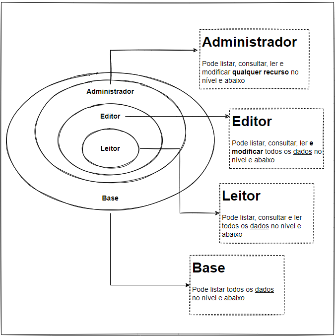

O papel base foi criado para visualização da existência das bases de dados. Com ele, pode-se listar as bases existentes, mas não pode consultar, ler os dados.
O ponto focal, automaticamente, terá seu acesso definido como __Administrador__. Portanto, definirá qual papel os técnicos de seu órgão poderão exercer. 

## 3. Compartimentação do projeto e definindo acesso aos dados
Em caso de órgãos que contenham unidades administrativas (sub-órgãos) com bases de dados próprias, projetos específicos, e independência relativa à gestão de dados, o acesso, assim como a divisão do Projeto na GCP ocorrerá da seguinte maneira:

a)O acesso será por grupos distintos, restringindo acesso apenas ao sub-órgão pertinente do usuário. A inserção do usuário ao sub-grupo acontecerá no momento da concessão da credencial de acesso ao Datalake.

__Ex.:__ 

__Projeto:__ SMFP 

__Dataset’s:__  RH e EGP

__Acesso:__ Grupo Leitor RH e Grupo Leitor EGP

#### 3.1 Criando grupos e sub-grupos
 Em _admin.google.com/ac/groups_, como na imagem abaixo, clique em Grupos que abrirá o painel central com a lista de grupos existentes. 
 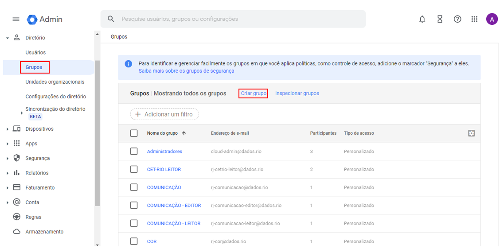
 Em seguida, clique no botão Criar grupo e preencha o formulário que abrirá, como mostra a imagem abaixo. 
  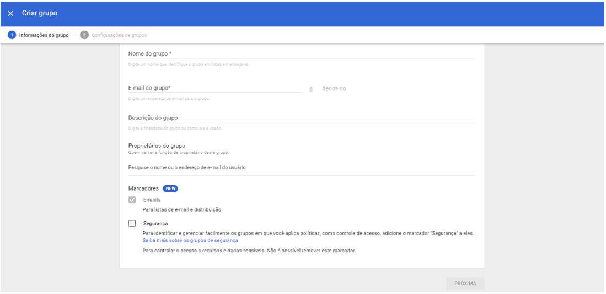

- Para a criação de grupos, recomendamos padrão de formulação de nome do grupo e e-mail.

- Para o nome do grupo sugere-se a sigla do órgão (ex.: SMFP) seguido do papel atribuído às funções do grupo (ex.: SMFP - LEITOR). 

- Enquanto para o e-mail, também devemos seguir a ordem de rj-(sigla do órgão)-(função do papel atribuído). Como, por exemplo: rj-smfp-leitor@dados.rio. A descrição do grupo segue livre.

#### 3.2 Configurando o grupo 

Após o preenchimento do formulário da etapa anterior, basta clicar em “Próxima”, para seguir a página seguinte de configuração, conforme imagem abaixo. Nesta etapa realizaremos a configuração do grupo será autorizar que todos da organização vejam o grupo, peçam acesso, interaja com outros participantes etc. 

Neste caso, selecionamos a opção “Restrito” e desmarcamos a caixa referente ao “Externo”. 

 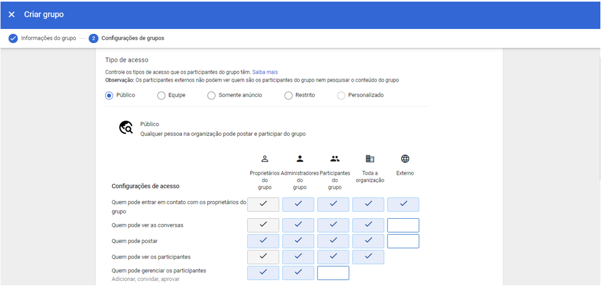

#### 3.3 Inserindo usuários em seus respectivos grupos
Após a criação dos grupos segundo o nível de permissão de uso, retorno para a tela da lista de grupos, clicando em Grupos, como destaque em vermelho na imagem abaixo. 
 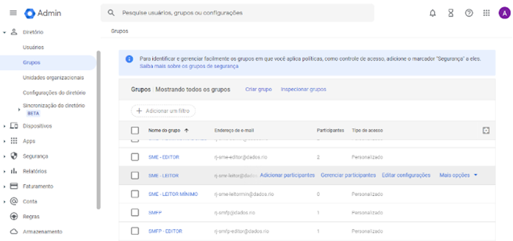

Em seguida, encontre o grupo de seu desejo para adicionar usuários conforme o perfil. Com a seta do mouse em cima da linha do grupo, surgirá opções para clicar, clique em Adicionar participantes, assim abrirá a tela abaixo. 

Agora, basta adicionar o e-mail do usuário (domínio @dados.rio). Para encontrar o e-mail dos usuários clique em Usuários no canto esquerdo da tela, então surgirá a lista de usuários cadastrados com o domínio @dados.rio. Copie o e-mail desejado e preencha o campo da tela a seguir. 

Repita o processo para cada usuário que deseja adicionar ao grupo.

 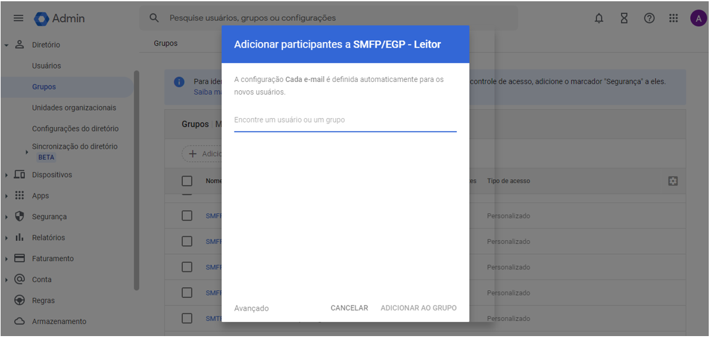

## 4. Compartilhamento de Dados com atores externos

Em caso de compartilhamento de bases com atores externos (universidades, pesquisadores, iniciativa priva, startups etc) 
 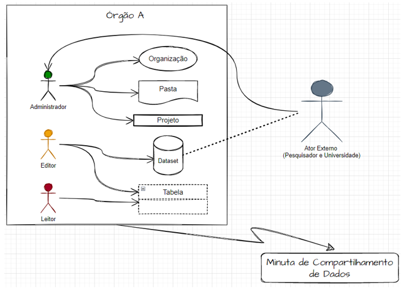

a) O solicitante deverá se manifestar oficialmente sobre o interesse em determinada base de dados.

b) Sua manifestação deverá conter: Tema, Objetivo, Justificativa, Possíveis produtos (análises, solução, software etc).

c) O concedente deverá ter acordo de compartilhamento padrão assinado, conforme modelo aprovado pela PGM.

d) Também deverá constar um Plano de Trabalho com os elementos pertinentes.

e) Após a deliberação sobre o compartilhamento dos dados, o modo de compartilhar, em caso de ser pela plataforma BigQuery, seguirá o mesmo modo que o compartilhamento entre órgãos e usuários internos. Entretanto, o usuário deverá possuir uma conta Google (um gmail, por exemplo) para acessar e o custo de processamento será de sua responsabilidade. 

## 5. Compartilhamento de Dados com atores internos

O compartilhamento de dados entre usuários e/ou órgãos municipais é de responsabilidade legal do solicitante e concedente. 
Recomendamos que ao compartilhar dados com atores internos ou externos, seja concedido o papel de leitor. 
 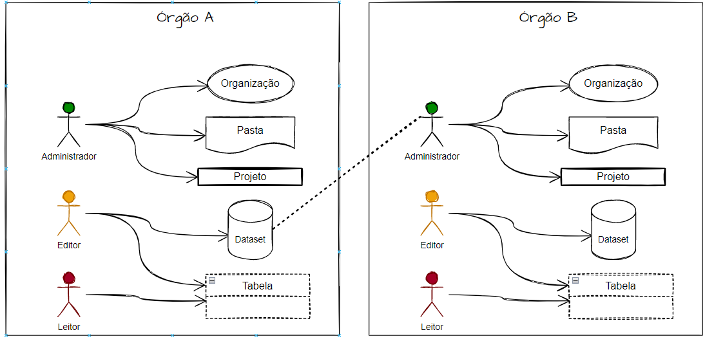

#### 5.1 Considerações: 
Para acessar dados não-públicos de outro órgão, o solicitante deverá:
a) Solicitar formalmente ao órgão proprietário dos dados.

b) Se deferido, o concedente deverá notificar ao Escritório de Dados.

C)Deverá ser celebrado entre os órgãos o Acordo de Cooperação Padrão (PADM) com o Plano de Trabalho.

d) E o Gestor dos Dados (Papel de Administrador) compartilhará os dados via BigQuery. 

## 6. Como compartilhar Projetos, Datasets e Tabelas
É importante ressaltar que no compartilhamento de cada elemento (projeto, dataset e tabela) você deverá conceder um papel ao usuário e para todos os elementos, obrigatoriamente, deverá considerar o nível Base, onde apenas a visualização do elemento será possível, sem mais qualquer outra opção de uso. 

Somente o usuário com permissão de Administrador poderá realizar compartilhamento de projeto, dataset e tabelas.

__Nota:__ Os papéis são complementares. Nesse sentido, ao atribuir um papel de nível maior, deve-se atribuir também todos os inferiores a ele. Exemplo: ao conceder o papel de “Editor” a um usuário, deve-se também conceder os papéis de “Leitor” e “Base”, pois são níveis inferiores.

#### 6.1 Projetos: 

Para compartilhar um Projeto (e consequentemente todos os recursos que estão contidos nele), basta acessar a página do IAM (Identity and Access Management) do Projeto em questão, disponível pelo seguinte modelo de link: https://console.cloud.google.com/iam-admin/iam?project=NOME_DO_PROJETO.

Ao acessá-la, deve clicar em “Permitir acesso”, no topo esquerdo e preencher:

- Novas principais: identidade do(s) usuário(s) (pode ser Gmail ou identidade @dados.rio)

- Papéis: selecionar os desejados

##### 6.1.1 Configurando a permissão por grupo
A concessão de acesso com as devidas permissões a usuários deve ser atribuída pela inserção do técnico no grupo pertinente ao nível de permissão que lhe foi permitido. Para isso, os grupos devem estar configurados para exercer o papel correspondente, conforme descrito no item 2. Sendo assim, deve seguir as orientações abaixo. 

a) Na barra de pesquisa do GCP procure por “Resource Manage”, acessando a tela, aparecerá o projeto do órgão correspondente ao administrador.

b) Para prosseguir tenha o e-mail do grupo que deseja conceder permissão de acesso, de acordo com o nível. É possível encontrá-lo no painel de administrador. 

c) Selecione o projeto que deseja conceder e em seguida clique em “Adicionar Principal” que abrirá uma aba ao lado direito para realizar a configuração.

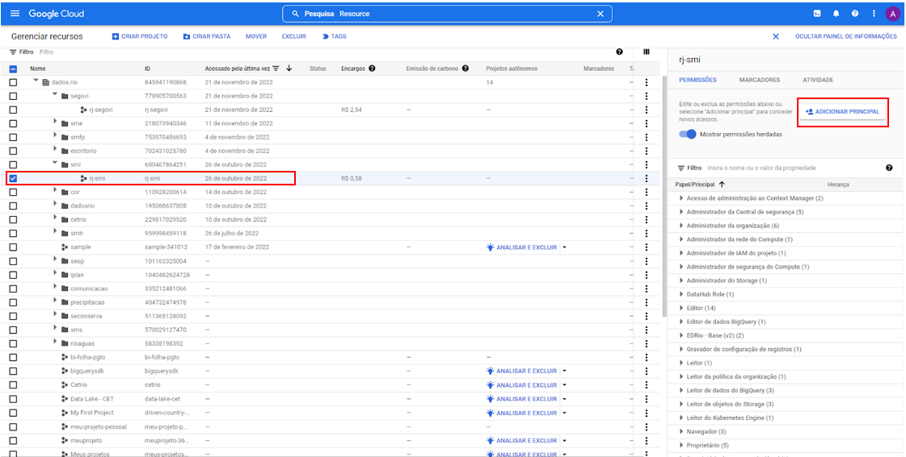

d) Em “Adicionar Participantes” insira o e-mail do grupo que deseja configurar acesso. 

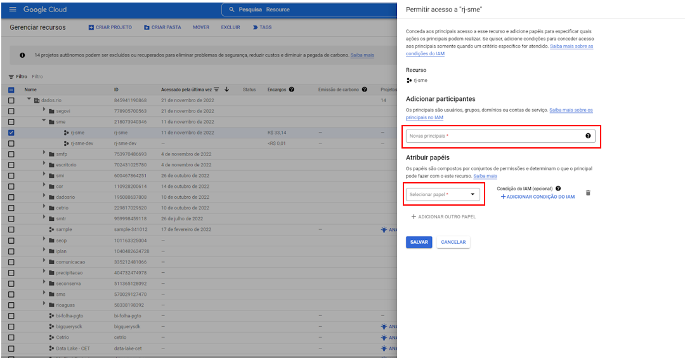

e) O passo seguinte devemos ter atenção, pois é neste momento que atribuirá o devido papel ao grupo. Em “Atribuir papeis”, abra a caixa suspensa e selecione, em “Acesso rápido” o papel que deseja atribuir. A imagem abaixo ilustra o que se relata. 

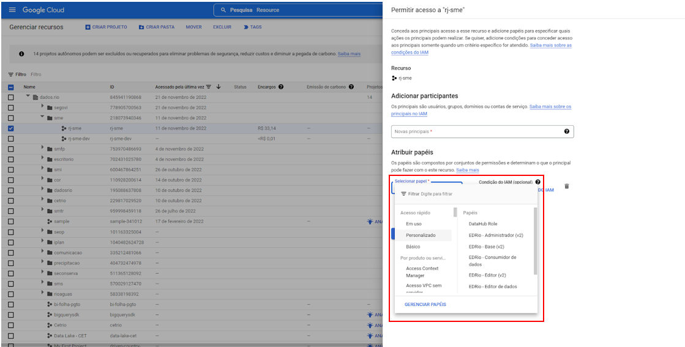

Destacamos que os papéis devem ser concedidos seguindo a hierarquia apresentada no item 2. De modo que:

**Administrador**: 
	    Receberá papel “Base”,  “Administrador”, “Editor” e “Leitor”. 

**Editor**: 
	    Receberá papel “Base”, “Editor” e “Leitor”

**Leitor**:
	    Receberá papel “Base” e “Leitor”. 

f) No caso dessas múltiplas concessões de configuração, deve agir da seguinte maneira, conforme imagem abaixo ilustra. 

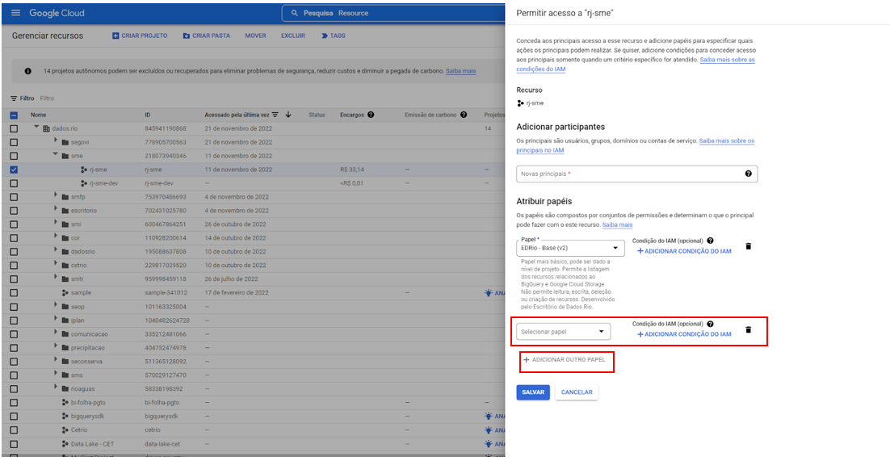
Clicando em “+ Adicionar outro Papel” uma nova caixa surgirá, possibilitando a inserção de um novo papel. Então, o processo de inclusão de papéis se repetirá até que atenda a necessidade da configuração. 

#### 6.2 Datasets
Para compartilhar Dataset (conjunto de dados) selecione o dataset desejado, dentro do respectivo projeto. 
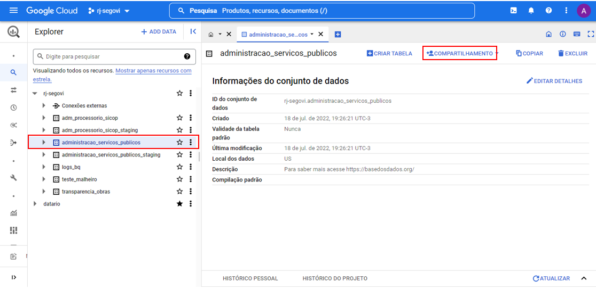

Há duas opções para iniciar o compartilhamento: 1) nos três pontos ao lado do nome do dataset, você pode clicar e selecionar “compartilhar”. 2) Com o dataset selecionado e aparecendo ao lado direito, conforme imagem acima, você pode clicar em “+compartilhamento”. 

Em seguida selecione “Permissões”. Feito isso aparecerá uma aba ao lado direito para a concessão do nível de acesso permitido que você poderá disponibilizar ao solicitante.

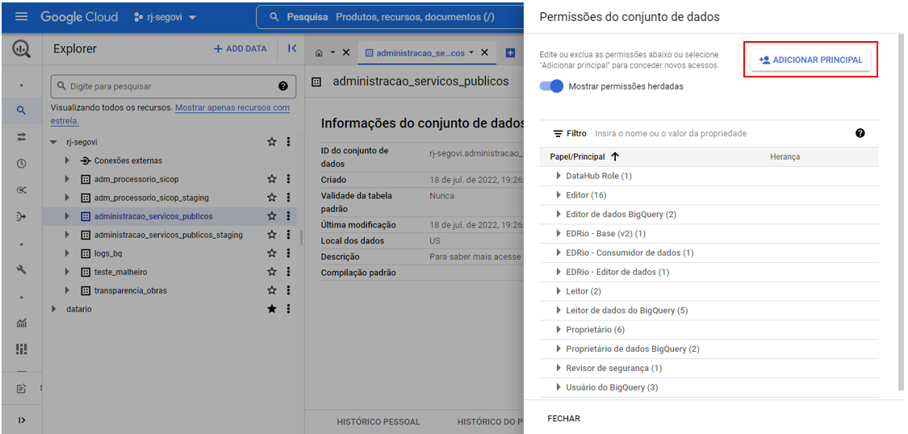

Em “Adicionar Principal” deverá informar o e-mail do usuário solicitante. E posterior a isso, deverá atribuir o papel concedido. 

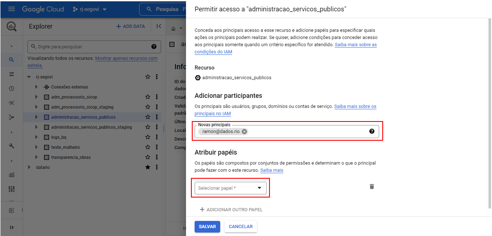

A atribuição de papéis deverá seguir a orientação exposta no item 6.1.1 (E). 

#### 6.3  Tabelas

Para o compartilhamento de Tabelas, o procedimento é similar ao de Dataset, porém deve ser feita para cada tabela compartilhada. 

Selecione a tabela que deseja compartilhar para proceder a abertura da mesma. 

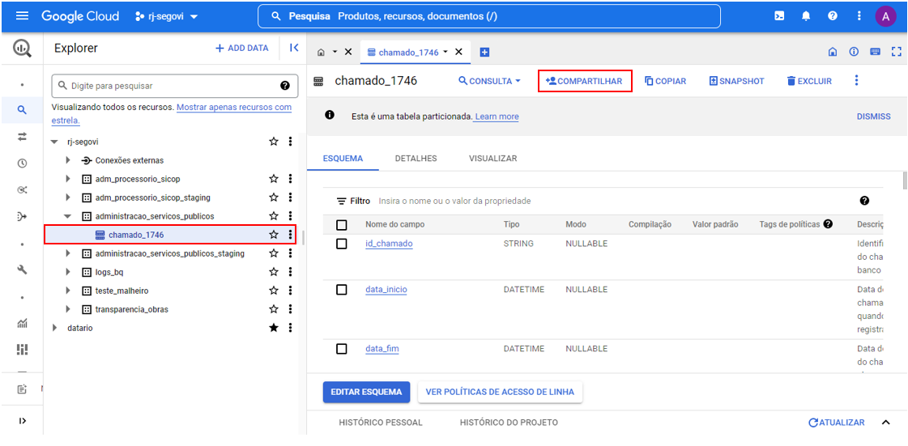

Em seguida, selecione “+compartilhar”, então surgirá uma aba no lado direito para informar o e-mail do solicitante e atribuir o papel de uso. Este processo se repete como apresentado anteriormente.

