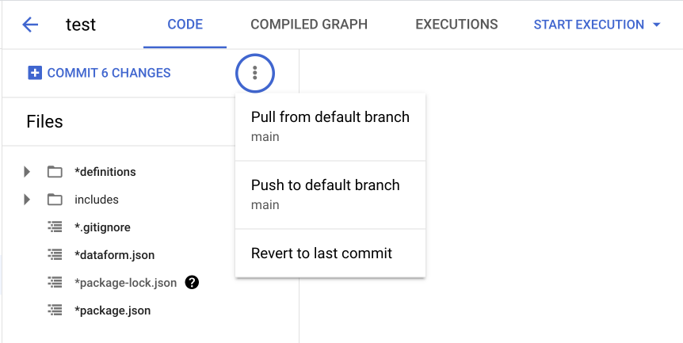
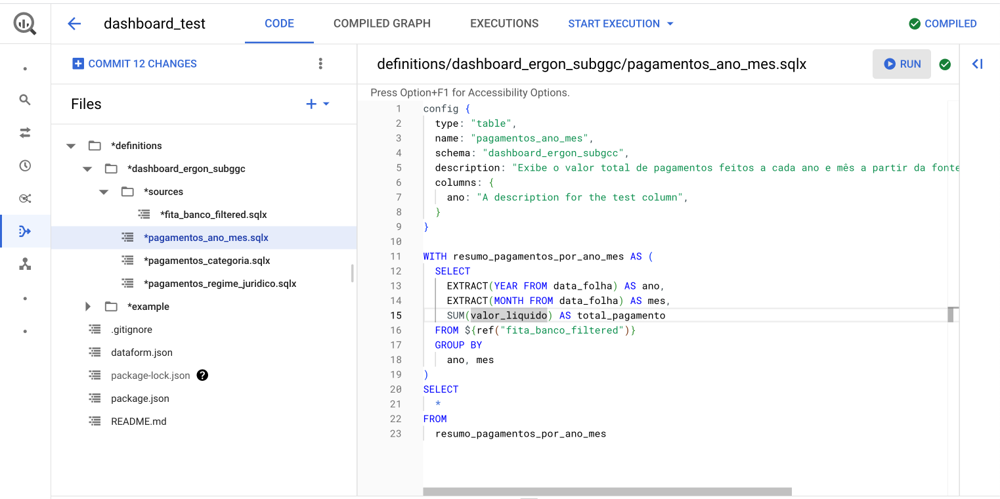
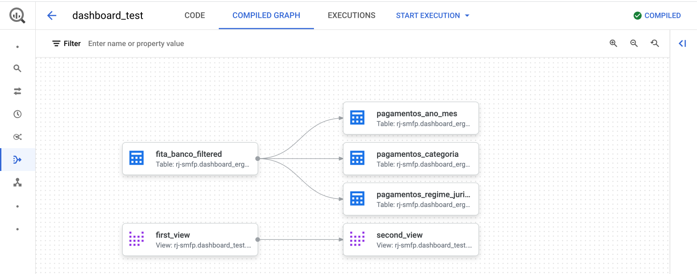
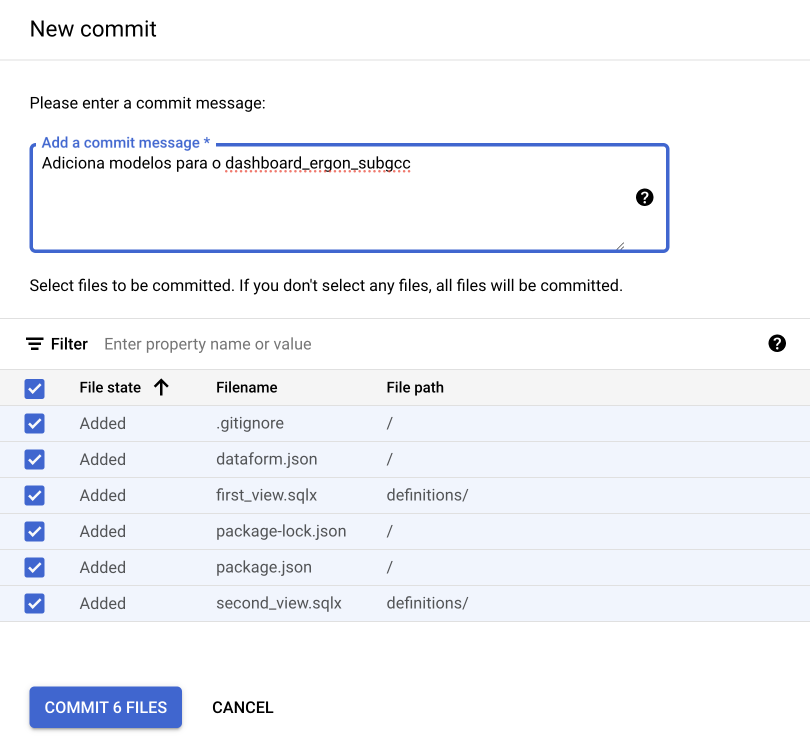
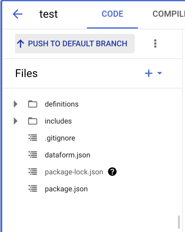
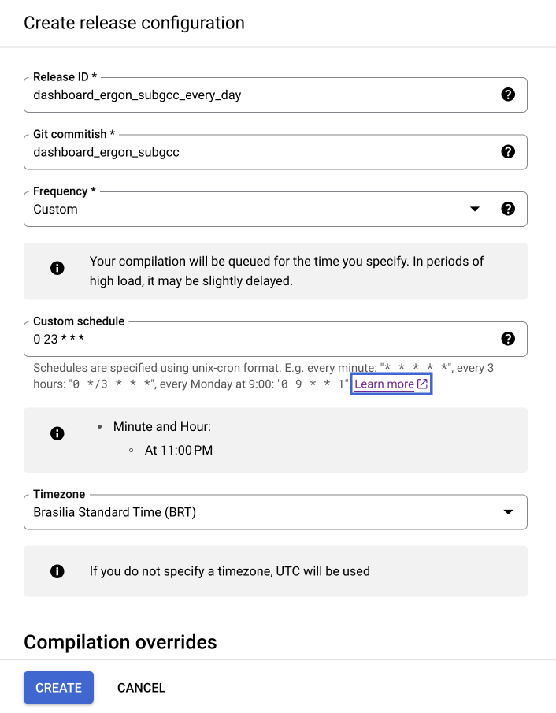
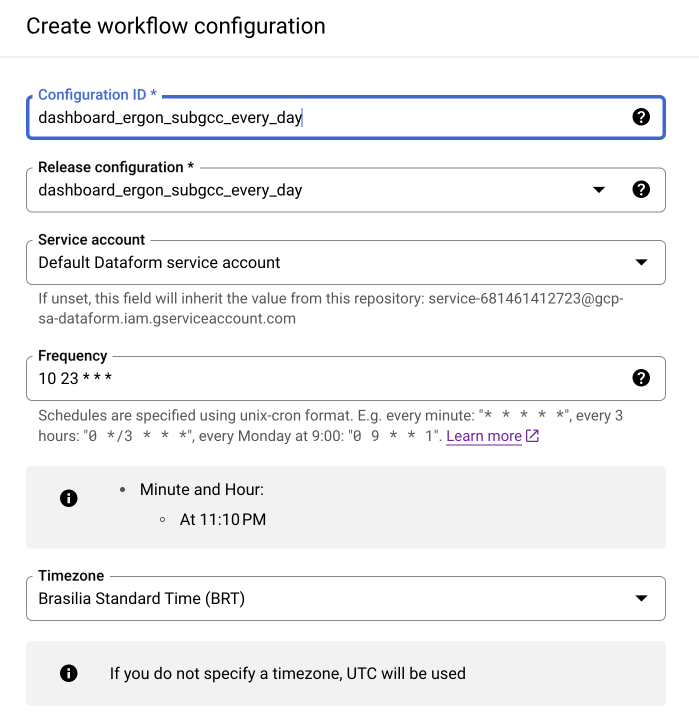
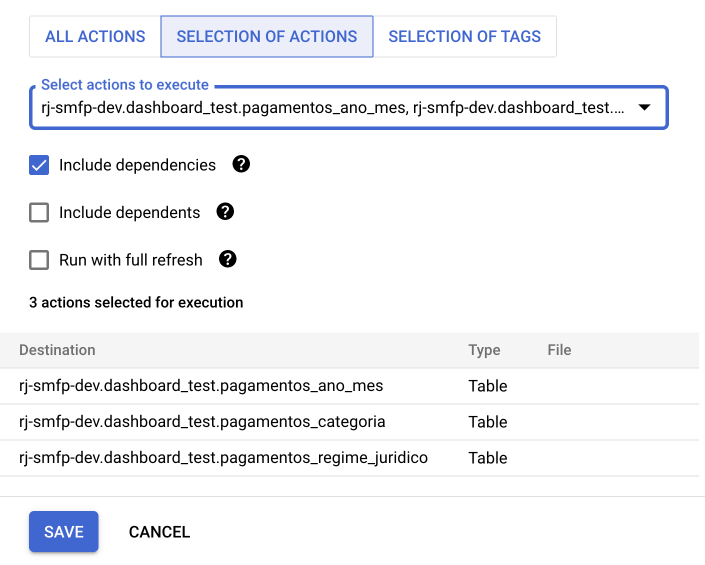

## Organização de Datasets e Tabelas

A organização eficiente dos datasets e tabelas no BigQuery é fundamental para manter um ambiente de dados limpo e gerenciável. Durante o desenvolvimento de uma nova análise ou dashboard, é recomendável seguir um conjunto de práticas específicas para garantir a clareza e a organização dos dados.

### Separação de ambientes

Durante o desenvolvimento de análises e dashboards, recomenda-se a utilização de um projeto de desenvolvimento específico. Por exemplo, para o projeto de produção `rj-smfp`, utilize o projeto de desenvolvimento `rj-smfp-dev`. Isso ajuda a separar claramente os ambientes de produção e desenvolvimento.

### Nomenclatura de Datasets e Tabelas

A estrutura de nomeação de datasets e tabelas deve seguir boas práticas para facilitar a identificação e a compreensão dos dados. A seguir, estão algumas diretrizes para nomear datasets e tabelas:

- Use todas as letras minúsculas (inclusive siglas), sem acentos, conectadas por underscores (_).
- Evite abreviações e inclusão de conectores como "de", "da", "dos", "e", "a", "em", etc.
- Ao criar datasets destinados a análises ou dashboards, mantenha o nome original do dataset e acrescente o sufixo "dashboard" ou "analise," juntamente com a identificação do órgão responsável. Por exemplo, para um dashboard relacionado ao sistema ERGON feito pela SUBGCC, as tabelas se encontram no dataset_id: `recursos_humanos_ergon`, os dados relevantes para esse dashboard devem ser armazenados no dataset_id `recursos_humanos_ergon_dashboard_subgcc`.
- Utilize nomes de datasets e tabelas descritivos para refletir claramente o conteúdo ou finalidade dos dados.


| **Regra**                                                                                                    | **Exemplos Bons**                                                      | **Exemplos Ruins**                           |
|---------------------------------------------------------------------------------------------------------------|------------------------------------------------------------------------|----------------------------------------------|
| Use todas as letras minúsculas.                                                                              | `empresa.funcionarios`                                                 | `Empresa.Funcionários`                       |
| Conecte as palavras com underscores (_).                                                                      | `vendas.historico_vendas`                                              | `vendas.historicovendas`                    |
| Evite abreviações e conectores como "de", "da", etc.                                                         | `clientes.informacoes_cliente`                                         | `clientes.inf_do_cliente`                    |
| Mantenha o nome original ao criar datasets para análises e adicione os sufixos adequados.                    | `recursos_humanos_ergon_dashboard_subgcc.funcionarios`                              | `rh_dash_subgcc.func`                       |
| Utilize nomes de datasets e tabelas que refletem claramente o conteúdo ou finalidade dos dados.               | `fornecedores.pagamentos_fornecedores`                                 | `fornecedores.tabela_123`                    |


### Tipos de Tabelas no BigQuery

O BigQuery oferece três tipos diferentes de tabelas, cada uma com suas características:

1. **Tabelas Externas**: Tabelas externas funcionam de forma semelhante a tabelas normais do BigQuery. Os detalhes sobre a estrutura da tabela, como as colunas e os tipos de dados, são armazenados no BigQuery. No entanto, os dados em si permanecem na fonte externa. Isso pode incluir fontes como **Google Cloud Storage (GCS)**, **Google Sheets**, **Google Drive** e outras. Para saber mais, consulte [como consultar fontes de dados externas](https://cloud.google.com/bigquery/docs/external-data-sources).

2. **Tabelas Nativas**: Tabelas nativas contêm os dados diretamente dentro do BigQuery. Essas tabelas oferecem alta velocidade de consulta, mas possuem um limite de 4 mil partições, o que pode ser um fator limitante para conjuntos de dados muito grandes.

3. **Views (Visualizações)**: Uma view é uma tabela virtual criada a partir de uma consulta SQL. Ela não armazena dados fisicamente, mas, em vez disso, fornece uma maneira conveniente de organizar e acessar dados de outras tabelas. Para obter mais informações, consulte [como criar visualizações](https://cloud.google.com/bigquery/docs/views).

Esses três tipos de tabelas oferecem flexibilidade para lidar com uma variedade de cenários de armazenamento e consulta de dados no BigQuery. A escolha do tipo de tabela depende das necessidades específicas do seu projeto e da fonte dos dados que você está gerenciando.


## Importação de Dados de Apoio

Muitas vezes, precisamos trazer outros dados para apoiar as análises. Eles normalmente são pequenos, podem mudar constantemente e são construídos manualmente. Um bom exemplo são tabelas de categorias ou de-para. Essa seção vai ter mostrar como subir esses dados no BigQuery sem precisar construir uma pipeline no Prefect ou DBT.

### Sheets
Uma maneira eficaz de trazer dados de fontes externas para o BigQuery é por meio da importação de dados do Google Sheets. Essa integração permite que você trabalhe com dados de planilhas do Google diretamente no ambiente do BigQuery.

1. Nas opções do dataset, clique em "Criar nova tabela".

2. Na página de configuração da nova tabela, escolha a opção "Drive" como origem dos dados, indique a URL da tabela no Google Sheets e selecione o formato "Google Sheet". Em seguida, defina um nome para sua tabela. No final, você deve ter algo como na imagem abaixo: 

3. Você pode definir o esquema manualmente ou utilizar a função de autodetecção. Na seção de opções avançadas, indique a linha que representa o cabeçalho da tabela para que ele não seja interpretado como um dado: 

4. É importante que a tabela no Google Sheets seja pública ou que os usuários tenham permissão de visualização para executar consultas na tabela criada. 

5. Lembre-se, é uma boa prática adicionar descrição para os dados que foram adicionados dessa maneira. Assim, você garante que outras pessoas conseguirão usar os dados. Para isso, basta editar o esquema da tabela.


## Guia de Automação com BigQuery Dataform

O BigQuery Dataform é uma ferramenta poderosa que simplifica a automação de transformações de dados no Google BigQuery. Neste guia, vamos abordar as etapas essenciais para configurar o BigQuery Dataform e automatizar tarefas de gerenciamento de dados. Esta é uma versão simplificada da documentação; para mais detalhes, consulte a [documentação oficial do Dataform](https://cloud.google.com/dataform/docs/overview?hl=pt-br).

### Configuração do Repositório

Antes de começar, é fundamental configurar um repositório para seus projetos de dados no BigQuery Dataform. Aqui estão as etapas:

1. Comece criando um repositório no BigQuery Dataform. O repositório é o local onde você gerenciará seus projetos de dados e deve seguir o padrão `rj-orgao-dataform` ou `rj-smfp-dataform`.

2. Crie um projeto no Github com o mesmo nome do repositório do Dataform, `rj-orgao-dataform` ou `rj-smfp-dataform`.

    2.1. No seu perfil do Github, selecione a opção **settings** e escolha o menu **developer settings**. Em seguida, selecione a opção **Fine-grained tokens** em **Personal Access Tokens**.
    
    2.2. Crie um novo token seguindo o mesmo padrão de nomenclatura do repositório (`rj-orgao-dataform` ou `rj-smfp-dataform`). Defina a data de expiração para o maior valor possível, selecione a organização de interesse e conceda permissões apenas para o repositório desejado. Em permissões de acesso, selecione **read and write** para **Content**. 
    
    2.3. Salve o token gerado. Vá até o **Secret Manager do Google Cloud** e crie um novo secret com o mesmo nome do repositório, cole o valor do token no campo **secret value** e clique em criar novo secret. 

3. No repositório do Dataform, vá até **Settings** e clique em **Edit Git Connections**. Selecione a opção **HTTP** e cole a URL do repositório do Github, acompanhado de **.git**. Coloque o nome da branch como **master** (em alguns casos pode ser **main**) e selecione o secret criado na etapa anterior. Copie a conta de serviço default fornecida pelo Dataform na parte inferior da janela. No exemplo da imagem, é **service-681461412723@gcp-sa-dataform.iam.gserviceaccount.com**. 

4. Vá até o **Resource Manager do Google Cloud** e conceda acesso para a conta de serviço default fornecida pelo Dataform para o projeto de produção (**rj-smfp**) e desenvolvimento (**rj-smfp-dev**), com as seguintes permissões:
    - Dataform Service Agent
    - EDRio - Infra - Conta de Serviço
    - Secret Manager Secret Accessor

Essa integração permite o controle de versões dos modelos desenvolvidos no Dataform em ambientes de desenvolvimento que são branches do repositório do Github.

## Criação de Modelos

#### Configuração do ambiente de desenvolvimento

No Dataform, você interage com o código do fluxo de trabalho SQL em um espaço de trabalho de desenvolvimento. Um espaço de trabalho de desenvolvimento é sua própria cópia editável de um repositório. Em um espaço de trabalho, você cria, edita ou exclui o conteúdo do repositório sem afetar outros que trabalham no mesmo repositório e, em seguida, confirma e envia as alterações para o repositório.

É possível desenvolver seu fluxo de trabalho SQL com o núcleo do Dataform ou JavaScript. O Dataform compila seu código em consultas SQL em tempo real.

1. O primeiro passo para criar modelos é a criação de um ambiente de desenvolvimento. Vá até a interface do Dataform, selecione o repositório e crie um ambiente de desenvolvimento, caso seja necessário. Dê um nome descritivo, por exemplo, `dashboard_ergon_suggc`.

2. Entre no ambiente de trabalho e inicialize o ambiente, caso seja necessário.
   

3. Caso o ambiente já exista, **SEMPRE** realize o **Pull from remote branch** antes de iniciar qualquer edição. Entre as opções estão:

      - **Pull from remote branch** (Puxar da branch remota): Essa opção é utilizada para "puxar" as últimas atualizações do ambiente de desenvolvimento. É como atualizar seu trabalho com o que outras pessoas fizeram.

      - **Pull from default branch** (Puxar da branch padrão): Similar ao primeiro, mas específico para a branch principal do projeto.

      - **Push to remote branch** (Enviar para branch remota): Essa opção é utilizada para "empurrar" suas alterações para a branch do ambiente de desenvolvimento.

      - **Push to default branch** (Enviar para a branch padrão): Essa é a mesma ideia do anterior, mas específica para a branch principal do projeto.

      - **Revert to last commit** (Reverter para o último commit): Desfaz todas as edições até o último commit.



Para entender a estrutura de um ambiente no Dataform, é importante conhecer os principais componentes e conceitos envolvidos:

- A pasta **definitions** é o coração do ambiente do Dataform. Ela contém os arquivos que definem as transformações de dados e as operações que desejamos automatizar.

- Os arquivos com a extensão **.sqlx** contêm código SQL que descreve as transformações de dados que você deseja aplicar. Esses arquivos são escritos no formato SQLX, que é uma extensão do SQL padrão e suporta recursos adicionais, como a definição de modelos, testes e documentação.

- Arquivos **.sqlx** suportam configurações específicas, como o tipo de tabela a ser criado, em qual dataset será salvo, nome da tabela, entre outras. Para informações detalhadas, consulte a [documentação oficial](https://cloud.google.com/dataform/docs/reference/dataform-core-reference?hl=pt-br#columns-descriptor). Segue um exemplo de configuração que deve ser colocada no início do arquivo:

      ```sql
      config {
         type: "table",
         name: "fita_banco_filtered",
         schema: "dashboard_ergon_subgcc",
         description: "Fonte filtrada para o ano de 2023."
         columns: {
            ano: "Ano da folha"
            mes: "Mês da folha"
         }
      }
      ```

- O arquivo **dataform.json** é o arquivo de configuração do seu projeto Dataform. Ele contém informações sobre como os modelos são construídos, quais tarefas devem ser executadas e como as dependências entre modelos são gerenciadas. É onde você especifica configurações como o esquema padrão do BigQuery, conexões de banco de dados e programação de tarefas. Para mais informações, acesse a [documentação oficial](https://cloud.google.com/dataform/docs/configure-dataform?hl=pt-br).

#### Criação de um Novo Modelo

Para criar um novo modelo, primeiro iremos definir um padrão de estrutura e organização de pastas dentro da pasta **definitions**. Os modelos criados no ambiente devem ser salvos dentro de uma pasta com o mesmo nome do ambiente. Dessa forma, isolamos projetos, dashboards e análises de outros ambientes. Seguindo o exemplo anterior, teríamos `definitions/dashboard_ergon_sugg

c`. Dentro dessa pasta, podemos organizar nossas queries da forma que melhor nos atender.

No exemplo da imagem, criamos uma tabela filtrada que servirá de fonte para as demais agregações. Observe que o nome do arquivo e o nome da tabela no config devem ser iguais. Dessa forma, iremos consultar apenas a tabela filtrada e não o conjunto de dados inteiro, o que gera uma redução de custos. Também é possível executar a query na opção **Run**.


Ao criarmos um modelo, podemos fazer uma referência direta a ele em outro modelo, utilizando o método `${ref("nome_do_modelo_referenciado")}`. Dessa forma, adicionamos o modelo referenciado como uma dependência do novo modelo criado. **É importante que o nome dos modelos seja único**. Segue um exemplo para a tabela de agregação `pagamentos_ano_mes` que referencia o modelo `fita_banco_filtered`.


Na aba **Compiled Graph**, é possível visualizar o grafo de dependências dos modelos do ambiente de desenvolvimento. Também é possível executar um modelo e suas dependências na opção **Start Execution**.


Ao finalizar as edições, **SEMPRE** sincronize suas modificações com o repositório do Github. Clique na opção **Git Commit**, selecione todos os arquivos e escreva alguma mensagem que descreva a alteração realizada e finalize o commit.


Finalize a sincronização clicando em **Push to default branch**.



#### Execução do Fluxo de Trabalho

Agora que temos um fluxo de execução de modelos definido, podemos automatizar sua execução com agendamentos.

Primeiramente, devemos criar o **Release Configuration**. Dentro do repositório do Dataform, selecione a aba **Release Configuration** e clique em **New Release Configuration**.

Preencha os campos como na imagem abaixo, utilizando o nome do ambiente de desenvolvimento acompanhado da frequência de atualização para o **Release ID**. No campo **Git Commitish**, coloque o nome do ambiente de desenvolvimento que contém os modelos a serem executados. Selecione a frequência de atualização e o fuso horário desejados.

Na seção **Compilation variables**, é possível definir o projeto no qual as tabelas/views serão criadas e os sufixos para o nome das tabelas e datasets. Enquanto estiver na etapa de desenvolvimento, é indicado utilizar o projeto `rj-orgao-dev`. Ao finalizar o desenvolvimento, esse parâmetro pode ser alterado para o projeto de produção `rj-orgao`.



Com o **Release Configuration** criado, podemos criar o agendador para executar nossos fluxos de modelos. Dentro do repositório do Dataform, selecione a aba **Workflow Configuration** e clique em **New Workflow Configuration**.

Preencha os campos como na imagem abaixo. Para o campo **Configuration ID**, utilize o nome do ambiente de desenvolvimento acompanhado da frequência de atualização. No campo **Release Configuration**, selecione o release que deve ter o mesmo nome do **Configuration ID**. No campo **Service Account**, selecione a conta de serviço padrão criada pelo Dataform. Selecione a frequência de atualização (lembre-se de colocar o início da execução alguns minutos após o definido no **Release Configuration**) e o fuso horário desejados.



Na seção de seleção dos modelos, selecione os modelos a serem executados e suas dependências.




## Conectando com o Produto Final

### Integração com Looker Studio

Integrar o BigQuery com o Looker Studio permite criar painéis de controle interativos. Exemplo:


### Integração com Google Sheets

Para compartilhar dados do BigQuery no Google Sheets, siga as etapas:

### Integração com Python e R

Para conectar o BigQuery ao Python ou R, você pode utilizar o pacote `basedosdados` desenvolvido pela ONG [Base dos Dados](http://basedosdados.org). Para mais detalhes, acesse a [documentação oficial do pacote](https://basedosdados.github.io/mais/access_data_packages/). Abaixo, segue um exemplo para Python:

```python
import basedosdados as bd

# Consulta ao BigQuery
query = """
SELECT 
   *
FROM `rj-smfp.dashboard_ergon_subgcc.pagamentos_ano_mes`
"""
df = bd.read_sql(query, billing_project_id="SEU_PROJECT_ID")

```