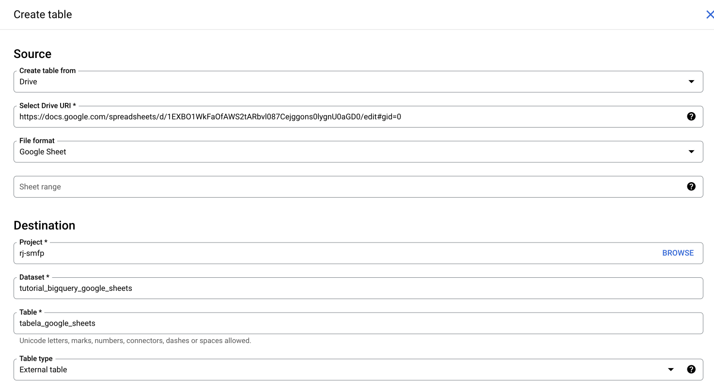
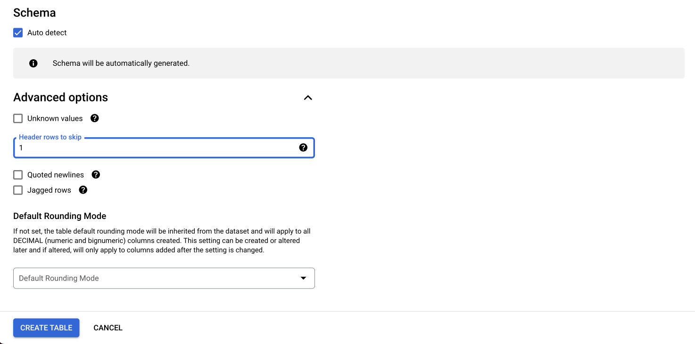
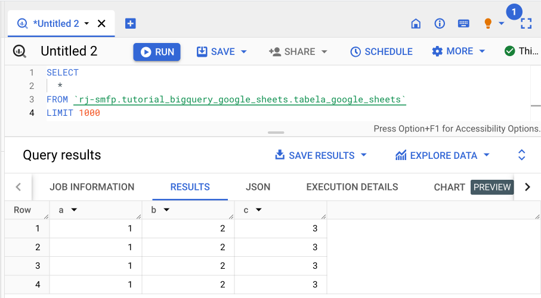
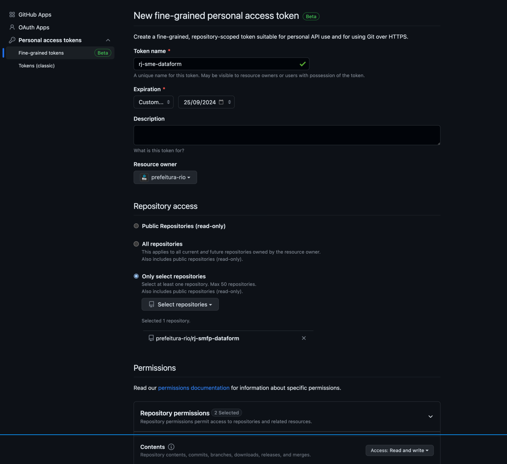
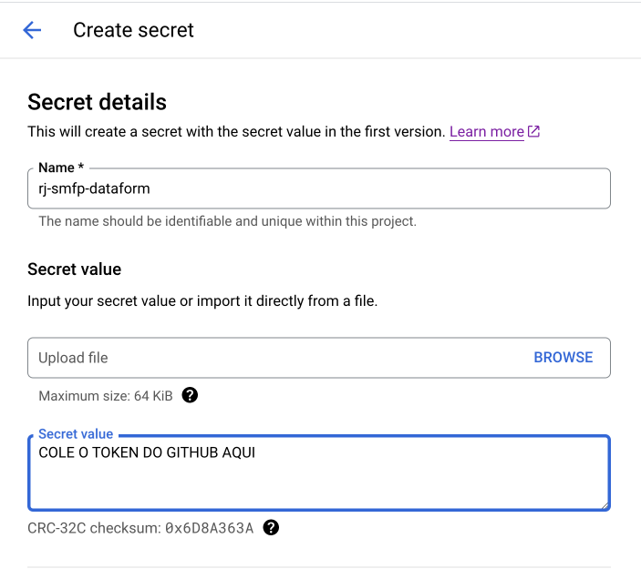
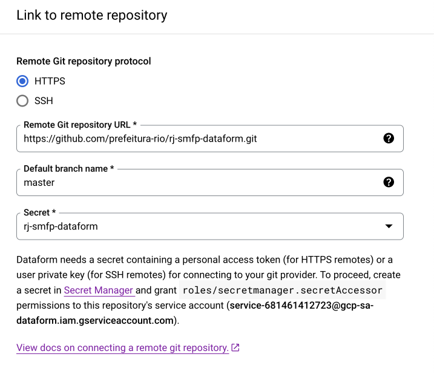
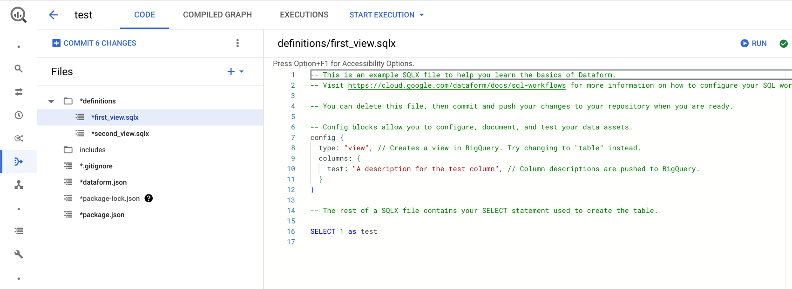
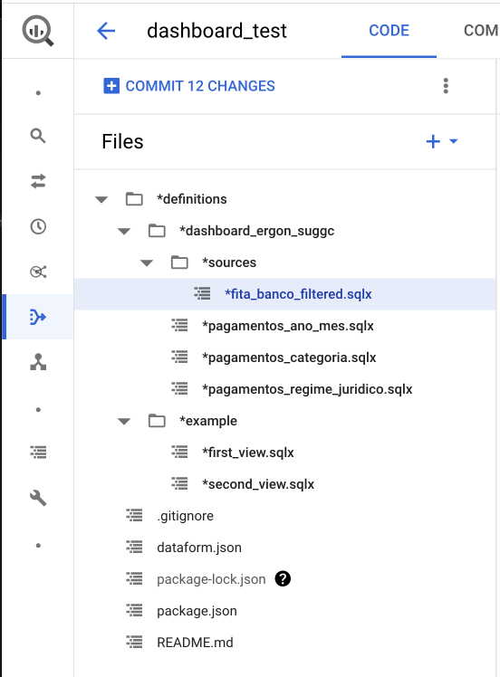
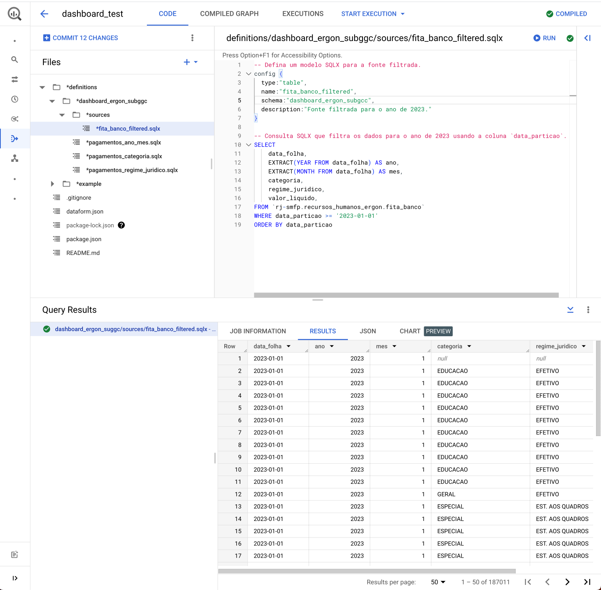

## Organização de Datasets e Tabelas

A organização eficiente dos datasets e tabelas no BigQuery é fundamental para manter um ambiente de dados limpo e gerenciável. Durante o desenvolvimento de uma nova análise ou dashboard, é recomendável seguir um conjunto de práticas específicas para garantir a clareza e a organização dos dados.

### Projetos de Desenvolvimento

Durante o desenvolvimento de análises e dashboards, recomenda-se a utilização de um projeto de desenvolvimento específico. Por exemplo, para o projeto de produção `rj-smfp` utilize o projeto de desenvolvimento `rj-smfp-dev`. Isso ajuda a separar claramente os ambientes de produção e desenvolvimento.

### Nomenclatura de Datasets e Tabelas

A estrutura de nomeação de datasets e tabelas deve seguir boas práticas para facilitar a identificação e a compreensão dos dados. A seguir, estão algumas diretrizes para nomear datasets e tabelas:

- Use todas as letras minúsculas (inclusive siglas), sem acentos, conectadas por underscores (_).
- Evite abreviações e inclusão de conectores como "de", "da", "dos", "e", "a", "em", etc.
- Ao criar datasets destinados a análises ou dashboards, mantenha o nome original do dataset e acrescente o sufixo dashboard ou analise, juntamente com a identificação do órgão responsável. Por exemplo para um dashboard relacionado ao sistema ERGON feito pela SUBGCC; as tabelas se encontram no dataset_id: `recursos_humanos_ergon`, os dados relevantes para esse dashboard devem ser armazenados no dataset_id `recursos_humanos_ergon_dashboard_subgcc`.
- Utilize nomes de datasets e tabelas descritivos para refletir claramente o conteúdo ou finalidade dos dados.


### Tipos de Tabelas no BigQuery

O BigQuery oferece três tipos diferentes de tabelas, cada uma com suas características:

1. **Tabelas Externas**: Tabelas externas funcionam de forma semelhante a tabelas normais do BigQuery. Os detalhes sobre a estrutura da tabela, como as colunas e os tipos de dados, são armazenados no BigQuery. No entanto, os dados em si permanecem na fonte externa. Isso pode incluir fontes como **Google Cloud Storage (GCS)**, **Google Sheets**, **Google Drive** e outras. Para saber mais, consulte [como consultar fontes de dados externas](https://cloud.google.com/bigquery/docs/external-data-sources).

2. **Tabelas Nativas**: Tabelas nativas contêm os dados diretamente dentro do BigQuery. Essas tabelas oferecem alta velocidade de consulta, mas possuem um limite de 4 mil partições, o que pode ser um fator limitante para conjuntos de dados muito grandes.

3. **Views (Visualizações)**: Uma view é uma tabela virtual criada a partir de uma consulta SQL. Ela não armazena dados fisicamente, mas, em vez disso, fornece uma maneira conveniente de organizar e acessar dados de outras tabelas. Para obter mais informações, consulte [como criar visualizações](https://cloud.google.com/bigquery/docs/views).

Esses três tipos de tabelas oferecem flexibilidade para lidar com uma variedade de cenários de armazenamento e consulta de dados no BigQuery. A escolha do tipo de tabela depende das necessidades específicas do seu projeto e da fonte dos dados que você está gerenciando.


### Importação de Dados do Google Sheets

Uma maneira eficaz de trazer dados de fontes externas para o BigQuery é por meio da importação de dados do Google Sheets. Essa integração permite que você trabalhe com dados de planilhas do Google diretamente no ambiente do BigQuery.


1. Nas opções do dataset clique em criar nova tabela

2. Na página de configuração da nova tabela, escolha a opção Drive como origem dos dados, indique a URL da tabela no google sheets e selecione o formato Google Sheet em seguida defina um nome para sua tabela. No final você deve ter algo como na imagem abaixo: 

3. Voce pode definir o Schema manualmente ou utilizar a função de auto deteção. Na seção de opções avançadas indique a linha que represente o header da tabela para que ele não seja interpretado como um dado: 

4. É importante que a tabela no google sheets seja pública ou que os usuarios tenham permissão de visualização para executar queries na tabela criada.


## Guia de Automação com BigQuery Dataform

O BigQuery Dataform é uma ferramenta poderosa que simplifica a automação de transformações de dados no Google BigQuery. Neste guia, vamos abordar as etapas essenciais para configurar o BigQuery Dataform e automatizar tarefas de gerenciamento de dados.


### Configuração do Repositório

Antes de começar, é fundamental configurar um repositório para seus projetos de dados no BigQuery Dataform. Aqui estão as etapas:

1. Comece criando um repositório no BigQuery Dataform. O repositório é o local onde você gerenciará seus projetos de dados e deve seguir o padrão, `rj-orgao-dataform`; `rj-smfp-dataform`.

2. Crie um projeto no Github com o mesmo nome do repositorio do dataform, `rj-orgao-dataform`; `rj-smfp-dataform`.
    
      2.1. No seu perfil do Github selecione a opção **settings** e selecione o menu **developer settings**, selecione a opção **Fine-grainted tokens** em **Personal Acess Tokens**
      2.2. Crie um novo token seguindo o mesmo padrao de nomeação do repositorio (`rj-orgao-dataform`; `rj-smfp-dataform`). Defina a data de data de expiração para o maior valor possivel, selecione a organização de interesse e de permissão apenas para o repositorio desejado. Em permissões de acesso **read and write** para **Content**. 
      2.3. Salve o token gerado. Vá até o **Secret Manager do Google Cloud** e crie um novo secret com o mesmo nome do repositorio, cole o valor do token no campo **secret value** e clique em criar novo secret.
      

3. No repositorio do Dataform vá até **Settings** e clique em **Edit Git Connections** . Selecione a opção **HTTP** e cole a URL do repositorio do Github acompanhado de **.git**, coloque o nome da branch como **master** (em alguns casos pode ser **main**) e selecione o secret criado na etapa anterior. Copie a conta de servico default fornecida pelo Dataform na parte inferior da janela, no exemplo da imagem é **service-681461412723@gcp-sa-dataform.iam.gserviceaccount.com**
      . 

4. Vá até o **Resource Manager do Google Cloud** e de acesso para a conta de serviço default fornecida pelo dataform para o projeto de prod (**rj-smfp**) e dev (**rj-smfp-dev**) com a permissões abaixo:
      - Dataform Service Agent 
      - EDRio - Infra - Conta de Serviço
      - Secret Manager Secret Accessor


Essa integração permite o controle de versões dos modelos desenvolvidos no Dataform em ambientes de desenvolvimentos que são branchs do repositório do github.

### Criação de Modelos

#### Configuração ambiente desenvolvimento

No Dataform, você interage com o código do fluxo de trabalho SQL em um espaço de trabalho de desenvolvimento. Um espaço de trabalho de desenvolvimento é sua própria cópia editável de um repositório. Em um espaço de trabalho, você cria, edita ou exclui o conteúdo do repositório sem afetar outros que trabalham no mesmo repositório e, em seguida, confirma e envia as alterações para o repositório.

É possível desenvolver seu fluxo de trabalho SQL com o núcleo do Dataform ou JavaScript. O Dataform compila seu código em consultas SQL em tempo real.

1. O primeiro passo para criação de modelos é a criação de um ambiente de desenvolvimento. Vá até a interfacie do Dataform selecione o repositorio e crie um ambiente de desenvolvimento caso necessario, de algum nome descritivo ex: `dashboard_ergon_suggc`. 

2. Entre no ambiente de trabalho e inicialize o ambiente caso seja necessario. 
   

Para entender a estrutura de um ambiente no Dataform, é importante conhecer os principais componentes e conceitos envolvidos;

- A pasta **definitions** é o coração do ambiente do Dataform. Ela contém os arquivos que definem as transformações de dados e as operações que desejamos automatizar. 

- Os arquivos com a extensão **.sqlx** contêm código SQL que descreve as transformações de dados que você deseja aplicar. Esses arquivos são escritos no formato SQLX, que é uma extensão do SQL padrão e suporta recursos adicionais, como a definição de modelos, testes e documentação.

- Explicar confg {}

- O arquivo **dataform.json** é o arquivo de configuração do seu projeto Dataform. Ele contém informações sobre como os modelos são construídos, quais tarefas devem ser executadas e como as dependências entre modelos são gerenciadas. É onde você especifica configurações como o esquema padrão do BigQuery, conexões de banco de dados e programação de tarefas.

#### Criação de um Novo Modelo

Para criação de um novo modelo primeiro iremos definir um padrao de estrutura e organização de pastas dentro da pasta **definitions**. Os modelos criados no ambiente devem ser savos dentro de uma pasta com o mesmo nome do ambiente, dessa forma isolamos projetos, dashboard e analises de outros ambientes, seguindo o exemplo amterior teriamos `definitions/dashboard_ergon_suggc`. Dentro dessa pasta podemos organizar nossas queries da forma que melhor nos atender.


No exemplo da imagem criamos uma tabela filtrada que servira de fonte para as demais agregaçoes. Dessa forma iremos consultar apenas a tabela filtrada e não todo conjunto de dados gerando redução de custos



#### Execução do Fluxo de Trabalho

Inicie o fluxo de trabalho, que executará as tarefas na ordem especificada, automatizando o processo de ETL.


Com esses passos, você pode aproveitar ao máximo o BigQuery Dataform para automatizar a transformação de dados e a criação de modelos no BigQuery. Simplifique o gerenciamento de dados em seus projetos de desenvolvimento e produção.


## Conectando com o Produto Final

### Integração com Looker Studio

Integrar o BigQuery com o Looker Studio permite criar painéis de controle interativos. Exemplo:

1. No Looker, conecte-se ao BigQuery como fonte de dados.
2. Crie um modelo no Looker com as métricas desejadas.
3. Crie um painel de controle com base no modelo para visualizar os dados em tempo real.

### Integração com Google Sheets

Para compartilhar dados do BigQuery no Google Sheets, siga as etapas:

1. No Google Sheets, use a função `GOOGLECLOCK` para acessar os dados do BigQuery.
2. Configure as credenciais e permissões necessárias para acessar os dados.
3. Atualize automaticamente os dados no Google Sheets conforme os dados do BigQuery mudam.

### Integração com Python Notebook

Conectar o BigQuery a um notebook Python é útil para análises avançadas. Exemplo de configuração:

```python
import pandas as pd
from google.cloud import bigquery

# Configurar credenciais
client = bigquery.Client.from_service_account_json('seu-arquivo-de-credenciais.json')

# Consulta ao BigQuery
query = """
SELECT produto, AVG(receita) AS receita_media
FROM `projeto_desenvolvimento.processed_data.vendas_consolidadas`
GROUP BY produto
"""
df = client.query(query).to_dataframe()

# Análise e visualização com Pandas e Matplotlib
```

Isso permite executar consultas e análises mais avançadas usando Python. Certifique-se de ter as bibliotecas necessárias instaladas e configuradas para autenticação no BigQuery.