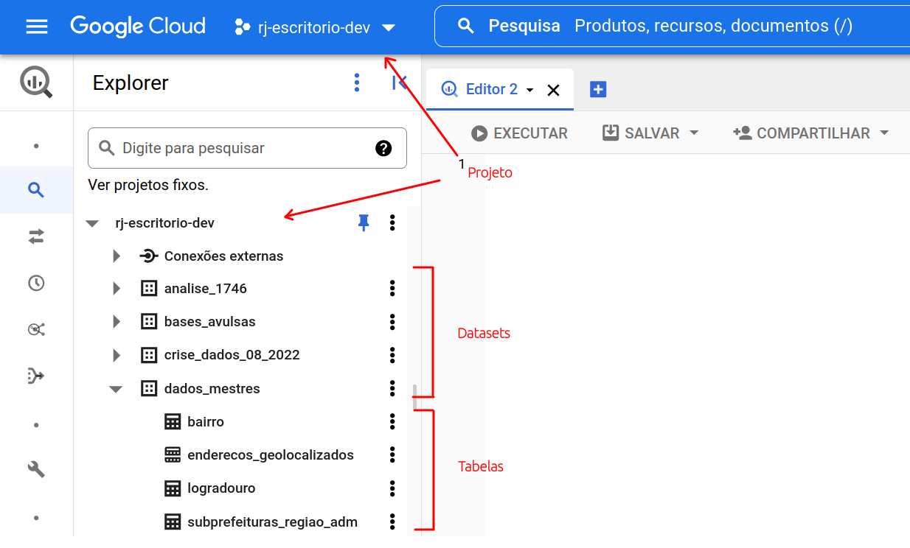
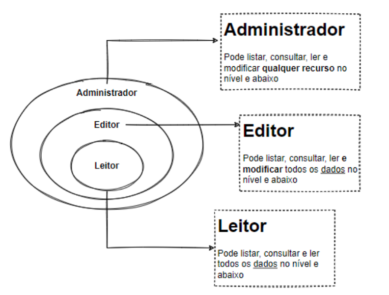
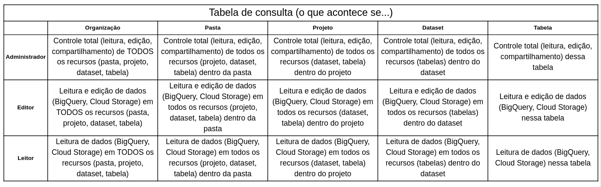
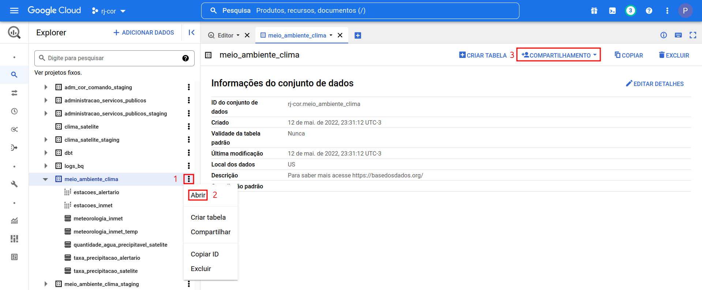
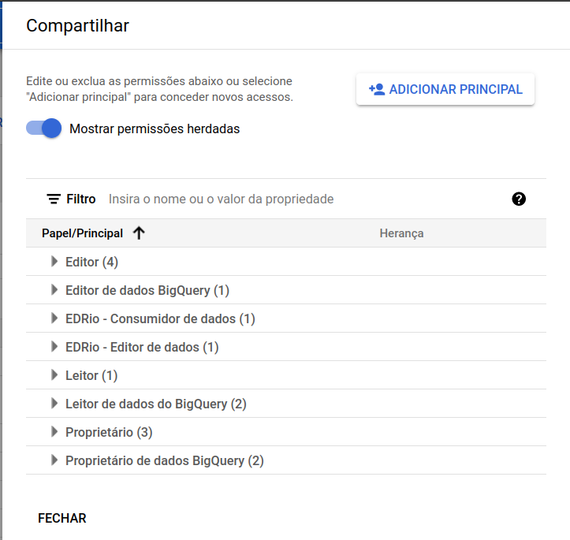
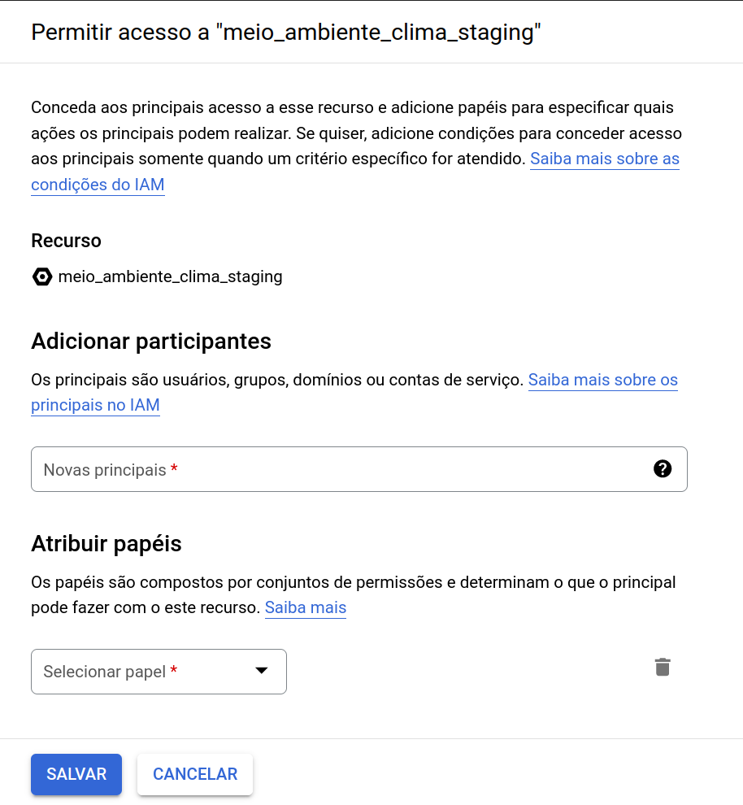
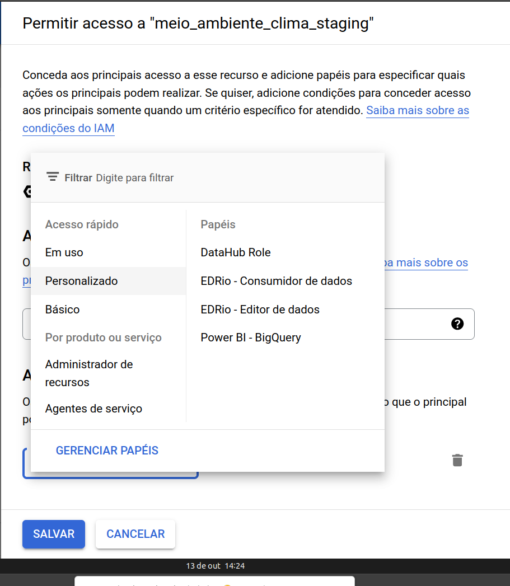

## Como compartilhar o acesso à uma base?

Se você é o ponto focal do seu órgão/secretaria e tem permissão de dar acesso às demais pessoas, se liga nesse tutorial que vamos te mostrar como fazer isso.

### Entendendo os diferentes papéis hierárquicos de acesso

Já sabemos que o BigQuery possui pelo menos três níveis de um conjunto de dados: o projeto (rj-escritorio-dev), dataset (dados_mestres) e tabela (logradouro).

{width=70%}

Agora precisamos saber que existem __três papéis principais__ que uma pessoa pode ter dentro do GCP:

- __Administrador:__ possuidor de super poderes dentro do GCP, esse papel pode conceder acesso às demais pessoas além de conseguir listar, consultar, ler e modificar qualquer recurso que esteja no seu nível e abaixo ao qual ele é administrador.
- __Editor:__ esse papel deixa de ter poder de dar permissões, mas ainda consegue listar, consultar, ler e modificar qualquer recurso que esteja no seu nível e abaixo ao qual ele é editor.
- __Leitor:__ nesse último caso, a pessoa perde o poder de editar os dados em relação ao papel de editor, mas consegue fazer as demais atividades que um editor consegue.

Exemplo: uma pessoa com papel de administradora do projeto "rj-escritorio-dev" terá controle total sobre tudo o que estiver disponibilizado dentro desse projeto recursivamente. Isso significa que ele consegue modificar desde pastas e projetos até as tabelas inseridas dentro dos projetos em que ele é administrador. Se essa pessoa for administradora somente de um determinado dataset (rj-escritorio-dev.dados_mestres), ela não terá permissão de modificar nem visualizar outros datasets dentro do projeto "rj-escritorio-dev".

{width=40%}

Para entender melhor o papel de cada um dos níveis hierárquicos e seus poderes em cada um dos níveis dos conjuntos de dados, montamos a tabela resumo a seguir:

{width=100%}

No GCP o papel de "Administrador" é equivalente ao papel de "Proprietário".

Agora sim podemos aprender a como dar permissão de acesso à uma pessoa!

### Compartilhando acesso a um dataset

Existem várias formas de conceder acesso dentro do GCP. Aqui iremos descrever apenas uma.

Dentro do BigQuery clique nos três pontinhos verticais e em seguida em "Abrir". Ná página com as informações do conjunto de dados clique em "Compartilhamento".

{width=90%}

Uma aba será aberta com os papéis disponibilizados. Agora clique em "Adicionar principal".

{ width=40% }

Uma nova aba será aberta com as opções de permissão de acesso. Preencha o e-mail que a pessoa utilizará para entrar o GCP no box "Novas principais" e, em seguida, selecione o papel dessa pessoa no box de "Atribuir papéis".

{ width=40% }

Selecione os papéis para essa pessoa de acordo com o nível de acesso que ela deve ter considerando tanto as permissões nas tabelas do BigQuery quanto no Storage.

{ width=40% }

Atualmente, temos que conceder dois acessos para os seguintes papéis:

- Papel de Leitor:
    - Em Personalizado clique em "EDRio - Consumidor de dados"
    - Em "Básico" clique em "Leitor"
- Papel de Editor:
    - Em Personalizado clique em "EDRio - Editor de dados"
    - Em "Básico" clique em "Editor"

Reforçando que esses papéis podem ser dados a nível de projeto, dataset e tabela.

### Bibliografia
[Entender a hierarquia de recursos do GCP](https://cloud.google.com/iam/docs/overview?hl=pt-br#resource-hierarchy)