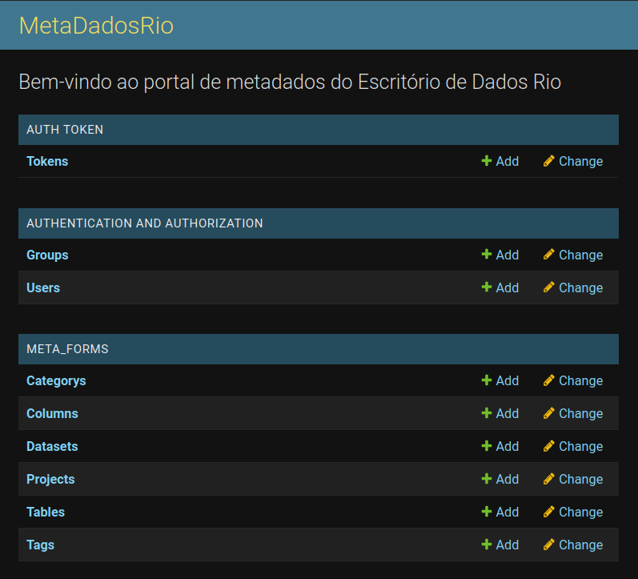
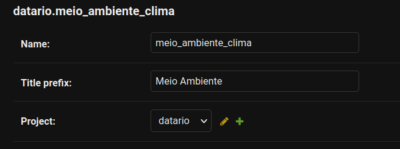
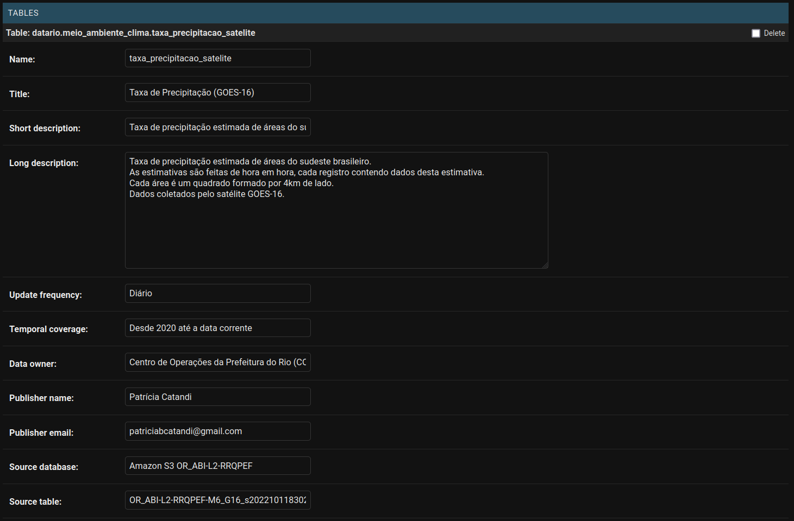
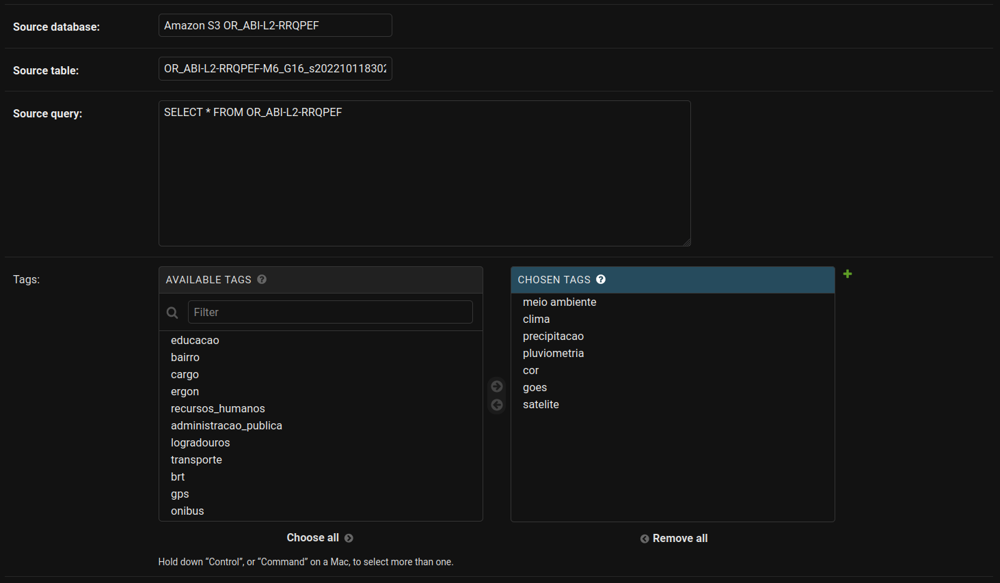
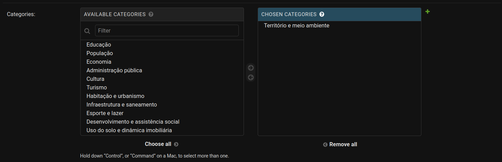
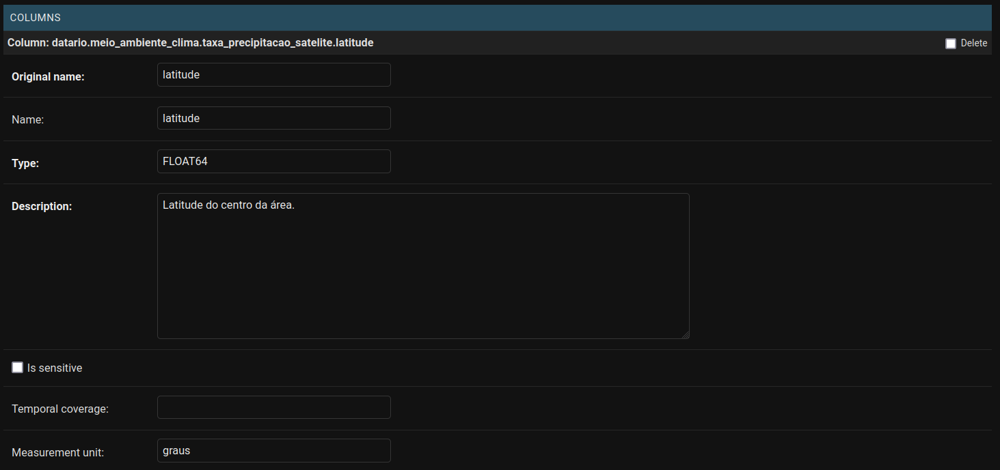
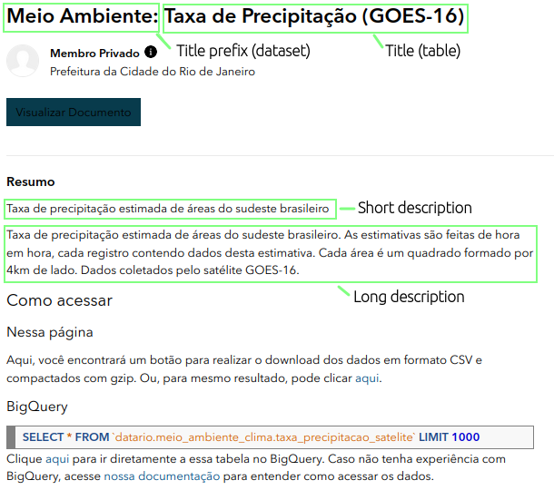
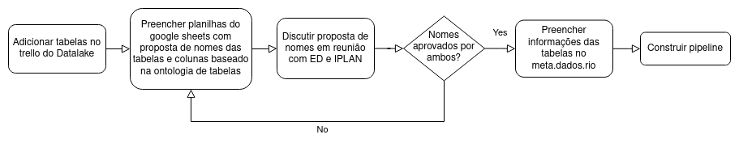

# Metadados, padronização e normalização

## Como estão estruturados os dados no ED?

A estrutura de dados utilizada segue a mesma hierarquia do BigQuery com project no nível mais alto, seguido de dataset e table.

Todo conjunto de dados terá obrigatoriamente 3 níveis de identificação sendo os dois primeiros para definir o nome do dataset_id e o último para definir o nome da tabela:

| objeto     | formato                                                                     | exemplo                    |
| ---------- | --------------------------------------------------------------------------- | -------------------------- |
| dataset_id | <primeiro_nivel\>\_<segundo_nivel\>\_<area ou tipo do conjunto (opcional)\> | meio_ambiente_clima        |
| table_id   | <nome da tabela\>                                                           | taxa_precipitacao_satelite |

Nesse nosso caso em que temos uma tabela que contém informações sobre a quantidade de precipitação obtida por satélite a nomenclatura para acessarmos os dados dentro de um determinado projeto seria _meio_ambiente_clima.taxa_precipitacao_satelite_ onde _meio_ambiente_ se refere ao primeiro nível, _clima_ ao segundo e _taxa_precipitacao_satelite_ é o nome da tabela que corresponde ao terceiro nível.

## Quais as melhores práticas na criação das tabelas?

### Nome do dataset_id e table_id

Para nomeação de objetos no datalake seguimos as melhores práticas detalhadas do Vocabulário Controlado de Governo Eletrônico - Ministério do Planejamento (VCGE).
Para saber quais as possibilidades de nomeação acesse essa [tabela](https://docs.google.com/spreadsheets/d/1qcQjxhrWEkhQbG2tIag_fWx2vxtsktKtzB1hs4tUTvc/edit?usp=sharing).

**Restrições:**

- Ter sempre 2 níveis de identificação do dado: dataset_id (nome do conjunto) + table_id (nome da tabela)
- Ter todas letras minúsculas (inclusive siglas), sem acentos, conectados por \_
- Não incluir conectores como de, da, dos, e, a, em, etc.
- Sempre que possível utilizar singular
- Não é permitida alteração do primeiro nível do VCGE.
- Não deve ser utilizado como segundo nível “Outros…”. Caso a categoria do seu conjunto não se encaixe em nenhuma das opções, é permitida a sugestão de novos termos desde que aprovado na reunião de Gestão do Datalake. (ex: administracao_processo).
- Nenhuma palavra deve ser repetida no dataset*id ou tabel_id (ex: educacao_basica.turmas deve ser usado, e não educacao_educacao*…)
- O dataset_id pode ser ser nomeado como "dados_mestres", não seguindo o VCGE, caso a tabela em questão seja uma referência para outras tabelas de outros sistemas incluídos no datalake.

**Referências:**

- [Manual de estilo e diretrizes de dados - Documentação (Base dos Dados)](https://basedosdados.github.io/mais/style_data/)
- [Ontologia SMTR](https://github.com/RJ-SMTR/maestro/wiki/Ontologia-de-nomea%C3%A7%C3%A3o-Datasets-e-Tabelas)
- [VCGE](https://www.gov.br/governodigital/pt-br/governanca-de-dados/vocabulario-controlado-do-governo-eletronico) | [VCGE versão resumida](https://www.gov.br/governodigital/pt-br/governanca-de-dados/vcge_2_1_0.pdf) | [VCGE versão detalhada](https://www.gov.br/governodigital/pt-br/governanca-de-dados/vcge_2_1_0_det.pdf)

### Nome e ordem das colunas

O nome e a ordem das colunas tem que respeitar o mesmo padrão descrito nas partes "Nomeação de variáveis" e "Ordenamento de variáveis" do [Manual de estilo e diretrizes de dados - Documentação (Base dos Dados)](https://basedosdados.github.io/mais/style_data/)

### Conteúdo das variáveis

Sobre o conteúdo das colunas deve-se respeitar o mesmo padrão descrito nas partes "Tipos de Variáveis", "Limpando STRINGs", "Formatos de valores" e "Quais variáveis manter, quais adicionar e quais remover" do [Manual de estilo e diretrizes de dados - Documentação (Base dos Dados)](https://basedosdados.github.io/mais/style_data/)

### Particionamento

Tabelas grandes ou com grande potencial de crescimento devem ser particionadas a fim de melhorarmos o desempenho de consulta e reduzir os custos.

Em geral, o particionamento é feito sobre o valors de uma data criando-se três colunas novas cujos nomes são dados por: `ano_particao`, `mes_particao`, `data_particao` e que possuem os respectivos formatos 'YYYY', 'MM', 'YYYY-MM-DD'.

**Datas nulas em coluna de particionamento** - caso a coluna utilizada para particionamento seja nula, preencher esses valores pela Unix epoch (1 de janeiro de 1970).

Em caso de necessidade de particionamento por outra coluna consultar o tópico "Particionamento de tabelas" no [Manual de estilo e diretrizes de dados - Documentação (Base dos Dados)](https://basedosdados.github.io/mais/style_data/).

## O que são Metadados e para o que servem?

Metadados são informações utilizadas para descrever tanto sobre do que se trata a tabela em específico quanto para descrever em profundidade o que são cada uma das suas colunas. Eles servem para facilitar o entendimento e a utilização dos dados.
Dessa forma, para cada tabela criada precisamos especificar através dos metadados o que cada coluna significa e o seu formato.

Aqui no Escritório de Dados armazenamos os seguintes campos no metadados:

- A nível de tabela:
  - descrição geral sobre o que são os dados;
  - tags que ajudam a encontrar a tabela;
  - categoria da tabela;
  - orgão da prefeitura de origem dos dados;
  - quem é a pessoa responsável pela publicação;
  - frequência de atualização da tabela;
  - entre outros...
- A nível de coluna:
  - descrição de cada uma das colunas
  - formato em que os dados estão salvos
  - unidade de medida (se necessário)
  - flag se a coluna tem dados sensíveis

E essas informações estão salvas no [meta.dados.rio](https://meta.dados.rio/admin).

## meta.dados.rio

O [meta.dados.rio](https://meta.dados.rio/admin) é o nosso repositório oficial de metadados.

Os valores a serem preenchidos em cada campo devem ter sido validados por um profissional da IPLAN. Para mais detalhes olhar a documentação sobre o "Fluxo de Aprovação" descrito nesse tutorial.

### Como criar uma conta/ acessar?

### Como preencher?

Toda vez que criamos uma tabela nova precisamos entrar no meta.dados.rio e preencher os campos de `Datasets` (caso ele não exista), `Projects` (caso ele não exista) e `Tables`.

Dentro de `Datasets` podemos criar um dataset_id novo utilizando o botão `ADD Dataset` ou modificar alguma coisa ao clicar no nome do nosso dataset de interesse.

As principais informações que precisamos preencher sobre o dataset são:

- Name: qual o nome desse dataset. Tem que ser o mesmo nome definido no BigQuery.
- Title prefix: prefixo que aparecerá na frente do nome de cada tabela no [data.rio](https://www.data.rio)
- Project: qual o nome do projeto que ele pertence dentro do BigQuery. Para ter essa tabela publicada no [data.rio](https://www.data.rio) é necessário setar esse valor para 'datario'.

Para preencher as informações sobre a tabela criada podemos continuar no mesmo link do `Dataset` ou entrar na página `Tables`. Aqui, os campos a serem preenchidos são:

- Name: nome da tabela. Tem que ser o mesmo nome definido no BigQuery.
- Title: o título da tabela que irá aparecer no [data.rio](https://www.data.rio) após o prefixo definido no dataset.
- Short description: resumo sobre os dados disponibilizados nessa tabela.
- Long description: descrição detalhada sobre os dados disponibilizados nessa tabela (limite de 200 caracteres).
- Update frequency: qual é a frequência de atualização desses dados (Anual, Mensal, Semanal, Diária, Nunca).
- Temporal coverage: qual a última data de atualização (ex: Até data corrente).
- Data owner: Órgão responsável pela criação e disponibilização dos dadaos.
- Publisher name: Nome da pessoa responsável pelo pipeline dos dados.
- Publisher email: E-mail da pessoa responsável pelo pipeline dos dados.
- Source database: Base de dados de origem.
- Source table: Nome da tabela de origem dos dados.
- Source query: Query utilizada na extração dos dados.
- Tags: Tags para facilitar a busca desses dados no [data.rio](https://www.data.rio). As tags obrigatórias estão relacionadas ao orgão que disponibilizou os dados (Ex: cor, alertario, sme, ...), sistema que originou os dados (Ex: comando), sinônimos, nome do dataset*id e table_id. As tags devem ser escritas em minúsculo, sem acentos e o espaçamento de palavras dado por *. Automaticamente são geradas as tags: escritorio_de_dados, datalake
- Categories: selecionar quais categorias se adequam aos seus dados.

Já para o preenchimento dos metadados das colunas os campos obrigatórios são:

- Original name: nome original da coluna. Tem que ser o mesmo nome definido no BigQuery.
- Name: nome que irá aparecer no [data.rio](https://www.data.rio).
- Type: se essa coluna é um INTEGER, FLOAT, DATE, DATETIME ou STRING.
- Description: Descrição detalhada do que representa essa coluna.
- Is sensitive: se essa coluna possui um dado sensível que não deve ser publicado.
- Measurement unit: unidade do dado (se fizer sentido).

### Onde ficam disponibilizadas as informações preenchidas?

Quando o projeto selecionado é o `datario`, os metadados são disponibilizados no [data.rio](https://www.data.rio).

Nas figuras abaixo é possível verificar como ficaram os metadados dentro do [data.rio](https://www.data.rio) com destaque para os campos _Title prefix_, preenchido nas informações do dataset, _Title_, _Short_ e _Long_ description que são preenchidos nas informações da tabela.

## Fluxo de Aprovação

Antes de começar a construção do pipeline de dados é fundamental que tenhamos definidos quais serão os nomes do dataset, tabela e de cada uma das colunas.

Para garantir que todas as nomenclaturas estejam de acordo com o padrão pré-definido, precisamos que cada tabela criada no data lake passe por um fluxo de aprovação.

Esse fluxo inicia-se criando um card para cada uma das tabelas dentro do [Trello do Data Lake](https://trello.com/b/UwQB6YSJ/datalake-bases). Nesse Trello faremos o acompanhamento para todas as etapas de produtização dos dados.

Em seguida, deve-se criar uma pasta (se ela não existir) dentro da pasta "Bases" com o nome do seu dataset e copiando a mesma estrutura de arquitetura presente no [template](https://docs.google.com/spreadsheets/d/1fkeJyFbp95lkDjZ84CTNF6TB8Uc-rb9B/edit?usp=sharing&ouid=110461902090406283473&rtpof=true&sd=true). Nesse template, você deve preencher ambas as abas com as informações solicitadas, lembrando que os nomes devem seguir o padrão definido na [Ontologia das Bases](https://docs.google.com/spreadsheets/d/12A6NWEAPtYnFkeIMbBNSeq04PLSQJhPa4HIwaDXAo3I/edit?usp=sharing).

Os dados preenchidos devem ser validados em reunião com membros da IPLAN e do Escritório de Dados. [Aqui](https://docs.google.com/spreadsheets/d/1SrWMDLAL0eB4W1lfkHR0eBRMaEbdLBlA/edit?usp=sharing&ouid=110461902090406283473&rtpof=true&sd=true) temos como exemplo o preenchimento das informações da tabela de logradouros.

Se tudo estiver aprovado, as mesmas informações da planilha do Google Sheets devem ser preenchidas no site do [meta.dados.rio](https://meta.dados.rio/admin) conforme explicitado anteriormente.

E, por fim, pode-se dar início a construção do pipeline! 

