Agora que já vimos como criar um _Flow_ e executá-lo, vamos dar o próximo passo e integrar nosso desenvolvimento ao [repositório de pipelines](https://github.com/prefeitura-rio/pipelines)!


## O repositório de pipelines

O [repositório de pipelines](https://github.com/prefeitura-rio/pipelines) possui várias funcionalidades que vão auxiliar no desenvolvimento, integração, garantia de qualidade de código e deploy dos _Flows_.


### Adicionando dependências

Para começar, precisamos seguir alguns breves passos.

1 - Crie uma pasta no seu computador no qual ficarão armazenados todos os repositórios da prefeitura

2 - Dentro dessa pasta vamos criar um ambiente virtual em python, mais conhecido como venv. Esse ambiente virtual serve para separarmos as bibliotecas e versões dessas que são exclusivas à esse projeto e evita que tenhamos problema de conflito entre elas. Para esse passo é necessário que você acesse essa pasta utilizando um terminal. Agora, basta escrever `python3.9 -m venv <nome_da_sua_venv` e aguardar a finalização do comando. O python irá criar uma pasta com o nome da sua venv. Toda vez que for rodar e testar suas pipelines, você deve ativar sua venv. Para ativá-la você deve entrar na mesma pasta em que você estava na criação da venv e pelo terminal digitar `source <nome_da_sua_venv/bin/activate` caso esteja em máquina linux ou mac. No windows, o comando é `<nome_da_sua_venv/Scripts/activate`. Repare que agora o ínicio da linha do seu terminal terá o nome da sua venv. É assim que você saberá que está com ela ativada. Para desativar, digite `deactivate` no terminal. Você pode ter quantas venvs quiser no seu computador. Para saber mais, acesse a [documentação oficial](https://docs.python.org/pt-br/3/library/venv.html).

3 - Se você ainda não realizou o `git clone` do [repositório](https://github.com/prefeitura-rio/pipelines) de `pipelines` da prefeitura, esse é o momento!

4 - Antes de começar a criar seu pipeline, verifique que você está na master e utilize o comando `git checkout -b staging/<nome_branch>` para criar uma nova branch a partir dela. É muito importante que o nome da sua branch inicie com "staging/" para que você consiga testar seu flow na cloud.

Neste tutorial focaremos em como rodar o prefect usando a cloud. Caso queira rodar local você deve seguir também os passos descritos no README do repositório de pipelines.


### Estrutura de diretórios

Todos os diretórios seguem uma estrutura padrão, demonstrada e comentada abaixo:

```
orgao/                       # diretório raiz para o órgão
├── projeto1/                # diretório de projeto
│   ├── __init__.py          # vazio
│   ├── constants.py         # valores constantes para o projeto
│   ├── flows.py             # declaração dos flows
│   ├── schedules.py         # declaração dos schedules
│   ├── tasks.py             # declaração das tasks
│   └── utils.py             # funções auxiliares para o projeto
...
├── __init__.py              # importa todos os flows de todos os projetos
├── constants.py             # valores constantes para o órgão
├── flows.py                 # declaração de flows genéricos do órgão
├── schedules.py             # declaração de schedules genéricos do órgão
├── tasks.py                 # declaração de tasks genéricas do órgão
└── utils.py                 # funções auxiliares para o órgão

orgao2/
...

utils/
├── __init__.py
├── flow1/
│   ├── __init__.py
│   ├── flows.py
│   ├── tasks.py
│   └── utils.py
├── flows.py                 # declaração de flows genéricos
├── tasks.py                 # declaração de tasks genéricas
└── utils.py                 # funções auxiliares

constants.py                 # valores constantes para todos os órgãos
```


### Constantes globais e locais :information_source:

Para facilitar a troca de certos parâmetros e o reaproveitamento de códigos, temos como boa prática um arquivo específico para salvarmos nossas variáveis. Aqui no ED vamos classificar nossos arquivos de constantes em dois tipos: globais e locais.

As **constantes locais** são todas aquelas que são específicas para um determinado flow (ou projeto). Elas ficam armazenadas em um arquivo `constants.py` no mesmo diretório do seu `flow.py` (ou do projeto no qual vocês está trabalhando). Em geral, criamos nesse arquivo uma classe `constants` que contém o `DATASET_ID` e `TABLE_ID` que serão utilizados para gravar os dados finais do flow no GCP, entre outras coisas que você julgar importante.

```python
from enum import Enum

class constants(Enum):  # pylint: disable=c0103
    """
    Constant values for the geolocator project
    """

    PATH_BASE_ENDERECOS = "/tmp/base_enderecos.csv"
    DATASET_ID = "dados_mestres"
    TABLE_ID = "enderecos_geolocalizados"
```

Já as **constantes globais** se referem as constantes que são comuns a todos os flows dentro do repositório de _pipelines_. Nesse arquivo você encontrará os valores de variáveis como os Agents, variáveis do docker, entre outras. Dificilmente você precisará alterar esse arquivo, e quando precisar fazê-lo tome muito cuidado. Uma mudança nele impacta todos os demais flows desse repositório.

## Trabalhando com pipelines na Cloud

Agora que conhecemos o repositório de pipelines, vamos trabalhar com eles na Cloud. Isso envolve várias etapas, que serão detalhadas a seguir.

### Como nomear _Flows_

Um dos primeiros passos no desenvolvimento de uma pipeline é a definição de seu nome. Para mantermos a organização e facilitar a busca das pipelines no prefect definimos algumas regras de nomeação;

O nome da pipeline deve seguir o modelo: `<sigla_orgao_maiuscula>: <descricao_curta> - <descricao_longa>`

- **sigla_orgao_maiuscula**: sigla do orgão em letras maiúsculas; EMD, SME, SMS, SEGOVI
- **descricao_curta**: Breve descrição da pipeline podendo ser um dataset_id, sistema, entre outros. Reservamos **template** para pipelines que podem ser reutilizadas e que normalmente ficam na pasta utils
- **descricao_longa**: Descrição mais completa do que a pipeline faz

Alguns exemplos: **SEGOVI: 1746 - Ingerir tabelas de banco SQL**, **EMD: template - Ingerir tabela de banco SQL**, **EMD: template - Executa DBT model**

Normalmente quando queremos reutilizar uma pipeline é necessário que o nome dela seja declarado em um arquivo constants.py que permite referenciar ela em outras partes do código. Podemos ver um exemplo dessa pratica nas pipelines que estão na pasta [pipelines/utils](https://github.com/prefeitura-rio/pipelines/tree/b944967e5f7953cb9b8ac040bd3ccf22a339ca4d/pipelines/utils) e tem seus nomes definidos no arquivo [constants.py](https://github.com/prefeitura-rio/pipelines/blob/b944967e5f7953cb9b8ac040bd3ccf22a339ca4d/pipelines/utils/constants.py).

## Desenvolvendo um _Flow_ para a Cloud

Nesse tutorial vamos mostrar apenas duas das formas de pipelines que podemos montar: criando seu próprio flow e utilizando flows pré-definidos

### Criando um flow do zero

Agora podemos começar a desenvolver nosso primeiro _Flow_ para a cloud. Para isso, vamos reaproveitar o código implementado no tutorial anterior.

Seguindo a estrutura de diretórios, podemos criar um novo diretório, chamado `formacao`, dentro da pasta `pipelines`. Dentro dele, vamos criar um arquivo `__init__.py`, para indicar que o diretório se trata de um submódulo do projeto. Então, nesse momento, a estrutura está assim:

```
formacao/
└── __init__.py
```

Então, vamos criar um novo diretório chamado `exemplo`, dentro do diretório `formacao`. Dentro dele, vamos criar um arquivo `__init__.py`, para indicar que o diretório se trata de um submódulo do projeto. Então, nesse momento, a estrutura está assim:

```
formacao/
├── __init__.py
└── exemplo/
    └── __init__.py
```

Dentro do diretório `exemplo`, então, vamos criar nossas _tasks_ e o _Flow_. Para isso, vamos criar um arquivo `tasks.py`, que conterá as _tasks_ que serão utilizadas no _Flow_, e um arquivo `flows.py`, que conterá o _Flow_ em si. Então, a estrutura está assim:

```
formacao/
├── __init__.py
└── exemplo/
    ├── __init__.py
    ├── flow.py
    └── tasks.py
```

Se você se recorda bem, no tutorial anterior, havíamos criado um arquivo `utils.py` para conter nossa função de log. No entanto, no repositório de pipelines essa função já existe e pode ser importada de `pipelines.utils.utils`. Então, vamos escrever o arquivo `tasks.py` da seguinte forma:

```python
# -*- coding: utf-8 -*-
"""
Tasks for the example flow
"""
from io import StringIO

import pandas as pd
from prefect import task
import requests

from pipelines.utils.utils import log

@task
def download_data(n_users: int) -> str:
    """
    Baixa dados da API https://randomuser.me e retorna um texto em formato CSV.

    Args:
        n_users (int): número de usuários a serem baixados.

    Returns:
        str: texto em formato CSV.
    """
    response = requests.get(
        "https://randomuser.me/api/?results={}&format=csv".format(n_users)
    )
    log("Dados baixados com sucesso!")
    return response.text

@task
def parse_data(data: str) -> pd.DataFrame:
    """
    Transforma os dados em formato CSV em um DataFrame do Pandas, para facilitar sua manipulação.

    Args:
        data (str): texto em formato CSV.

    Returns:
        pd.DataFrame: DataFrame do Pandas.
    """
    df = pd.read_csv(StringIO(data))
    log("Dados convertidos em DataFrame com sucesso!")
    return df

@task
def save_report(dataframe: pd.DataFrame) -> None:
    """
    Salva o DataFrame em um arquivo CSV.

    Args:
        dataframe (pd.DataFrame): DataFrame do Pandas.
    """
    dataframe.to_csv("report.csv", index=False)
    log("Dados salvos em report.csv com sucesso!")
```

**Obs:** esse `# -*- coding: utf-8 -*-` no início do arquivo é para indicar que o arquivo está em UTF-8. Isso é necessário para que o Python consiga ler corretamente os caracteres especiais, como acentos, caso existam. Isso é uma forma de manter uma boa consistência em nossa base de código, dentre outras boas práticas que são adotadas para esse repositório.

Agora, vamos escrever o arquivo `flows.py` da seguinte forma:

```python
# -*- coding: utf-8 -*-
"""
Example flow
"""
from prefect import Parameter
from prefect.run_configs import KubernetesRun
from prefect.storage import GCS

from pipelines.constants import constants
from pipelines.formacao.exemplo.tasks import download_data, parse_data, save_report
from pipelines.utils.decorators import Flow

with Flow("EMD: formacao - Exemplo de flow do Prefect") as formacao_exemplo_flow:
    # Parâmetros
    n_users = Parameter("n_users", default=10)

    # Tasks
    data = download_data(n_users)
    dataframe = parse_data(data)
    save_report(dataframe)

formacao_exemplo_flow.storage = GCS(constants.GCS_FLOWS_BUCKET.value)
formacao_exemplo_flow.run_config = KubernetesRun(
    image=constants.DOCKER_IMAGE.value,
    labels=[constants.RJ_COR_AGENT_LABEL.value],
)
formacao_exemplo_flow.schedule = None
```

Opa, opa, opa! Bastante coisa nova por aqui, não é mesmo? Vamos entender o que está acontecendo:

- Estamos importando duas coisas novas aqui, o `KubernetesRun` e o `GCS`. O `KubernetesRun` é um _run config_ que indica que o _Flow_ deve ser executado em um cluster Kubernetes (que, em nosso caso, é onde os _agents_ do Prefect estão hospedados. Caso não recorde o que são _agents_, retorne à [Visão geral da infraestrutura](/guia-desenvolvedores/visao-geral-infra/)). O `GCS` é um _storage_ que indica que o _Flow_ deve ser armazenado no Google Cloud Storage. Essas duas coisas são necessárias para que o _Flow_ seja executado em nosso servidor do Prefect, na nuvem.

- Estamos importando, também, um tal de `constants`. Esse é um objeto que contém diversos valores constantes que utilizamos de forma compartilhada em várias pipelines. Nesse caso, em especial, estamos importando para utilizar os valores `GCS_FLOWS_BUCKET`, que é o nome do bucket do GCS onde os _Flows_ são armazenados, o `DOCKER_IMAGE`, que é a imagem Docker que contém o ambiente de execução do Prefect (essa imagem é construída a partir do arquivo `Dockerfile` que está no repositório de pipelines), e o `RJ_COR_AGENT_LABEL`, que é o nome do _label_ que os _agents_ do Prefect devem ter para que o Prefect consiga identificar onde a pipeline deve ser executada.

- Por fim, importamos também o `Flow`, que já conhecíamos do tutorial anterior. Porém, esse é uma versão modificada por nós, do Escritório de Dados, que adiciona algumas funcionalidades que julgamos importantes.

- Após a definição do _Flow_, que foi idêntica à do tutorial anterior, temos que configurar os valores de _storage_, _run config_ e _schedule_. Essas três coisas são necessárias para que o Prefect consiga executar o _Flow_ em nosso servidor do Prefect, na nuvem. Por enquanto, estamos atribuindo o valor nulo para o _schedule_, o que significa que o _Flow_ não será executado periodicamente. Para adicionar um _schedule_, teremos uma seção específica a seguir.

Agora que temos nosso _flow_ definido, precisamos garantir que ele seja encontrado na hora de registrar os _Flows_ no Prefect. Para isso, precisamos adicionar o seguinte no arquivo `pipelines/formacao/__init__.py`:

```python
# -*- coding: utf-8 -*-
"""
Prefect flows for formacao
"""
from pipelines.formacao.exemplo.flows import *
```

E, depois, no arquivo `pipelines/flows.py`, precisamos adicionar, ao final, o seguinte:

```python
from pipelines.formacao import *
```

E pronto! Está feito! Agora para registrar os _Flows_ e executá-los, continue lendo.

### _Flows_ pré-definidos

Hoje possuímos diversos _Flows_ pré-definidos, que são _Flows_ que já estão prontos para serem executados. Esses _Flows_ podem ser encontrados no diretório `pipelines/utils` e têm como objetivo introduzir templates de _Flows_ para tarefas que se repetem com frequência. Alguns exemplos de _Flows_ pré-definidos são:

- `dump_datario`: _Flow_ que extrai dados diretamente do [data.rio](https://data.rio) e gera uma tabela no BigQuery.
- `dump_db`: _Flow_ que extrai dados de um banco de dados SQL (no momento aceita Postgres, MySQL, SQL Server e Oracle) e gera uma tabela no BigQuery.
- `dump_to_gcs`: _Flow_ que consome uma tabela do BigQuery, gerando um CSV compactado no GCS.
- `dump_url`: _Flow_ que extrai dados de uma URL (pode ser um arquivo CSV, uma tabela no Google Sheets ou um arquivo no Google Drive) e gera uma tabela no BigQuery.
- `execute_dbt_model`: _Flow_ que executa um modelo do DBT para materialização de dados no BigQuery.

Esses são somente alguns exemplos do que existe hoje lá e a tendência é que novos _Flows_ sejam adicionados ao longo do tempo. Para saber mais sobre cada um deles e os parâmetros utilizados, entre em contato com o time do Escritório de Dados, será um prazer ajudar você!

### Utilizando _Flows_ pré-definidos

Uma prática muito importante quando estamos em um repositório colaborativo é a de reutilização de código. Sempre que possivel optamos por criar pipelines, tasks ou funções de forma modular para evitarmos a repetição do mesmo código em diferentes arquivos do repositório. 

Para reutilizar uma pipeline pré definida precisamos importar a pipeline original e fazer o [**deepcopy**](https://docs.python.org/3/library/copy.html) e seguir o template padrão para nomeação, definição de agent e scheduler. No exemplo abaixo vamos reutilizar uma adaptação do [_Flow_](https://github.com/prefeitura-rio/pipelines/tree/staging/dump_url_formacao/pipelines/utils/dump_url_formacao) que extrai dados de uma URL (pode ser um arquivo CSV, uma tabela no Google Sheets ou um arquivo no Google Drive) e gera uma tabela no BigQuery.

> Importante lembrar de adicionar o novo flow no `__init__.py` na raiz da pasta do orgão.

```python
# -*- coding: utf-8 -*-
"""
Database dumping flows for formation project
"""

from copy import deepcopy

from prefect.run_configs import KubernetesRun
from prefect.storage import GCS

from pipelines.constants import constants

from pipelines.rj_escritorio.dump_url_formacao.schedules import gsheets_one_minute_update_schedule
from pipelines.utils.dump_url_formacao.flows import dump_url_flow
from pipelines.utils.utils import set_default_parameters

formacao_gsheets_flow = deepcopy(dump_url_flow)
formacao_gsheets_flow.name = "EMD: Formação GSheets - Ingerir tabelas de URL"
formacao_gsheets_flow.storage = GCS(constants.GCS_FLOWS_BUCKET.value)
formacao_gsheets_flow.run_config = KubernetesRun(
    image=constants.DOCKER_IMAGE.value,
    labels=[
        constants.RJ_ESCRITORIO_DEV_AGENT_LABEL.value,
    ],
)

formacao_gsheets_flow_parameters = {
    "dataset_id": "test_formacao",
    "dump_mode": "overwrite",
    "url": "https://docs.google.com/spreadsheets/d/1uF-Gt5AyZmxCQQEaebvWF4ddRHeVuL6ANuoaY_-uAXE\
        /edit#gid=0",
    "url_type": "google_sheet",
    "gsheets_sheet_name": "sheet_1",
    "table_id": "test_table",
}

formacao_gsheets_flow = set_default_parameters(
    formacao_gsheets_flow, default_parameters=formacao_gsheets_flow_parameters
)

formacao_gsheets_flow.schedule = gsheets_one_minute_update_schedule

```

Abaixo temos um exemplo de scheduler para a pipeline mostrada anteriormente.


```python
# -*- coding: utf-8 -*-
"""
Schedules for the database dump pipeline
"""

from datetime import datetime, timedelta

import pytz
from prefect.schedules import Schedule
from pipelines.constants import constants
from pipelines.utils.dump_url.utils import generate_dump_url_schedules
from pipelines.utils.utils import untuple_clocks as untuple

#####################################
#
# EGPWeb Schedules
#
#####################################

gsheets_urls = {
    "test_table": {
        "dump_mode": "overwrite",
        "url": "https://docs.google.com/spreadsheets/d/1uF-Gt5AyZmxCQQEaebvWF4ddRHeVuL6ANuoaY_-uAXE\
            /edit#gid=0",
        "url_type": "google_sheet",
        "gsheets_sheet_name": "sheet_1",
    },
}


gsheets_clocks = generate_dump_url_schedules(
    interval=timedelta(minutes=1),
    start_date=datetime(2022, 10, 21, 15, 0, tzinfo=pytz.timezone("America/Sao_Paulo")),
    labels=[
        constants.RJ_ESCRITORIO_DEV_AGENT_LABEL.value,
    ],
    dataset_id="test_dataset_formacao",
    table_parameters=gsheets_urls,
)

gsheets_one_minute_update_schedule = Schedule(clocks=untuple(gsheets_clocks))

```

### Agendamento de _Flows_ :alarm_clock:

O prefect nos permite automatizar os horários que nosso flow irá rodar. O agendamento (scheduler) dos pipelines é especificado em um arquivo `scheduler.py` dentro do diretório relativo a esse flow.

Os flows têm dois principais tipos de agendamentos possíveis:

- `CronClock`, no qual você especifica os dias e horários que o pipeline irá rodar utilizando uma [string Cron](https://support-acquia.force.com/s/article/360004224494-Cron-time-string-format).

- `IntervalClock`, que faz com que o pipeline rode a cada x segundos.

No código abaixo, temos como exemplo um scheduler baseado no `IntervalClock` programado para rodar a cada 1 dia e com a data de início da automação para "2021-01-01 04:00:00" no timezone de São Paulo - BR. Assim que você subir esse código no github de staging ou master, o backend do prefect inicializará automaticamente esse flow todos os dias às 04:00 a partir de agora. Isso porque definimos o `start_date` para uma data do passado. Se quiser que o flow comece a rodar apenas a partir de uma data futura, basta indicá-la nesse campo.

Toda vez que vamos rodar um flow, precisamos especificar em qual _Agent_ ele irá rodar para que possamos realizar as divisões de custo da infraestrutura. Nesse caso, estamos importando o agente do arquivo `constants.py`

Por último, podemos definir alguns parâmetros defaults que serão utilizados dentro do flow. Neste caso, mantivemos a materialização das tabelas no BQ com o parâmetro _materialize_after_dump_ e definimos que essa materialização ocorra em ambiente dev utilizando o _materialization_mode_.

```python
# -*- coding: utf-8 -*-
"""
Este é um exemplo de um arquivo schedules.py
"""

from datetime import timedelta

import pendulum
from prefect.schedules import Schedule
from prefect.schedules.clocks import IntervalClock

from pipelines.constants import constants

# define o objeto every_day_at_four_am ao instanciar a classe Schedule
every_day_at_four_am = Schedule(
    clocks=[
        IntervalClock(
            interval=timedelta(days=1), # aqui definimos que o flow irá rodar a cada 1 dia
            start_date=pendulum.datetime(2021, 1, 1, 4, 0, 0, tz="America/Sao_Paulo"), # define qual em data o scheduler começa a funcionar, geralmente setamos uma no passado
            labels=[
                constants.RJ_ESCRITORIO_DEV_AGENT_LABEL.value, # define qual agent o flow deve utilizar
            ],
            parameter_defaults={
                "materialize_after_dump": True, # é possível setar parâmetros do flow pelo scheduler
                "materialization_mode": "dev",
            },
        )
    ]
)
```

Só criar o arquivo `schedules.py` não fará com que o backend do prefect inicialize a automação do flow. Precisamos indicar para esse determinado flow qual scheduler ele deve utilizar. Isso é feito dentro do arquivo `flows.py` .

```python
# importa o objeto every_day_at_four_am do arquivo schedules que se encontra no caminho pipelines.rj_escritorio.geolocator
from pipelines.rj_escritorio.geolocator.schedules import every_day_at_four_am

with Flow(
    "EMD: escritorio - Geolocalizacao de chamados 1746",
    code_owners=[
        "paty",
    ],
) as daily_geolocator_flow: # esse é o nome do nosso flow
    do_something()

daily_geolocator_flow.schedule = every_day_at_four_am # atribui o scheduler do flow ao que foi definido no arquivo schedules.py

```

Para saber mais sobre esse tema acesse a documentação oficial do prefect em [schedules](https://docs-v1.prefect.io/core/concepts/schedules.html#filters) e [clocks](https://docs-v1.prefect.io/api/latest/schedules/clocks.html#clock).

### Manutenção de qualidade de código

Para manter o código limpo, padronizado e compreensível para todos, utilizamos duas ferramentas: o `pylint` e o `pre-commit`.

O `pylint` é uma ferramenta de análise estática de código que nos ajuda a encontrar erros e padrões de código que podem ser melhorados. Ele é executado automaticamente quando você realiza um commit e, quando encontra algum erro, faz um comentário no seu PR indicando o que precisa ser corrigido. Um exemplo pode ser visto na imagem abaixo:

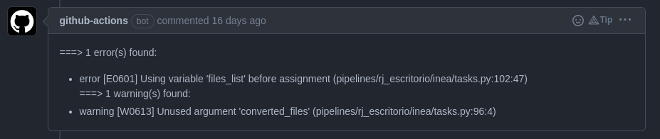

Nessa imagem, você pode notar que ele indica qual o erro encontrado e em qual linha do código ele ocorreu.

Você também pode executar o `pylint` localmente, para isso, basta executar o comando `pylint pipelines/` na raiz do projeto. Ele irá analisar todo o código e indicar os erros encontrados. Um exemplo de saída do comando pode ser visto abaixo:

```
************* Module pipelines.formacao.exemplo.tasks
pipelines/formacao/exemplo/tasks.py:43:4: C0103: Variable name "df" doesn't conform to snake_case naming style (invalid-name)

--------------------------------------------------------------------
Your code has been rated at 10.00/10 (previous run: 10.00/10, -0.00)
```

Para saber mais sobre o pylint, acesse a [documentação oficial](https://pylint.pycqa.org/en/latest/).

O `pre-commit` é uma ferramenta que permite realizar algumas ações antes do commit ser realizado. Essas ações podem ser configuradas conforme nossa necessidade. Para esse repositório, as ações que selecionamos foram:

- `check-added-large-files`: verifica se algum arquivo foi adicionado ao commit que ultrapasse o tamanho definido no arquivo `.gitattributes` (nesse caso, 10MB)
- `detect-private-key`: verifica se algum arquivo de chave privada foi adicionado ao commit (evita que chaves privadas sejam adicionadas ao repositório)
- `fix-byte-order-marker`: remove o byte order marker (BOM) de arquivos que possuam esse caractere
- `fix-encoding-pragma`: adiciona o pragma `# -*- coding: utf-8 -*-` nos arquivos que não o possuem
- `no-commit-to-branch`: impede que commits sejam realizados na branch `master`
- `trailing-whitespace`: remove espaços em branco no final das linhas
- `black`: formata o código utilizando o `black` (para saber mais sobre o `black`, acesse a [documentação oficial](https://black.readthedocs.io/en/stable/))
- `flake8`: verifica se o código está de acordo com o `flake8` (para saber mais sobre o `flake8`, acesse a [documentação oficial](https://flake8.pycqa.org/en/latest/))

Todas essas ações são realizadas automaticamente quando você realiza um commit (desde que corretamente configurado). De qualquer forma, caso um commit não atenda essas regras, o `pre-commit` irá fazer as correções que julgar adequadas diretamente no seu PR.

Para saber mais sobre o `pre-commit`, acesse a [documentação oficial](https://pre-commit.com/).

Por fim, mas não menos importante, temos também um utilitário customizado desenvolvido pelo Escritório de Dados que realiza a análise de árvore de dependências do código, alertando se as modificações que você introduziu no código podem afetar código de outras pessoas. Um exemplo pode ser visto na imagem abaixo:

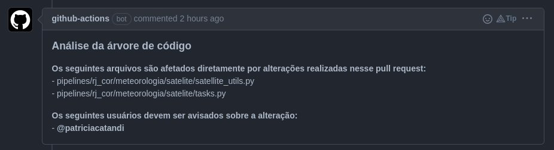

Como você pode ver, os usuários afetados por sua modificação são marcados diretamente no comentário.

### Gerenciamento de segredos :closed_lock_with_key:

:x: :skull_and_crossbones: :x: :skull_and_crossbones: :x: NUNCA, JAMAIS E EM HIPÓTESE ALGUMA :x: :skull_and_crossbones: :x: :skull_and_crossbones: :x: coloque senhas de acesso diretamente no seu código. Todo o gerenciamento de senhas é feito através do [Vault](https://www.vaultproject.io/). Para adicionar ou remover tokens, passwords, certificados, FTP e API keys peça ajuda ao @pipeliners nos canais do Discord do Escritório de Dados. O acesso ao Vault é restrito por conter muitas informações sensíveis.

Na imagem abaixo, temos um exemplo de como estão salvas as informações de acesso ao FTP da riomidia e como utilizamos esses dados no python. Nesse exemplo de código, utilizamos a função `get_vault_secret` para acessar as informações salvas com o nome de "riomidia". Note que as keys utilizadas dentro do dicionário têm os mesmos nomes definidos dentro do Vault.

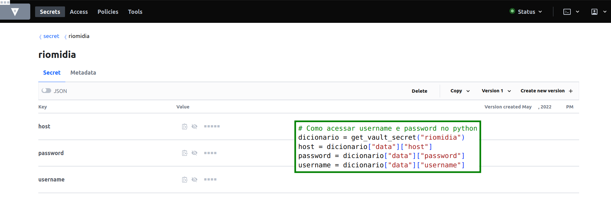{width=100%}

### Como testar pipelines em staging :wrench:

O teste do flow será feito diretamente na cloud utilizando o ambiente de staging. Para isso, é necessário que você esteja em uma branch cujo nome inicia-se com "staging/".

Crie um Pull Request (PR) e toda vez que você fizer um push para sua branch remota, o CI/CD do Github irá reconhecer o nome da branch e começará o deployment do seu código para a área de staging.

Para verificar o andamento do deploy você tem duas opções:

- pode acompanhar pela página de PR através do círculo que aparece na frente do nome do seu PR. ✅ significa que o deploy foi finalizado com sucesso, :x: o deploy teve algum problema e :orange_circle: que o processo ainda não foi finalizado.

{width=90%}

- ao entrar no PR é possível acompanhar o andamento de cada etapa e também do deploy. Aqui é possível verificar em qual etapa e qual foi o problema no deploy.

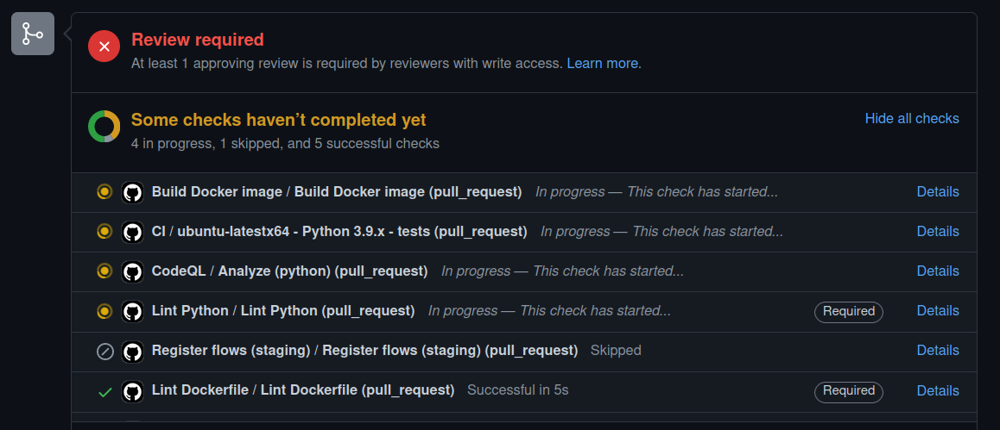{width=90%}

Quando a pipeline estiver finalizada e pronta para entrar na master, você precisa solicitar para alguém aprovar o seu PR. Com a aprovação, basta clicar no botão de merge e o CI/CD do Github começará o processo de deploy no ambiente de prod.

## Usando a UI do Prefect

É na [UI do Prefect](https://prefect.dados.rio/) que você conseguirá visualizar como está o andamento dos seus flows. Na imagem abaixo temos a tela de Dashboard do Prefect. Nessa primeira aba, temos uma visão geral de todos os pipelines. A caixa de "Run History" traz nas cores os status dos últimos flows rodados:

- :green_circle: sucesso
- :red_circle: falha
- :yellow_circle: agendados
- :black_circle: cancelados

Esse esquema de cores sera o mesmo para qualquer página do Prefect. 

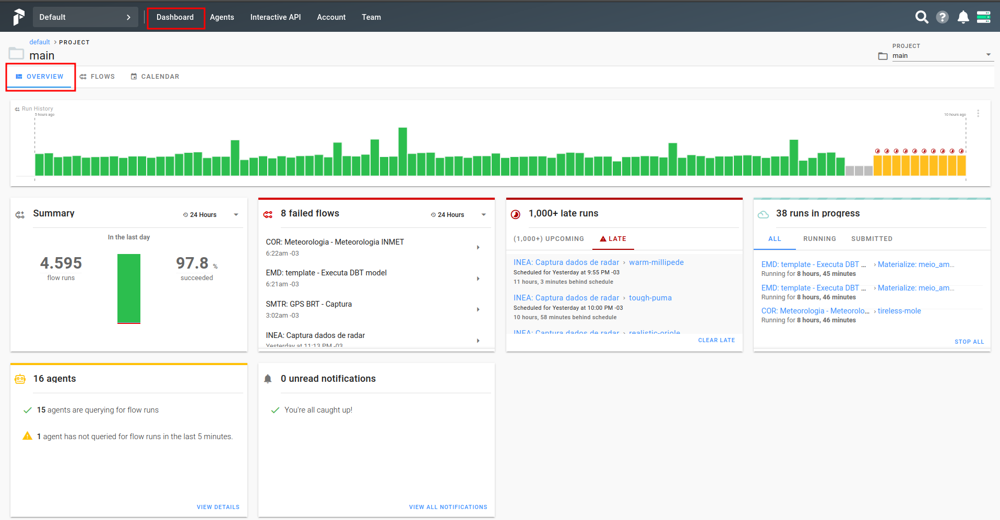{width=90%}

### Buscando um _Flow_

A aba que mais nos interessa é a de **Flows**. Nela temos uma visualização rápida em formato de tabela das últimas runs de cada um dos pipelines. Na coluna de nome aparece o parâmetro "name" que você colocou quando instânciou o Flow no arquivo flows.py. Na coluna de **Schedule** você pode ligar ou desligar um flow. Se ele estiver desligado, ele não rodará automaticamente. A coluna **Project** indica se esse flow está em prod (main) ou em staging. Os Flows que estão na branch master do Github sempre aparecerão no projeto main, enquanto as branchs que iniciam com "staging/" aparecerão no projeto staging. Para definir quais tipos de projetos visualizar, basta selecionar na caixa superior à direita destacada na figura. A coluna **Run History** apresenta o status das últimas runs de cada Flow.

Para buscar um flow utilize o campo de pesquisa à direita.

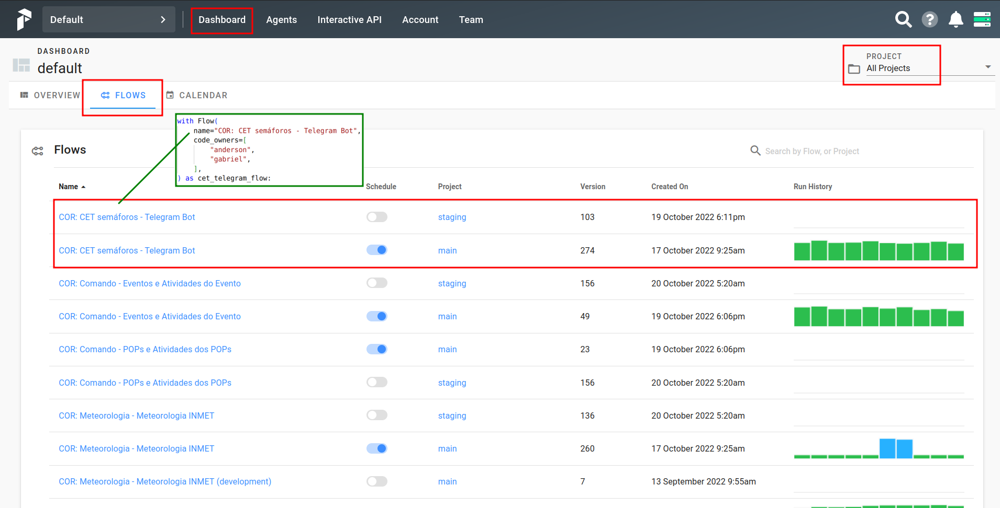{width=90%}

### Como visualizar um Flow

Para entrar em um flow específico, basta clicar em seu nome. Agora, é possível ver com mais detalhes as últimas runs e as que estão agendadas.

Temos quatro ações importantes nessa tela:

- Verificar qual versão do flow está rodando

- Verificar se o Schedule está ligado

- Executar o Flow

- Alterar parâmetros internos do Flow

- Acessar uma run específica: clique na barra referente à ela no "Run History" ou no nome dela em "Activity".

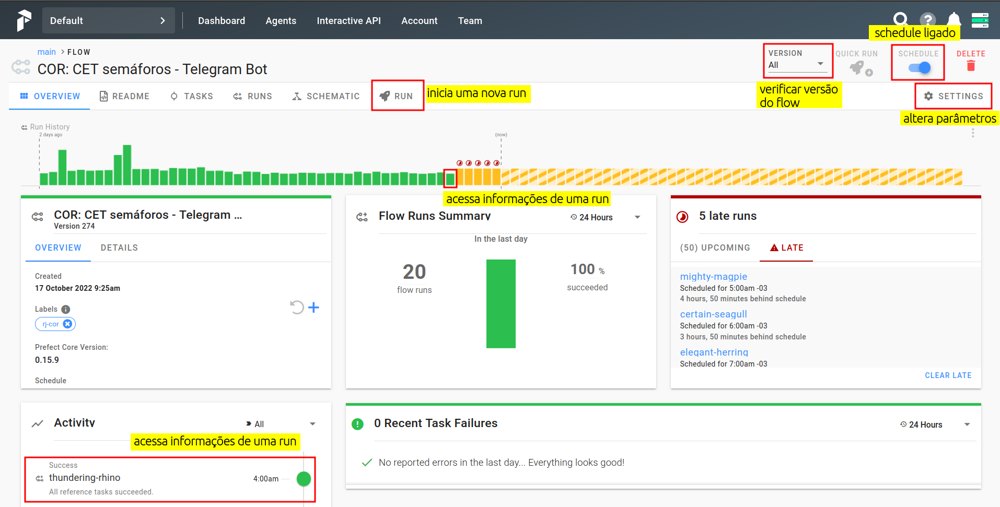{width=90%}

### Como executar um _Flow_

Para iniciar uma nova run no Flow, aperte o botão **Run** na página do flow. Nessa nova tela é possível:

- especificar um nome para a run, 

- preencher quais são os parâmetros específicos para essa run (no caso da imagem podemos especificar apenas o secret_path) e

- preencher em **Labels** quais são os **Agent** responsáveis por essa run.

Esse último tópico é extremamente importante, pois se adicionar um Agent que não tem permissão de acesso às tabelas a run não irá rodar com sucesso.

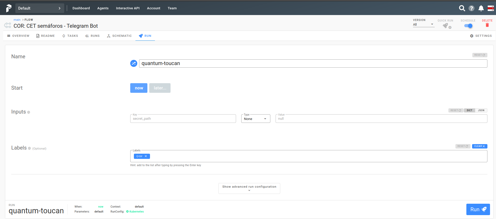{width=90%}

### Como alterar parâmetros

Para alterar os parâmetros de todas as próximas runs, entre no botão :gear: **Settings** da página do flow e depois entre na aba **Parameters**.

:warning: Os parâmetros adicionados aqui funcionarão para as próximas runs que ainda não foram scheduladas. Para que esses parâmetros passem a valer a partir do momento em que você o altera, é necessário DESLIGAR e RELIGAR o scheduler.

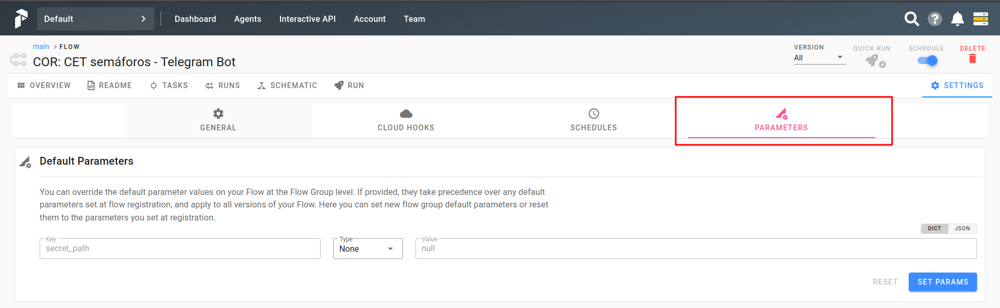{width=90%}

### Como visualizar uma Run :runner:

Agora você consegue visualizar o status de cada uma das tasks dessa run tanto em um gráfico do tipo Gant (em Timeline) quanto em formato de tabela com a data mais recente primeiro.

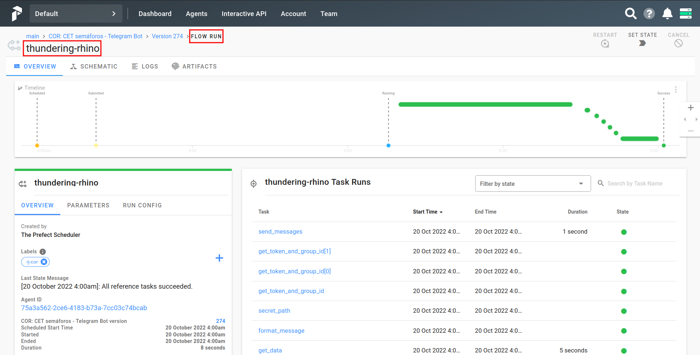{width=90%}

Na aba "Schematic" temos a representação em fluxo do pipeline e status de cada task.

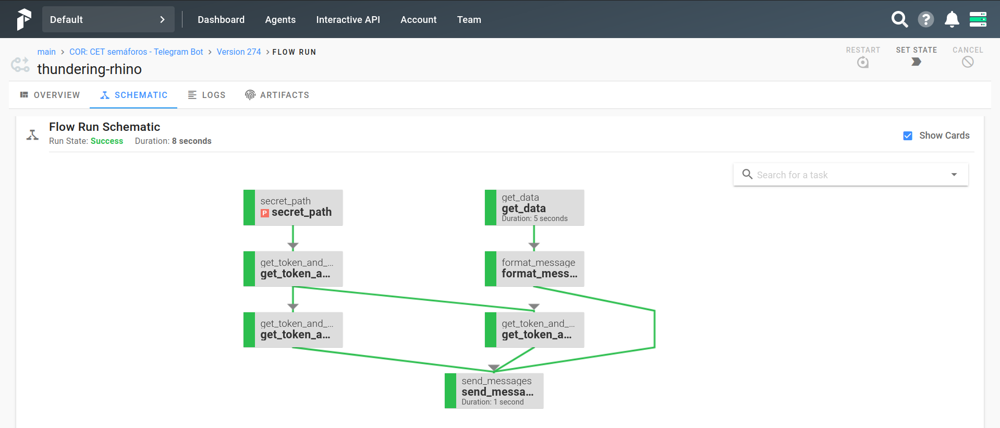{width=90%}

Na aba "Logs" você encontra mais informações sobre essa run específica, além de conseguir visualizar os logs que foram solicitados dentro do código. Essa aba de Logs será uma das mais utilizadas por você a partir de agora :green_heart: .

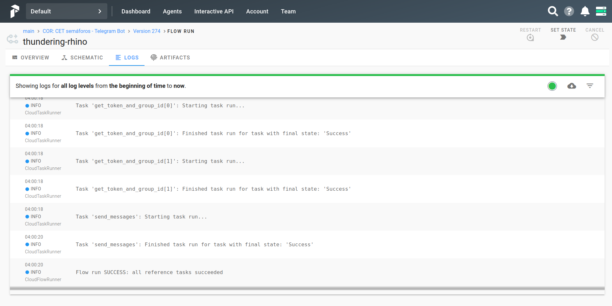{width=90%}
