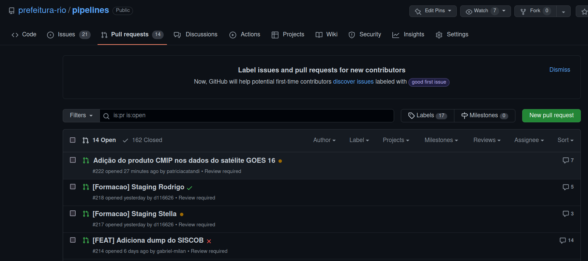

Agora que já vimos como criar um _Flow_ e executá-lo, vamos dar o próximo passo e integrar nosso desenvolvimento ao [repositório de pipelines](https://github.com/prefeitura-rio/pipelines)!


## O repositório de pipelines

O [repositório de pipelines](https://github.com/prefeitura-rio/pipelines) possui várias funcionalidades que vão auxiliar o desenvolvimento, integração, garantia de qualidade de código e deploy dos _Flows_.

### Estrutura de diretórios

Todos os diretórios seguem uma estrutura padrão, demonstrada e comentada abaixo:

```
orgao/                       # diretório raiz para o órgão
├── projeto1/                # diretório de projeto
│   ├── __init__.py          # vazio
│   ├── constants.py         # valores constantes para o projeto
│   ├── flows.py             # declaração dos flows
│   ├── schedules.py         # declaração dos schedules
│   ├── tasks.py             # declaração das tasks
│   └── utils.py             # funções auxiliares para o projeto
...
├── __init__.py              # importa todos os flows de todos os projetos
├── constants.py             # valores constantes para o órgão
├── flows.py                 # declaração de flows genéricos do órgão
├── schedules.py             # declaração de schedules genéricos do órgão
├── tasks.py                 # declaração de tasks genéricas do órgão
└── utils.py                 # funções auxiliares para o órgão

orgao2/
...

utils/
├── __init__.py
├── flow1/
│   ├── __init__.py
│   ├── flows.py
│   ├── tasks.py
│   └── utils.py
├── flows.py                 # declaração de flows genéricos
├── tasks.py                 # declaração de tasks genéricas
└── utils.py                 # funções auxiliares

constants.py                 # valores constantes para todos os órgãos
```

### Adicionando dependências (Paty)

Para começar, precisamos seguir alguns breves passos. 

1 - Crie uma pasta no seu computador no qual ficarão armazenados todos os repositórios da prefeitura

2 - Dentro dessa pasta vamos criar um ambiente virtual em python, mais conhecido como venv. Esse ambiente virtual serve para separarmos as bibliotecas e versões dessas que são exclusivas à esse projeto e evita que tenhamos problema de conflito entre elas. Para esse passo é necessário que você acesse essa pasta utilizando um terminal. Agora, basta escrever `python3.9 -m venv <nome_da_sua_venv` e aguardar a finalização do comando. O python irá criar uma pasta com o nome da sua venv. Toda vez que for rodar e testar suas pipelines, você deve ativar sua venv. Para ativá-la você deve entrar na mesma pasta em que você estava na criação da venv e pelo terminal digitar `source <nome_da_sua_venv/bin/activate` caso esteja em máquina linux ou mac. No windows, você o comando é `<nome_da_sua_venv/Scripts/activate`. Repare agora que o ínicio da linha do seu terminal terá o nome da sua venv. É assim que você saberá que está com ela ativada. Para desativar, digite `deactivate` no terminal. Você pode ter quantas venvs quiser no seu computador. para saber mais, acesse a [documentação oficial](https://docs.python.org/pt-br/3/library/venv.html).

3 -  Se você ainda não realizou o `git clone` do [repositório](https://github.com/prefeitura-rio/pipelines) de `pipelines` da prefeitura, esse é o momento!

4 - Antes de começar a criar seu pipeline, verifique que você está na master e utilize o comando `git checkout -b staging/<nome_branch>` para criar uma nova branch a partir dela. É muito importante que o nome da sua branch inicie com "staging/" para que você consiga testar seu flow na cloud.

Neste tutorial focaremos em como rodar o prefect usando a cloud. Caso queira rodar local você também deve seguir os passos descritos no README do repositório de pipelines.

## Trabalhando com pipelines na Cloud

Agora que conhecemos o repositório de pipelines, vamos trabalhar com eles na Cloud. Isso envolve várias etapas, que serão detalhadas a seguir.

### Como nomear _Flows_ (Diego)

### Desenvolvendo um _Flow_ para a Cloud (Gabriel)

### _Flows_ pré-definidos (Diego + Gabriel)

### Utilizando _Flows_ pré-definidos (Diego)

### Agendamento de _Flows_ :alarm_clock:

O prefect nos permite automatizar os horários que nosso flow irá rodar. O agendamento (scheduler) dos pipelines é especificado em um arquivo `scheduler.py` dentro do diretório relativo a esse flow.

Os flows têm dois principais tipos de agendamentos possíveis: 

- `CronClock`, no qual você especifica os dias e horários que o pipeline irá rodar utilizando uma [string Cron](https://support-acquia.force.com/s/article/360004224494-Cron-time-string-format).

- `IntervalClock`, que faz com que o pipeline rode a cada x segundos.

No código abaixo, temos como exemplo um scheduler baseado no `IntervalClock` programado para rodar a cada 1 dia e com a data de início da automação para "2021-01-01 04:00:00" no timezone de São Paulo - BR. Assim que você subir esse código no github de staging ou master, o backend do prefect inicializará automaticamente esse flow todos os dias às 04:00 a partir de agora. Isso porque definimos o `start_date` para uma data do passado. Se quiser que o flow comece a rodar apenas a partir de uma data futura, basta indicá-la nesse campo.

Toda vez que vamos rodar um flow, precisamos especificar em qual *Agent* ele irá rodar para que possamos realizar as divisões de custo da infraestrutura. Nesse caso, estamos importando o agente do arquivo `constants.py`

Por último, podemos definir alguns parâmetros defaults que serão utilizados dentro do flow. Neste caso, mantivemos a materialização das tabelas no BQ com o parâmetro *materialize_after_dump* e definimos que essa materialização ocorra em ambiente dev utilizando o *materialization_mode*.

```python
# -*- coding: utf-8 -*-
"""
Este é um exemplo de um arquivo schedules.py
"""

from datetime import timedelta

import pendulum
from prefect.schedules import Schedule
from prefect.schedules.clocks import IntervalClock

from pipelines.constants import constants

# define o objeto every_day_at_four_am ao instanciar a classe Schedule
every_day_at_four_am = Schedule(
    clocks=[
        IntervalClock(
            interval=timedelta(days=1), # aqui definimos que o flow irá rodar a cada 1 dia 
            start_date=pendulum.datetime(2021, 1, 1, 4, 0, 0, tz="America/Sao_Paulo"), # define qual em data o scheduler começa a funcionar, geralmente setamos uma no passado
            labels=[
                constants.RJ_ESCRITORIO_DEV_AGENT_LABEL.value, # define qual agent o flow deve utilizar
            ],
            parameter_defaults={
                "materialize_after_dump": True, # é possível setar parâmetros do flow pelo scheduler
                "materialization_mode": "dev",
            },
        )
    ]
)
```

Só criar o arquivo `schedules.py` não fará com que o backend do prefect inicialize a automação do flow. Precisamos indicar para esse determinado flow qual scheduler ele deve utilizar. Isso é feito dentro do arquivo `flows.py` . 

``` python
# importa o objeto every_day_at_four_am do arquivo schedules que se encontra no caminho pipelines.rj_escritorio.geolocator
from pipelines.rj_escritorio.geolocator.schedules import every_day_at_four_am

with Flow(
    "EMD: escritorio - Geolocalizacao de chamados 1746",
    code_owners=[
        "paty",
    ],
) as daily_geolocator_flow: # esse é o nome do nosso flow
    do_something()

daily_geolocator_flow.schedule = every_day_at_four_am # atribui o scheduler do flow ao que foi definido no arquivo schedules.py

```

Para saber mais sobre esse tema acesse a documentação oficial do prefect em [schedules](https://docs-v1.prefect.io/core/concepts/schedules.html#filters) e [clocks](https://docs-v1.prefect.io/api/latest/schedules/clocks.html#clock).

### Manutenção de qualidade de código (Gabriel)

pylint + pre-commit

### Constantes globais e locais :information_source:

Para facilitar a troca de certos parâmetros e o reaproveitamento de códigos, temos como boa prática um arquivo específico para salvarmos nossas variáveis. Aqui no ED vamos ter dois arquivos de constantes distintos denomidados de constantes globais e locais.

As **constantes locais** são todas aquelas que são específicas para um determinado flow. Elas ficam armazenadas em um arquivo `constants.py` no mesmo diretório do seu `flow.py`. Em geral, criamos nesse arquivo uma classe `constants` que contém o `DATASET_ID` e `TABLE_ID` que serão utilizados para gravar os dados finais do flow, entre outras coisas que você julgar importante.

``` python
from enum import Enum

class constants(Enum):  # pylint: disable=c0103
    """
    Constant values for the geolocator project
    """

    PATH_BASE_ENDERECOS = "/tmp/base_enderecos.csv"
    DATASET_ID = "dados_mestres"
    TABLE_ID = "enderecos_geolocalizados"
```

Já as **constantes globais** se referem as constantes que são comuns a todos os flows dentro do repositório de *pipelines*. Nesse arquivo você encontrará os valores de variáveis como os Agents, variáveis do docker, entre outras. Dificilmente você precisará alterar esse arquivo, e quando precisar fazê-lo tome muito cuidado. Uma mudança nele impacta todos os demais flows desse repositório.

### Gerenciamento de segredos :closed_lock_with_key:

:x: :skull_and_crossbones: :x: :skull_and_crossbones: :x: NUNCA, JAMAIS E EM HIPÓTESE ALGUMA :x: :skull_and_crossbones: :x: :skull_and_crossbones: :x: coloque senhas de acesso diretamente no seu código. Todo o gerenciamento de senhas é feito através do [Vault](https://www.vaultproject.io/). Para adicionar ou remover tokens, passwords, certificados, FTP e API keys peça ajuda ao @pipeliners nos canais do Discord do Escritório de Dados. O acesso ao Vault é restrito por conter muitas informações sensíveis.

Na imagem abaixo, temos um exemplo de como estão salvas as informações de acesso ao FTP da riomidia e como utilizamos esses dados no python. Nesse exemplo de código, utilizamos a função `get_vault_secret` para acessar as informações salvas com o nome de "riomidia". Note que as keys utilizadas dentro do dicionário têm os mesmos nomes definidos dentro do Vault.

{width=100%}

### Como testar pipelines em staging :wrench:

O teste do flow será feito diretamente na cloud utilizando o ambiente de staging. Para isso, é necessário que você esteja em uma branch cujo nome inicia-se com "staging/". 

Crie um Pull Request (PR) e enquanto estiver trabalhando no flow mantenha a tag **[WIP]** (Working in Progress) na frente do nome do seu PR, como no exemplo da figura a seguir.

{width=100%}

Assim, toda vez que você fizer um push para sua branch remota, o CI/CD do Github irá reconhecer o nome da branch e começará o deployment do seu código para a área de staging. 

Para verificar o andamento do deploy você tem duas opções:

- pode acompanhar pela página de PR através do círculo que aparece na frente do nome do seu PR. :heavy_check_mark: significa que o deploy foi finalizado com sucesso, :x: o deploy teve algum problema e :orange_circle: que o processo ainda não foi finalizado.

{width=90%}

- ao entrar no PR é possível acompanhar o andamento de cada etapaele tb do deploy. Aqui é possível verificar em qual etapa e qual foi o problema no deploy.

{width=90%}

Quando a pipeline estiver finalizada e pronta para entrar na master, você precisa tirar o **[WIP]** do título do seu PR e solicitar para alguém aprovar o seu PR. Com a aprovação, basta clicar no botão de merge e o CI/CD do Github começará o processo de deploy no ambiente de prod.

## Usando a UI do Prefect (Diego)

### Buscando um _Flow_ (Diego)

### Como executar um _Flow_ (Diego)

### Como alterar parâmetros (Diego)

Prestar atenção aos agents

### Como visualizar logs (Diego)

```

```