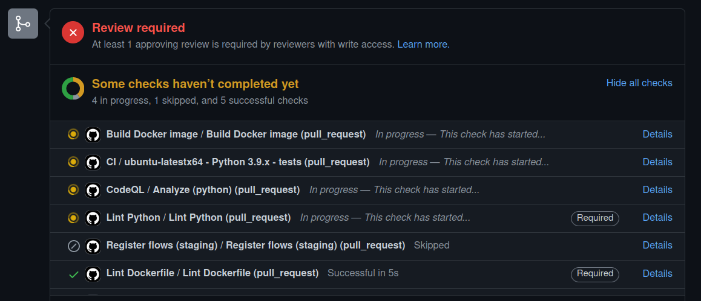

Como você deve se recordar, no capítulo sobre [Visão geral da infraestrutura](/guia-desenvolvedores/visao-geral-infra), comentamos sobre o Prefect, que é a ferramenta que utilizamos para automatizar os processos de ETL (Extração, Transformação e Carga de Dados). Neste capítulo, vamos aprofundar um pouco sobre o funcionamento do Prefect e desenvolver uma pipeline de exemplo.

## Como o Prefect funciona?

O Prefect trabalha em um **modelo híbrido**: a **orquestração** de tarefas é feita em um servidor, os **códigos** das tarefas são armazenados em outro e a **execução** é feita em um terceiro. Essa arquitetura permite a descentralização completa das execuções em diferentes centros de custo, além de permitir uma maior privacidade e segurança de todos os servidores envolvidos. Para entender melhor como isso funciona, traduzimos e adaptamos [um texto extraído do site oficial do Prefect](https://www.prefect.io/why-prefect/hybrid-model/), que mostra os passos de desenvolvimento com Prefect:


**Passo 1: Construir seu _Flow_**: uma pipeline, no Prefect, recebe o nome de _Flow_. Você deve utilizar o pacote Python `prefect` (em nosso caso, na versão 0.15.9) para desenvolver seu fluxo de trabalho. Depois de desenvolver, você pode executá-lo e testá-lo em sua máquina.


**Passo 2: Registrar seu _Flow_**: esse passo consiste em armazenar seu código em um repositório de objetos, em nosso caso o Google Cloud Storage, de forma que ele possa ser acessado posteriormente. Depois de armazená-lo, sabendo sua localização, você envia esse metadado para o servidor do Prefect (registra o _Flow_). Isso permite que você possa localizá-lo na interface web do Prefect e inspecioná-lo.

_Obs.:_ no caso das pipelines desenvolvidas em nosso repositório no GitHub, esse processo de registrar _Flows_ é automatizado.


**Passo 3: Executar um agente**: agentes do Prefect são processos que se comunicam com o servidor do Prefect, procurando por cargas de trabalho agendada. Quando ele encontra, lança sua execução. Agentes podem ser executados em qualquer lugar, o que permite que as cargas de trabalho sejam lançadas em diferentes centros de custo.

_Obs.:_ para a Prefeitura do Rio, já existem diversos agentes registrados, esse passo não será necessário.


**Passo 4: Agendar cargas de trabalho**: você pode agendar cargas de trabalho para serem executadas em um determinado horário, ou com certa recorrência. Você pode fazer isso através do próprio código, em Python (recomendado para manter consistência), ou através da interface web do Prefect.


**Passo 5: Executar o _Flow_**: o agente do Prefect encontrará a carga de trabalho agendada e a executará. Dessa forma, a carga de trabalho será executada onde o agente estiver rodando. Ao mesmo tempo, todo o processo de execução e logs poderão ser acompanhados através da interface web do Prefect, já que o agente os comunica ao servidor.


**Passo 6: Monitorar e gerenciar**: você pode monitorar e gerenciar as cargas de trabalho através da interface web do Prefect. Você pode ver o status de cada carga de trabalho, visualizar os logs, inspecionar o código, etc. de quaisquer cargas de trabalho, seja em execução ou já finalizadas.

## Desenvolvendo seu primeiro Flow

Aqui, vamos tratar do desenvolvimento de uma pipeline de exemplo, que consiste em:

1. Baixar dados de uma API;
2. Converter esses dados em um formato tabular;
3. Armazenar esses dados em um arquivo CSV.

**Obs:** esse exemplo tratará exclusivamente de uma execução local, em sua máquina, sem interações com o servidor do Prefect ou mecanismos de armazenamento, como o Google Cloud Storage. Abaixo, nessa mesma página, haverão exemplos mais complexos.

### Preparando o ambiente

Requisitos:

- Python 3.9, pois a versão deve coincidir com a que usamos
- `pip`, para instalar dependências

A primeira boa prática é criar um arquivo `requirements.txt` para armazenar as dependências do seu projeto. Nesse arquivo, você deve colocar todas as bibliotecas que serão utilizadas no desenvolvimento do seu _Flow_. O que vamos usar, por exemplo, é o seguinte:

```
prefect==0.15.9
requests
pandas
```

Note que o único pacote que tem sua versão especificada é o Prefect, pois a versão dele deve corresponder à que usamos em nossos servidores.

Em seguida, para instalar as dependências declaradas nesse arquivo, você deve executar o seguinte comando:

```bash
pip install -r requirements.txt
```

E pronto, você já tem tudo o que precisa para começar a desenvolver seu _Flow_. Caso, no futuro, você deseje adicionar novas dependências, basta adicionar no arquivo `requirements.txt` e executar o comando acima novamente.

Para manter um padrão de desenvolvimento, devemos criar os seguintes arquivos:

- `tasks.py`: arquivo que conterá as funções que serão utilizadas no _Flow_.
- `flows.py`: arquivo que conterá o _Flow_ propriamente dito.
- `utils.py`: arquivo que conterá funções auxiliares, como por exemplo, funções para imprimir logs.

### Criando funções auxiliares

Começando então no arquivo `utils.py`, vamos criar uma função que imprime logs no console. Essa função será útil para acompanhar o andamento do _Flow_. Como é uma função que envolve conhecer o Prefect um pouquinho mais a fundo, vamos explicar o que ela faz.

```python
import prefect

def log(message) -> None:
    """Logs a message"""
    prefect.context.logger.info(f"\n{message}")
```

A função `log` recebe uma mensagem e a imprime no console. Ela faz isso através do objeto `prefect.context.logger`, que é um objeto que contém o logger do Prefect. Esse logger é um objeto que está dentro do `prefect.context`, esse que contém informações sobre o _Flow_ e a execução atual, como por exemplo, o nome do _Flow_ e o ID da execução atual. Por isso, é importante que essa função seja chamada dentro de um _Flow_, pois ela depende do objeto `prefect.context` para funcionar.

### Criando _tasks_

Aqui é onde vamos criar as funções que implementam os passos da nossa pipeline. Essas funções serão chamadas de _tasks_. Então, abrindo o arquivo `tasks.py`, vamos criar as seguintes funções:

```python
from io import StringIO

import pandas as pd
from prefect import task
import requests

from utils import log

@task
def download_data(n_users: int) -> str:
    """
    Baixa dados da API https://randomuser.me e retorna um texto em formato CSV.

    Args:
        n_users (int): número de usuários a serem baixados.

    Returns:
        str: texto em formato CSV.
    """
    response = requests.get(
        "https://randomuser.me/api/?results={}&format=csv".format(n_users)
    )
    log("Dados baixados com sucesso!")
    return response.text

@task
def parse_data(data: str) -> pd.DataFrame:
    """
    Transforma os dados em formato CSV em um DataFrame do Pandas, para facilitar sua manipulação.

    Args:
        data (str): texto em formato CSV.

    Returns:
        pd.DataFrame: DataFrame do Pandas.
    """
    df = pd.read_csv(StringIO(data))
    log("Dados convertidos em DataFrame com sucesso!")
    return df

@task
def save_report(dataframe: pd.DataFrame) -> None:
    """
    Salva o DataFrame em um arquivo CSV.

    Args:
        dataframe (pd.DataFrame): DataFrame do Pandas.
    """
    dataframe.to_csv("report.csv", index=False)
    log("Dados salvos em report.csv com sucesso!")
```

Como as funções estão comentadas, não há muito o que explicar. Mas vale ressaltar que elas são decoradas com o `@task`, que é um decorator do Prefect. Esse decorator é necessário para que o Prefect reconheça as funções como _tasks_.

### Definindo o _Flow_

Agora, vamos criar o _Flow_ propriamente dito. Aqui vamos definir como as _tasks_ interagem entre si e os parâmetros que elas recebem. Para isso, abra o arquivo `flows.py` e crie a seguinte função:

```python
from prefect import Flow, Parameter

from tasks import (
    download_data,
    parse_data,
    save_report,
)

with Flow("Users report") as flow:

    # Parâmetros
    n_users = Parameter("n_users", default=10)

    # Tasks
    data = download_data(n_users)
    dataframe = parse_data(data)
    save_report(dataframe)
```

Aqui, criamos um _Flow_ chamado `Users report` com o seguinte parâmetro:

- `n_users`: número de usuários a serem baixados.

Observe que foi configurado um valor padrão para esse parâmetro, que é 10. Isso significa que, caso o parâmetro não seja passado na hora de executar o _Flow_, ele será executado com o valor padrão.

Além disso, inserimos as três _tasks_ que criamos anteriormente. Observe que a _task_ `download_data` recebe o parâmetro `n_users` como argumento. Isso significa que, quando a _task_ for executada, ela receberá o valor do parâmetro `n_users` como argumento. Depois disso, a _task_ `parse_data` recebe o retorno da _task_ `download_data` como argumento, fazendo com que o dado baixado seja passado a ela, para converter em um DataFrame. Por fim, a _task_ `save_report` recebe o retorno da _task_ `parse_data` como argumento, fazendo com que o DataFrame seja salvo em um arquivo CSV.

### Executando

Ufa! Com tudo pronto, vamos executar o _Flow_! Para facilitar a execução, vamos criar um arquivo `run.py` e colocar o seguinte código nele:

```python
from flows import flow

flow.run()
```

Depois, podemos executar o _Flow_ com o seguinte comando:

```bash
python3 run.py
```

A saída deve ser semelhante ao seguinte:

```
[2022-10-05 14:40:40-0300] INFO - prefect.FlowRunner | Beginning Flow run for 'Users report'
[2022-10-05 14:40:40-0300] INFO - prefect.TaskRunner | Task 'n_users': Starting task run...
[2022-10-05 14:40:40-0300] INFO - prefect.TaskRunner | Task 'n_users': Finished task run for task with final state: 'Success'
[2022-10-05 14:40:40-0300] INFO - prefect.TaskRunner | Task 'download_data': Starting task run...
[2022-10-05 14:40:40-0300] INFO - prefect.download_data |
Dados baixados com sucesso!
[2022-10-05 14:40:40-0300] INFO - prefect.TaskRunner | Task 'download_data': Finished task run for task with final state: 'Success'
[2022-10-05 14:40:40-0300] INFO - prefect.TaskRunner | Task 'parse_data': Starting task run...
[2022-10-05 14:40:40-0300] INFO - prefect.parse_data |
Dados convertidos em DataFrame com sucesso!
[2022-10-05 14:40:40-0300] INFO - prefect.TaskRunner | Task 'parse_data': Finished task run for task with final state: 'Success'
[2022-10-05 14:40:40-0300] INFO - prefect.TaskRunner | Task 'save_report': Starting task run...
[2022-10-05 14:40:40-0300] INFO - prefect.save_report |
Dados salvos em report.csv com sucesso!
[2022-10-05 14:40:40-0300] INFO - prefect.TaskRunner | Task 'save_report': Finished task run for task with final state: 'Success'
[2022-10-05 14:40:40-0300] INFO - prefect.FlowRunner | Flow run SUCCESS: all reference tasks succeeded
```

Observe que um arquivo chamado `report.csv` foi criado. Esse arquivo contém os dados baixados e convertidos em um DataFrame.

Observe também que as mensagens de log foram impressas na saída. Isso acontece porque, como vimos anteriormente, as funções `log` são decoradas com o `@task`, que é um decorator do Prefect. Isso faz com que o Prefect reconheça as funções como _tasks_ e, por isso, as mensagens de log são impressas na saída.

### Executando com parâmetros

Agora, vamos executar o _Flow_ passando um valor para o parâmetro `n_users`. Para isso, vamos modificar o arquivo `run.py` para o seguinte:

```python
from flows import flow

flow.run(n_users=20)
```

Novamente, podemos executar o _Flow_ com o seguinte comando:

```bash
python3 run.py
```

E pronto! O _Flow_ foi executado com sucesso e um arquivo `report.csv` foi criado. Observe que, dessa vez, o arquivo contém 20 linhas, pois o parâmetro `n_users` foi passado com o valor 20.

## O repositório de pipelines

Agora que já vimos como criar um _Flow_ e executá-lo, vamos dar o próximo passo e integrar nosso desenvolvimento ao repositório de pipelines! Lá, temos várias funcionalidades que vão auxiliar o desenvolvimento, integração e garantia de qualidade dos _Flows_.

### Estrutura de diretórios

Todos os diretórios seguem uma estrutura padrão, demonstrada e comentada abaixo:

```
orgao/                       # diretório raiz para o órgão
├── projeto1/                # diretório de projeto
│   ├── __init__.py          # vazio
│   ├── constants.py         # valores constantes para o projeto
│   ├── flows.py             # declaração dos flows
│   ├── schedules.py         # declaração dos schedules
│   ├── tasks.py             # declaração das tasks
│   └── utils.py             # funções auxiliares para o projeto
...
├── __init__.py              # importa todos os flows de todos os projetos
├── constants.py             # valores constantes para o órgão
├── flows.py                 # declaração de flows genéricos do órgão
├── schedules.py             # declaração de schedules genéricos do órgão
├── tasks.py                 # declaração de tasks genéricas do órgão
└── utils.py                 # funções auxiliares para o órgão

orgao2/
...

utils/
├── __init__.py
├── flow1/
│   ├── __init__.py
│   ├── flows.py
│   ├── tasks.py
│   └── utils.py
├── flows.py                 # declaração de flows genéricos
├── tasks.py                 # declaração de tasks genéricas
└── utils.py                 # funções auxiliares

constants.py                 # valores constantes para todos os órgãos
```

### Adicionando dependências (Paty)

Para começar, precisamos seguir alguns breves passos. 

1 - Crie uma pasta no seu computador no qual ficarão armazenados todos os repositórios da prefeitura

2 - Dentro dessa pasta vamos criar um ambiente virtual em python, mais conhecido como venv. Esse ambiente virtual serve para separarmos as bibliotecas e versões dessas que são exclusivas à esse projeto e evita que tenhamos problema de conflito entre elas. Para esse passo é necessário que você acesse essa pasta utilizando um terminal. Agora, basta escrever `python3.9 -m venv <nome_da_sua_venv` e aguardar a finalização do comando. O python irá criar uma pasta com o nome da sua venv. Toda vez que for rodar e testar suas pipelines, você deve ativar sua venv. Para ativá-la você deve entrar na mesma pasta em que você estava na criação da venv e pelo terminal digitar `source <nome_da_sua_venv/bin/activate` caso esteja em máquina linux ou mac. No windows, você o comando é `<nome_da_sua_venv/Scripts/activate`. Repare agora que o ínicio da linha do seu terminal terá o nome da sua venv. É assim que você saberá que está com ela ativada. Para desativar, digite `deactivate` no terminal. Você pode ter quantas venvs quiser no seu computador. para saber mais, acesse a [documentação oficial](https://docs.python.org/pt-br/3/library/venv.html).

3 -  Se você ainda não realizou o `git clone` do [repositório](https://github.com/prefeitura-rio/pipelines) de `pipelines` da prefeitura, esse é o momento!

4 - Antes de começar a criar seu pipeline, verifique que você está na master e utilize o comando `git checkout -b staging/<nome_branch>` para criar uma nova branch a partir dela. É muito importante que o nome da sua branch inicie com "staging/" para que você consiga testar seu flow na cloud.

Neste tutorial focaremos em como rodar o prefect usando a cloud. Caso queira rodar local você também deve seguir os passos descritos no README do repositório de pipelines.

## Trabalhando com pipelines na Cloud

Agora que conhecemos o repositório de pipelines, vamos trabalhar com eles na Cloud. Isso envolve várias etapas, que serão detalhadas a seguir.

### Como nomear _Flows_ (Diego)

### Desenvolvendo um _Flow_ para a Cloud (Gabriel)

### _Flows_ pré-definidos (Diego + Gabriel)

### Utilizando _Flows_ pré-definidos (Diego)

### Agendamento de _Flows_ :alarm_clock:

O prefect nos permite automatizar os horários que nosso flow irá rodar. O agendamento (scheduler) dos pipelines é especificado em um arquivo `scheduler.py` dentro do diretório relativo a esse flow.

Os flows têm dois principais tipos de agendamentos possíveis: 

- `CronClock`, no qual você especifica os dias e horários que o pipeline irá rodar utilizando uma [string Cron](https://support-acquia.force.com/s/article/360004224494-Cron-time-string-format).

- `IntervalClock`, que faz com que o pipeline rode a cada x segundos.

No código abaixo, temos como exemplo um scheduler baseado no `IntervalClock` programado para rodar a cada 1 dia e com a data de início da automação para "2021-01-01 04:00:00" no timezone de São Paulo - BR. Assim que você subir esse código no github de staging ou master, o backend do prefect inicializará automaticamente esse flow todos os dias às 04:00 a partir de agora. Isso porque definimos o `start_date` para uma data do passado. Se quiser que o flow comece a rodar apenas a partir de uma data futura, basta indicá-la nesse campo.

Toda vez que vamos rodar um flow, precisamos especificar em qual *Agent* ele irá rodar para que possamos realizar as divisões de custo da infraestrutura. Nesse caso, estamos importando o agente do arquivo `constants.py`

Por último, podemos definir alguns parâmetros defaults que serão utilizados dentro do flow. Neste caso, mantivemos a materialização das tabelas no BQ com o parâmetro *materialize_after_dump* e definimos que essa materialização ocorra em ambiente dev utilizando o *materialization_mode*.

```python
# -*- coding: utf-8 -*-
"""
Este é um exemplo de um arquivo schedules.py
"""

from datetime import timedelta

import pendulum
from prefect.schedules import Schedule
from prefect.schedules.clocks import IntervalClock

from pipelines.constants import constants

# define o objeto every_day_at_four_am ao instanciar a classe Schedule
every_day_at_four_am = Schedule(
    clocks=[
        IntervalClock(
            interval=timedelta(days=1), # aqui definimos que o flow irá rodar a cada 1 dia 
            start_date=pendulum.datetime(2021, 1, 1, 4, 0, 0, tz="America/Sao_Paulo"), # define qual em data o scheduler começa a funcionar, geralmente setamos uma no passado
            labels=[
                constants.RJ_ESCRITORIO_DEV_AGENT_LABEL.value, # define qual agent o flow deve utilizar
            ],
            parameter_defaults={
                "materialize_after_dump": True, # é possível setar parâmetros do flow pelo scheduler
                "materialization_mode": "dev",
            },
        )
    ]
)
```

Só criar o arquivo `schedules.py` não fará com que o backend do prefect inicialize a automação do flow. Precisamos indicar para esse determinado flow qual scheduler ele deve utilizar. Isso é feito dentro do arquivo `flows.py` . 

``` python
# importa o objeto every_day_at_four_am do arquivo schedules que se encontra no caminho pipelines.rj_escritorio.geolocator
from pipelines.rj_escritorio.geolocator.schedules import every_day_at_four_am

with Flow(
    "EMD: escritorio - Geolocalizacao de chamados 1746",
    code_owners=[
        "paty",
    ],
) as daily_geolocator_flow: # esse é o nome do nosso flow
    do_something()

daily_geolocator_flow.schedule = every_day_at_four_am # atribui o scheduler do flow ao que foi definido no arquivo schedules.py

```

Para saber mais sobre esse tema acesse a documentação oficial do prefect em [schedules](https://docs-v1.prefect.io/core/concepts/schedules.html#filters) e [clocks](https://docs-v1.prefect.io/api/latest/schedules/clocks.html#clock).

### Manutenção de qualidade de código (Gabriel)

pylint + pre-commit

### Constantes globais e locais :information_source:

Para facilitar a troca de certos parâmetros e o reaproveitamento de códigos, temos como boa prática um arquivo específico para salvarmos nossas variáveis. Aqui no ED vamos ter dois arquivos de constantes distintos denomidados de constantes globais e locais.

As **constantes locais** são todas aquelas que são específicas para um determinado flow. Elas ficam armazenadas em um arquivo `constants.py` no mesmo diretório do seu `flow.py`. Em geral, criamos nesse arquivo uma classe `constants` que contém o `DATASET_ID` e `TABLE_ID` que serão utilizados para gravar os dados finais do flow, entre outras coisas que você julgar importante.

``` python
from enum import Enum

class constants(Enum):  # pylint: disable=c0103
    """
    Constant values for the geolocator project
    """

    PATH_BASE_ENDERECOS = "/tmp/base_enderecos.csv"
    DATASET_ID = "dados_mestres"
    TABLE_ID = "enderecos_geolocalizados"
```

Já as **constantes globais** se referem as constantes que são comuns a todos os flows dentro do repositório de *pipelines*. Nesse arquivo você encontrará os valores de variáveis como os Agents, variáveis do docker, entre outras. Dificilmente você precisará alterar esse arquivo, e quando precisar fazê-lo tome muito cuidado. Uma mudança nele impacta todos os demais flows desse repositório.

### Gerenciamento de segredos :closed_lock_with_key:

:x: :skull_and_crossbones: :x: :skull_and_crossbones: :x: NUNCA, JAMAIS E EM HIPÓTESE ALGUMA :x: :skull_and_crossbones: :x: :skull_and_crossbones: :x: coloque senhas de acesso diretamente no seu código. Todo o gerenciamento de senhas é feito através do [Vault](https://www.vaultproject.io/). Para adicionar ou remover tokens, passwords, certificados, FTP e API keys peça ajuda ao @pipeliners nos canais do Discord do Escritório de Dados. O acesso ao Vault é restrito por conter muitas informações sensíveis.

Na imagem abaixo, temos um exemplo de como estão salvas as informações de acesso ao FTP da riomidia e como utilizamos esses dados no python. Nesse exemplo de código, utilizamos a função `get_vault_secret` para acessar as informações salvas com o nome de "riomidia". Note que as keys utilizadas dentro do dicionário têm os mesmos nomes definidos dentro do Vault.

{width=100%}

### Como testar pipelines em staging :wrench:

O teste do flow será feito diretamente na cloud utilizando o ambiente de staging. Para isso, é necessário que você esteja em uma branch cujo nome inicia-se com "staging/". 

Crie um Pull Request (PR) e enquanto estiver trabalhando no flow mantenha a tag **[WIP]** (Working in Progress) na frente do nome do seu PR, como no exemplo da figura a seguir.

{width=100%}

Assim, toda vez que você fizer um push para sua branch remota, o CI/CD do Github irá reconhecer o nome da branch e começará o deployment do seu código para a área de staging. 

Para verificar o andamento do deploy você tem duas opções:

- pode acompanhar pela página de PR através do círculo que aparece na frente do nome do seu PR. :heavy_check_mark: significa que o deploy foi finalizado com sucesso, :x: o deploy teve algum problema e :orange_circle: que o processo ainda não foi finalizado.

{width=90%}

- ao entrar no PR é possível acompanhar o andamento de cada etapaele tb do deploy. Aqui é possível verificar em qual etapa e qual foi o problema no deploy.

{width=90%}

Quando a pipeline estiver finalizada e pronta para entrar na master, você precisa tirar o **[WIP]** do título do seu PR e solicitar para alguém aprovar o seu PR. Com a aprovação, basta clicar no botão de merge e o CI/CD do Github começará o processo de deploy no ambiente de prod.

## Usando a UI do Prefect (Diego)

### Buscando um _Flow_ (Diego)

### Como executar um _Flow_ (Diego)

### Como alterar parâmetros (Diego)

Prestar atenção aos agents

### Como visualizar logs (Diego)

```

```
