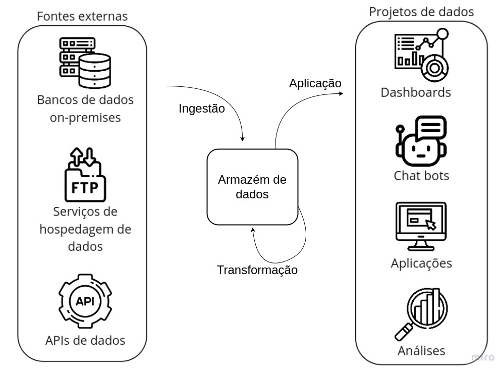
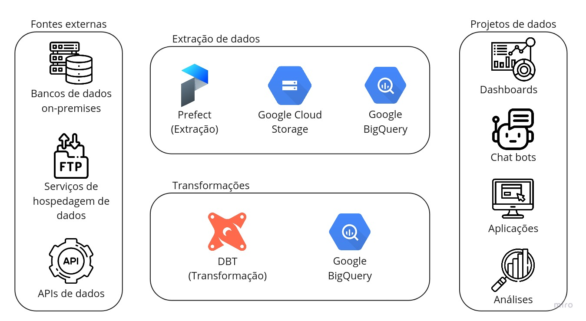

E aí, quer entender melhor nossa infraestrutura de dados, os componentes selecionados, como interagem
entre si e onde estão hospedados? Então vamos lá! 👨‍💻

## Introdução ao fluxo de dados

Não há nada extravagante em nosso fluxo de dados, na realidade, ele é tão intuitivo quanto pode ser.
No entanto, é muito importante entender cada etapa para que seja possível compreender o funcionamento
da infraestrutura como um todo.

Então, vamos colocar aqui um diagrama que ajudará a entender por onde o dado transita e no que consistem
as etapas:



Como estamos falando sobre a infraestrutura de dados, vamos focar única e exclusivamente na parte
central desse diagrama, ou seja, as três grandes etapas - Ingestão, Transformação e Aplicação - e o
bloco central, o Armazém de Dados.

### Armazém de dados

Como o próprio nome já diz, é o local onde os dados são armazenados. No entanto, não é uma ferramenta
tão simples quanto o nome faz parecer, dado que é o componente central do fluxo de dados e, portanto,
deve suportar uma grande variedade de operações, além de uma imensa capacidade de processamento e
armazenamento, visto que os dados podem ter tamanhos e prioridades diferentes.

Mais especificamente, uma ferramenta de armazém de dados para nossa infraestrutura deve possuir as
seguintes funcionalidades:

- **Capacidade de armazenamento e processamento "ilimitada"**: não queremos nos preocupar em qual o tamanho do dado
  que vamos armazenar, nós o queremos e ponto!
- **Otimização de processamento via particionamento e correlatos**: para dados de grande volume, é
  sempre interessante recorrer a mecanismos de particionamento e semelhantes para otimizar o processamento
  e, consequentemente, os custos de uma consulta.
- **Suporte a SQL**: nós queremos usar a linguagem de consulta mais popular e acessível até o momento.
- **Funções de análise geoespacial**: por se tratar de dados da cidade são, em maioria, geolocalizados.
  Assim, ter funcionalidades de análise geoespacial é fundamental.
- **Governança simplificada**: ter uma interface amigável para gerir o armazém de dados é fundamental.
- **Conexões com plataformas de desenvolvimento de dashboards**: não adianta ter dados se não conseguimos
  visualizá-los ou usá-los.
- **Possibilidade de disponibilizar os dados publicamente**: afinal, queremos que a comunidade acesse!

### Ingestão

A ingestão é o ato de obter um dado e trazê-lo para seu ambiente. Ela consiste em duas subetapas: a
extração e o armazenamento.

A **Extração** é ato de adquirir o dado a partir de alguma fonte, como um banco de dados, uma API ou
um arquivo qualquer. A partir daí, o **Armazenamento** é a etapa de salvar esse dado em algum lugar
como, por exemplo, um computador ou um armazém de dados.

Se você parar para pensar, coisas rotineiras podem ser enxergadas como ingestão: ao consultar seu
contracheque, por exemplo, você está realizando uma extração, ao requerer os dados no website de
consulta, e um armazenamento, ao baixá-lo para seu computador.

### Transformação

A transformação de dados é um conceito extremamente abrangente, então sua definição deve ser suficientemente
ampla: modificar um dado buscando um objetivo. Então, qualquer modificação no dado original é considerada
uma transformação. Seguindo o exemplo do contracheque, uma possível transformação seria a conversão de
moeda, caso você precisasse de um contracheque em dólar.

Note que, após a transformação, uma nova etapa de armazenamento é realizada. Porém, esse dado transformado
poderá sobrescrever o original, ou seja, o dado original não será mais acessível, ou coexistir com ele.

### Aplicação

Essa é a última etapa de um fluxo de dados. Ela consiste em utilizar o dado para algum fim. Aqui se
encontram coisas como dashboards, aplicativos, chat bots e outros sendo, então, um pouco fora do
escopo desse guia.

Mas seguindo nosso exemplo do contracheque, uma possível aplicação seria a utilização dos dados do
seu contracheque para a declaração do IRPF.

### Considerações finais

Como é possível notar pelo próprio diagrama, é possível iterar nesse fluxo indefinidamente. Então,
grandes projetos de dados não usam somente um dado contido no armazém, mas múltiplos, fazendo transformações
para uní-los e obter informações mais ricas. Também, as transformações podem ocorrer indefinidamente,
até que se obtenha o resultado esperado.

## Apresentação dos componentes

Vamos incrementar aquele diagrama!



Aqui temos os componentes que compõem a infraestrutura de dados. Na parte de "Extração de dados",
temos o [Prefect](https://prefect.io/) para realizar a extração e [Google Cloud Storage](https://cloud.google.com/storage/)
[Google BigQuery](https://cloud.google.com/bigquery/) para armazenamento. Logo mais, você irá entender
o que cada um faz e como foram selecionados.

Já na parte de "Transformações", temos ali o [DBT](https://www.getdbt.com/) para realizar as transformações
e novamente o [Google BigQuery](https://cloud.google.com/bigquery/) para armazenamento.

### Como chegamos a isso

Muitos pontos foram levantados durante o levantamento das ferramentas. Dentre eles, selecionamos um
conjunto dos que julgamos mais adequados para nossa infraestrutura que, de forma simplificada, é o
seguinte:

- **Escalonamento**: todos os componentes devem funcionar bem para cargas de trabalho
  pequenas, mas devem ter a possibilidade de suportar cargas de trabalho enormes.
- **Liberdade**: como estamos hospedando nossos serviços em nuvem, gostaríamos de ter a possibilidade
  de transitar entre provedores com facilidade. Por isso, sempre que razoável, optamos por usar
  software livre.
- **Possibilidades**: poder usufruir por completo de uma linguagem de programação, como Python, ou
  de consulta, como SQL, permite fazer trabalhos extremamente complexos e replicáveis.
- **Descentralização**: hospedar cargas de trabalho de todos os órgãos da prefeitura em servidores
  separados permite um maior controle sobre os custos de cada órgão e dificulta condições em que
  cargas de trabalho de um órgão poderia onerar outro.
- **Simplicidade**: menos é mais. Um sistema com poucos componentes é mais fácil de manter e entender.

Claro que esses itens são muito abstratos e, sabendo disso, construímos um instrumento de avaliação
de serviços com diversos fatores quantificáveis e, a partir dele, conduzimos uma consulta pública
com vários provedores de serviços em nuvem, para que propusessem soluções para nosso problema.

Após a análise, os componentes escolhidos foram os explicitados no diagrama acima. Agora vamos conversar
sobre cada um deles e explicar como eles funcionam.

### Extração (Prefect)

Como mencionado anteriormente, para realizar a extração de dados, a ferramenta selecionada foi o
[Prefect](https://prefect.io/). Essa é uma ferramenta de código aberto, que permite a automação
de quaisquer tarefas através de sua API, em Python.

Por possuir uma interface muito simples de usar, é extremamente fácil modificar seu código para
usufruir de suas funcionalidades. Mas, para nós, além da linda interface que ele possui, os dois
itens que mais foram convidativos para nós foram:

- **Confiança**: é muito fácil lidar com falhas no Prefect, você não vai quebrar todo seu fluxo
  de dados se algo ruim acontecer. Além disso, em nossos testes preliminares, conseguimos executar
  mais de 10 mil pipelines por dia, consumindo poucos recursos, sem problemas.
- **Modelo híbrido de execução**: esse deve ser o item mais apelativo para todos que aderem o Prefect.
  O [modelo híbrido](https://www.prefect.io/why-prefect/hybrid-model/) dele permite que você tenha o servidor
  hospedado em um local, seu código em outro e o ambiente de execução em um terceiro. Existe uma clara
  separação de papeis que garante a segurança da execução do código e, de tabela, uma completa descentralização:
  podemos executar pipelines de um órgão em um servidor, outro em outro e, ao mesmo tempo, conseguir
  enxergar todas elas em uma única interface.

E quando eu falo sobre facilidade de uso, eu realmente quero dizer que é muito fácil. Olha só esse
exemplo: suponha que você tenha um código de extração de dados em Python puro, dá só uma olhada em
como portá-lo para o Prefect.

=== "Python puro"

    ```py
    def extrair_dados(url):
        response = requests.get(url)
        data = response.json()
        return data

    def montar_dataframe(data):
        df = pd.DataFrame(data)
        return df

    def salvar_dados(dataframe):
        dataframe.to_csv('dados.csv')

    def main():
        url = 'https://url.da.api.que.voce.quer.extrair'
        data = extrair_dados(url)
        dataframe = montar_dataframe(data)
        salvar_dados(dataframe)
    ```

=== "Prefect"

    ```py
    from prefect import task, Flow

    @task
    def extrair_dados(url):
        response = requests.get(url)
        data = response.json()
        return data

    @task
    def montar_dataframe(data):
        df = pd.DataFrame(data)
        return df

    @task
    def salvar_dados(dataframe):
        dataframe.to_csv('dados.csv')

    with Flow("main") as flow:
        url = 'https://url.da.api.que.voce.quer.extrair'
        data = extrair_dados(url=url)
        dataframe = montar_dataframe(data=data)
        salvar_dados(dataframe=dataframe)
    ```

Bom demais, né?

### Transformações (DBT)

Aqui é onde a galera do SQL se empolga. O [DBT](https://getdbt.com) é uma ferramenta de código aberto,
que permite a definição de modelos de dados em linguagem SQL. Então, em outras palavras, você pode
escrever uma query e, usando o DBT, materializar os resultados dessa query em diferentes formas e,
o que é mais legal, em diferentes plataformas.

Assim, com a mesma query, você pode criar tabelas e _views_ em diferentes plataformas. E não só isso,
as tabelas podem ser materializadas de maneiras diferentes, como, por exemplo, de forma incremental,
que consiste em adicionar novas linhas ao final de uma tabela.

Além de tudo, você pode parametrizar suas queries para que elas sejam executadas com diferentes
valores de entrada. Não bastante, você pode especificar configurações de particionamento, dentre
outras, diretamente no seu modelo de dados. Dá uma olhada só nesse exemplo:

```sql
{{
    config(
        materialized='table',
        partition_by={
            "field": "data_particao",
            "data_type": "date",
            "granularity": "month",
        }
    )
}}

SELECT
    *
FROM `datario.dataset_id.table_id`
```

Pode relaxar, você não precisa entender tudo desse modelo ainda, teremos guias para isso. Mas, apesar
de curto, tem muita coisa rolando nesse modelo aí! Estamos especificando para ele que deve se materializar
em formato de tabela nativa com o `materialized='table'`, e estamos especificando que deve ser particionado
por data na coluna `data_particao` com uma granularidade mensal. Pouquíssimas linhas e simplesmente
funciona!

### Armazenamento (Google Cloud Storage e Google BigQuery)

Eu sei o que você vai dizer:

> Mas você disse "sempre que razoável, optamos por usar software livre"

Sim, exatamente, sempre que razoável. Porém, no caso do armazenamento, principalmente, as ferramentas
apresentadas pela Google atenderam todos os requisitos que havíamos levantado, além de reduzirem o
número de componentes para dois ao invés de múltiplos open-source que teríamos que manter em conjunto.
Ok, vamos voltar ao que viemos fazer: apresentar os componentes.

- **Google Cloud Storage** é um serviço de armazenamento de objetos. Então, através de uma API, é
  possível fazer upload de qualquer tipo de arquivo, configurar permissões para ele e, caso tenha acesso,
  baixá-lo novamente. Além disso, você pode utilizá-lo como um _data lake_ em sua definição original -
  você pode armazenar arquivos na mesma estrutura de partições Hive e obter seus dados particionados
  para consulta. Você, então, pode consultar seus dados com SQL no console do BigQuery.

- **Google BigQuery** é um serviço de _data warehouse serverless_. Ele permite análises escalonáveis
  em petabytes (mil terabytes) de dados. Como mencionado anteriormente, você pode consumir dados de
  _data lakes_ hospedados no Google Cloud Storage mas, ao mesmo tempo, pode criar tabelas nativas,
  que possuem performance muito superior.

E aqui, então, finalizamos a apresentação de nossos componentes. Mas calma, ainda tem muita coisa
a ser dita aqui, vamos em frente.

## Como estão hospedados

> Explicar como as coisas são hospedadas, falar da descentralização, escalabilidade, Kubernetes,
> repositórios, GitHub Actions, etc.

## Comunicação e interações

> Os componentes precisam se comunicar pra fazer com que tudo funcione. Mencionar como isso é feito,
> falar do basedosdados que é um pacote importante que a gente usa, etc. Falar do BigQuery, GCS,
> tabelas externas, etc.
