Olá! Quer acessar dados do datalake? Beleza! Esse guia tem como objetivo cobrir diversos cenários
de acesso a eles. Mas, para isso, deixo aqui algumas perguntas e redirecionamentos que podem te ajudar:

- **Ainda não sabe qual dado quer acessar?**

&nbsp;&nbsp;&nbsp;&nbsp;&nbsp;&nbsp;&#8594; Sem problemas! Vamos para a seção [**Como buscar dados**](#como-buscar-dados).

- **Já escolheu o dado no data.rio e quer acessá-lo via download?**

&nbsp;&nbsp;&nbsp;&nbsp;&nbsp;&nbsp;&#8594; Excelente! Basta clicar no link, ele fará o download do arquivo. Se ele
não estiver disponível, [**entre em contato conosco**](/contato), será um prazer te ajudar.

- **Já escolheu o dado no data.rio e quer acessá-lo via BigQuery/Python/R/PowerBI?**

&nbsp;&nbsp;&nbsp;&nbsp;&nbsp;&nbsp;&#8594; Sensacional! Caso ainda não tenha uma conta na GCP e um projeto
configurado, siga para a seção [**Como criar uma conta na GCP**](#como-criar-uma-conta-na-gcp). Se já tiver,
melhor ainda! Basta olhar aqui ao lado, no menu de navegação, a seção que melhor se encaixa com suas necessidades.

- **Seu caso não se encaixa em nenhum acima?**

&nbsp;&nbsp;&nbsp;&nbsp;&nbsp;&nbsp;&#8594; Poxa! Vamos trabalhar juntos para melhorar o acesso aos dados!
[**Entre em contato conosco**](/contato), vamos entender sua demanda e te ajudar! 🤗

## Como buscar dados

### Conhecendo o data.rio

Você ainda não conhece o [data.rio](https://www.data.rio/)? 🤯

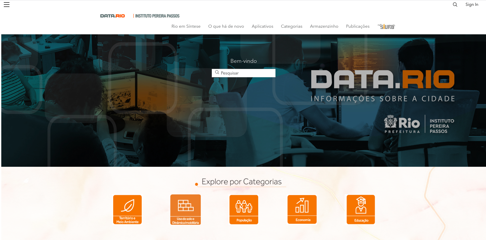

O [data.rio](https://data.rio) é o portal de dados abertos da Prefeitura do Rio de Janeiro. Ele é estruturado e mantido
pelo Instituto Pereira Passos. Nós, como Escritório de Dados, em parceria, disponibilizamos os dados do datalake lá também! 🤩

Tome um tempo para navegar pelo site e conhecer os dados disponíveis!

### Identificando dados do datalake

=== "Texto"

    Na [página de pesquisa](https://www.data.rio/search) do data.rio, você poderá buscar por dados das mais
    diversas formas. Ao acessá-la, você deve encontrar algo assim:

    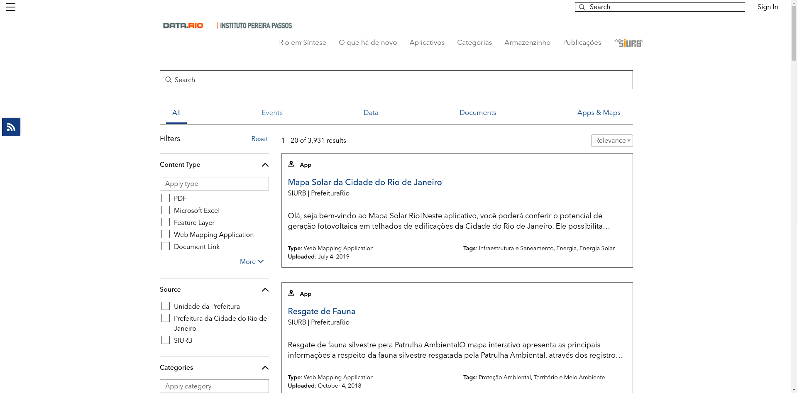

    Rolando a página, ao lado esquerdo, você verá um campo "Tags". Ali, você pode utilizar a tag `escritorio_de_dados` para
    encontrar os dados do datalake!

    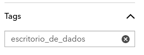

    Então você pode escolher o dado que quiser ali e, ao clicar, você vai se deparar com uma página semelhante à seguinte:

    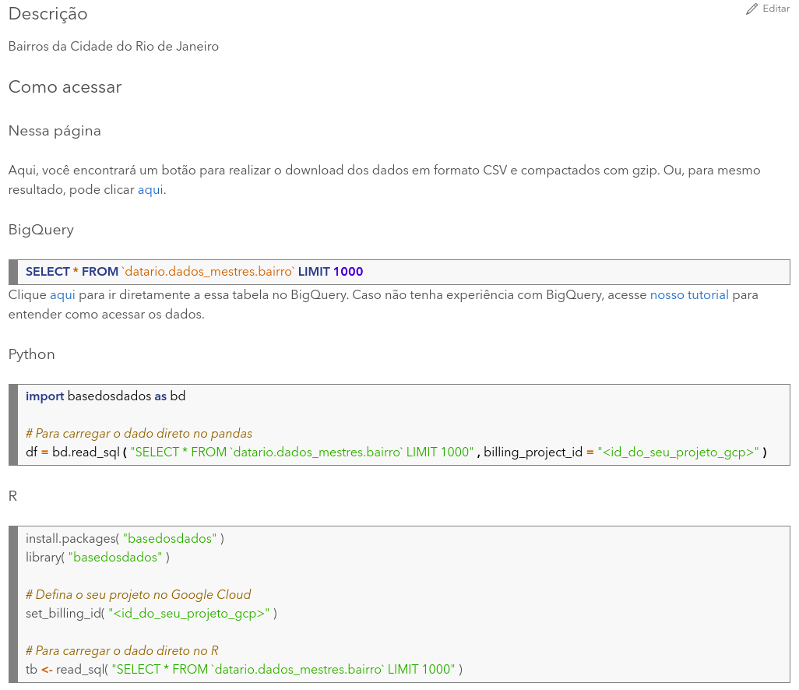

    Ali tem tudo que você precisa saber sobre o dado e diversas maneiras de acessá-lo! 💥

=== "Vídeo"

    

    

## Como criar uma conta na GCP

### Requisitos 
#### Pessoas externas à PCRJ

- Ter uma conta Google válida (um Gmail, por exemplo)
- Cartão de crédito (em alguns poucos casos a GCP exige o cadastro do cartão de crédito. Apesar de ser necessário, a GCP provê 1TB de consumo de dados gratuitamente todo mês, dentre outras coisas e é possível ativar o sandbox posteriormente.
  Para mais informações, veja [referências](#referencias))

#### Pessoas internas à PCRJ

- Preencher o formulário de [Solicitação de criação de credenciais de acesso aos dados](https://docs.google.com/forms/d/e/1FAIpQLSfgokhri9-7m31IYNh-O-ZuTRIv_BXmSYDX-cmtqAhVW8bOUg/viewform) também disponível dentro do botão institucional na ṕágina Datalake do [Escritório de Dados](https://www.dados.rio/).
- Ter uma conta @dados.rio. Vocês devem usar somente essa conta para todo o resto do tutorial.

### Criando uma conta

- Vá ao [GCP Console](https://console.cloud.google.com/) e clique no botão "Comece a usar gratuitamente", na barra superior direita

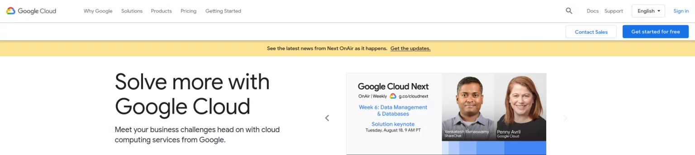

- Faça login com sua conta Google ou sua conta @dados.rio para acesso institucional. Nesse último caso, não aparecerá a opção de adicionar cartão de crédito.

=== "Sem cartão de crédito"

    Se não houver necessidade de cadastrar cartão de crédito, a GCP só irá solicitar para você preencher qual seu país e aceitar os Termos de Serviço. Feito isso é só criar um projeto!

    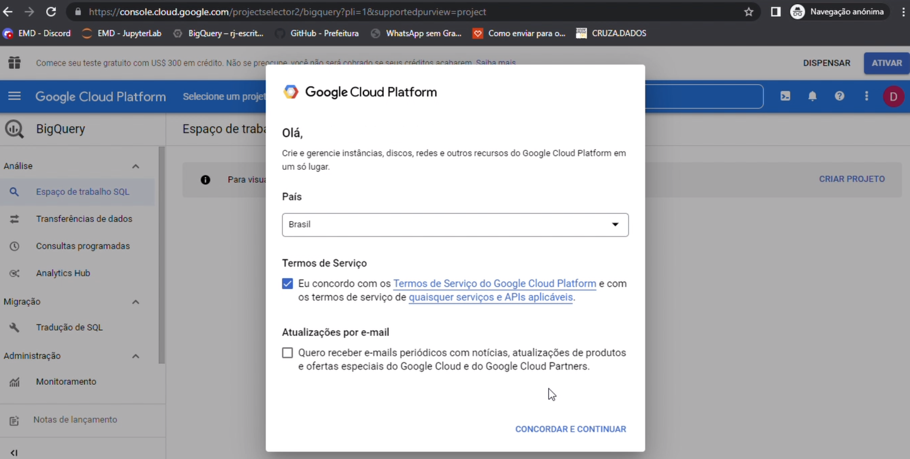

=== "Com cartão de crédito"

    - Preencha as informações necessárias para cadastro, incluindo os dados do cartão de crédito

    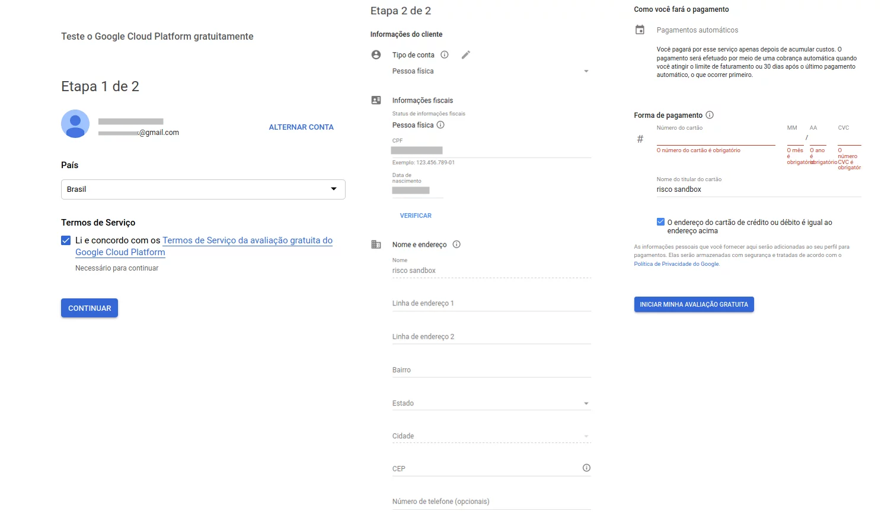

    - Quando chegar na etapa de verificação de informações de pagamento, clique em "Prosseguir para a verificação"

    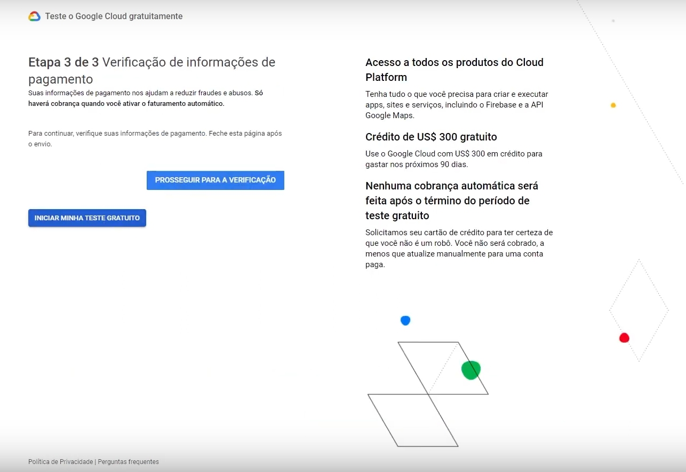

    - A aprovação dos documentos pode levar até 2 dias úteis.

    - Para entrar na sandbox e desabilitar o billing siga esse tutorial:

    

### Criando um projeto

Para consumir dados via Google BigQuery, será necessário criar um projeto na GCP. Para fazê-lo, siga as seguintes etapas:

- Vá ao [GCP Console](https://console.cloud.google.com/) e clique no botão "Selecione um projeto"

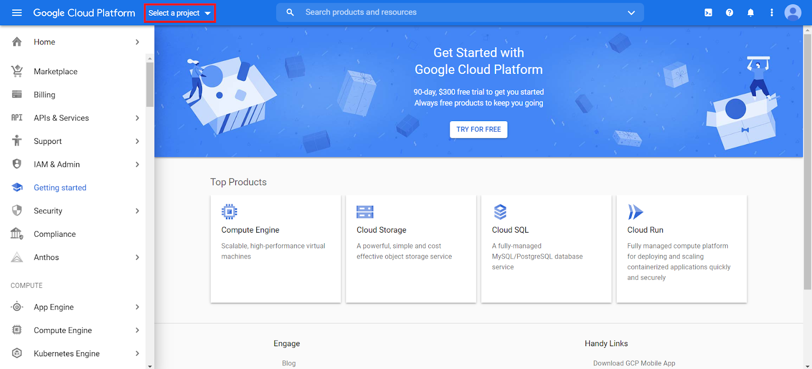

- Se você não possui e-mail institucional escolha a opção _Sem organização_, caso contrário selecione _dados.rio_. Depois, clique na opção "Novo projeto".

{ width=50% }

Se você for redirecionado para a página da imagem abaixo, clique em **Criar projeto**.

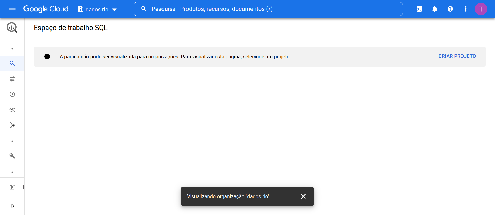{ width=80% }

- Preencha o nome do projeto lembrando que esse é um projeto só seu. Logo abaixo do nome do projeto haverá a possibilidade de alterar o ID do projeto. Por questões de organização, sugerimos que o ID do projeto seja o mesmo do nome do projeto e que a separação seja feita por hífens (`-`) no lugar de espaços. Para as pessoas que acessarem com um e-mail institucional (@dados.rio) deverá ser escolhida a opção de _dados.rio_ do campo *Organização*. Para os demais, pode deixar essa opção marca com _Sem organização_.

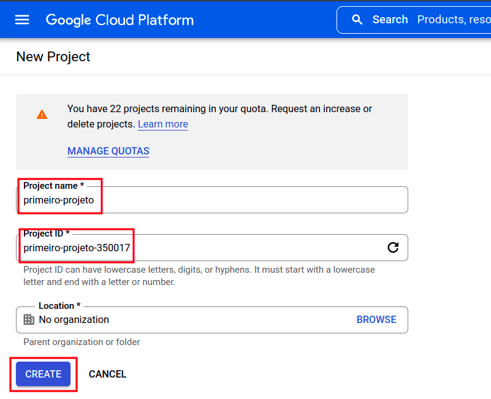{ width=90% }

- Clique em "Criar". Você será redirecionado para a página inicial do console da GCP. Quando o projeto tiver sido criado,
  clique em "Selecionar projeto".

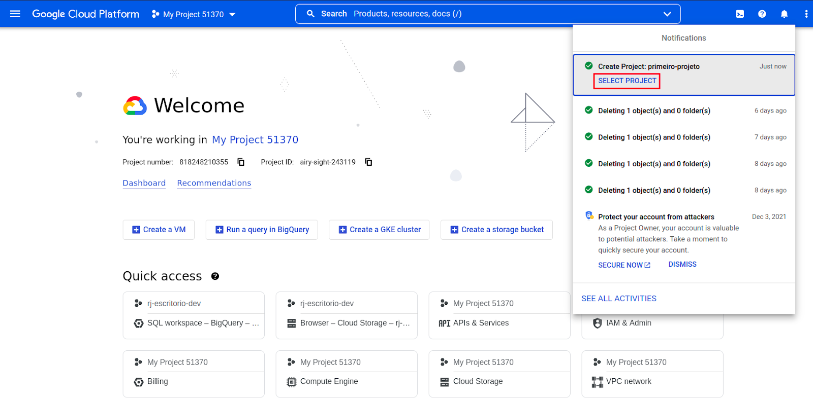

Parabéns! Você já pode usar o Google BigQuery! 🎉

## Acessando dados via BigQuery

Com sua conta da GCP devidamente configurada, você pode acessar dados via BigQuery. Vamos lá! :smiley:

### Adicionando o projeto do Escritório de Dados

- No [GCP Console](https://console.cloud.google.com/), verifique se você está com o projeto correto selecionado e,
  em seguida, clique no ícone de hambúrguer.

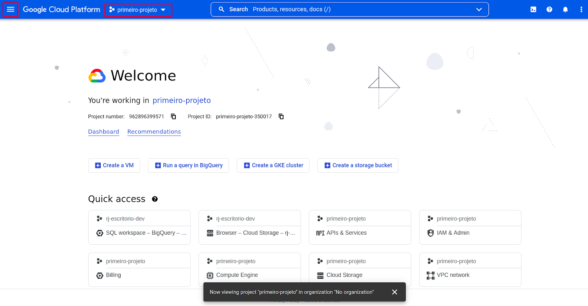

- Procure na lista do hambúrguer o serviço "BigQuery". Passe o mouse por cima e selecione "Espaço de trabalho SQL".

🆘 Se tiver dificuldade em encontrar o BigQuery, pode procurar por ele na barra de pesquisa lá em cima!.

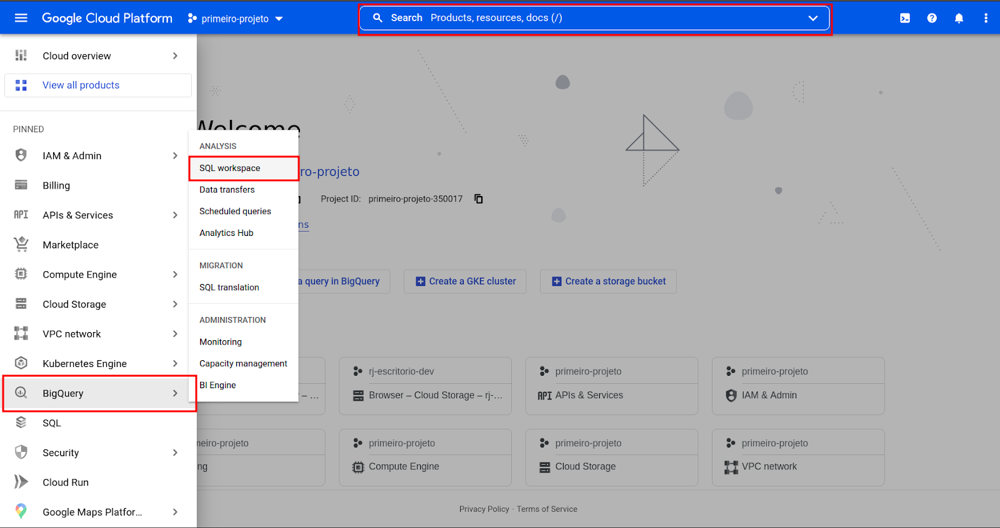

- O console do BigQuery será aberto. Ao lado esquerdo, você verá todos os projetos que você possui acesso.
  Ao lado direito, há um campo de texto para executar queries.

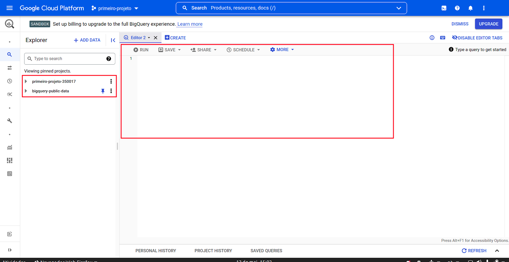

- Na barra **Explorer**, clique nas três bolinhas verticais e depois em "+ Adicionar dados" para adicionar novos projetos. Para algumas pessoas o botão "+ Adicionar dados" aparerá diretamente.

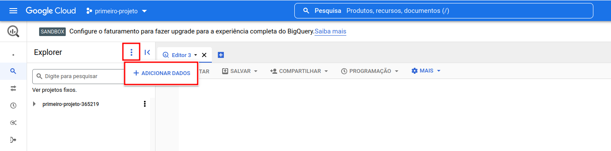{ width=90% }

- Depois, clique em "Fixar um projeto por nome".

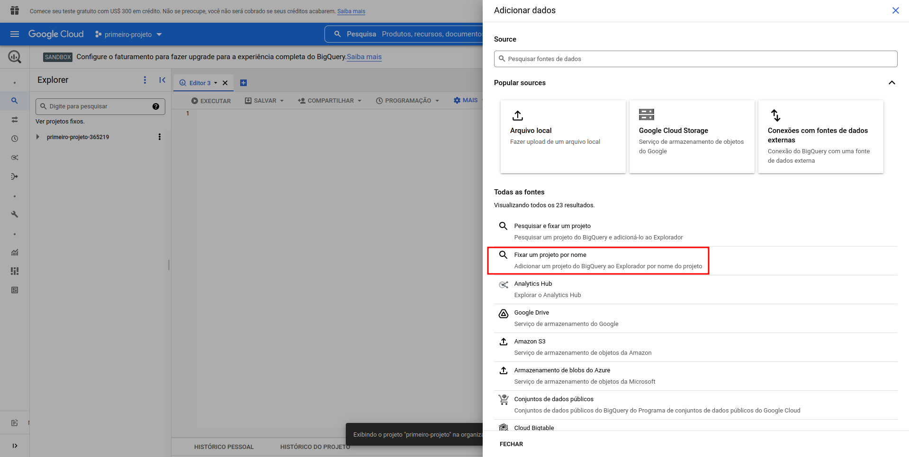

- Em seguida, procure pelo projeto **datario**, que se refere aos dados disponibilizados pela equipe
  do Escritório de Dados Rio. Ao encontrar, clique em "Fixar".

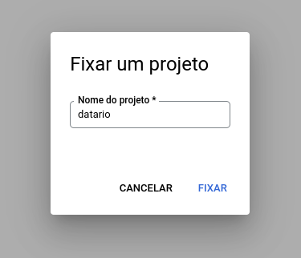{ width=30% }

- Depois de alguns segundos o projeto **datario** estará aparecendo em sua aba "Explorer". Ao navegar por ele, verá algo semelhante ao seguinte:

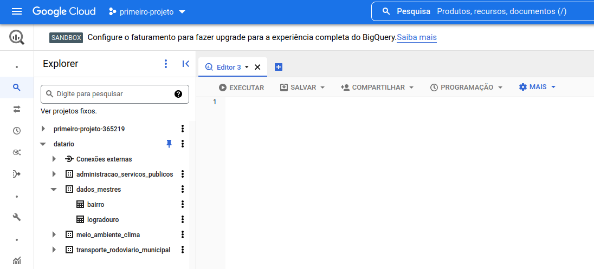{ width=90% }

Agora você está pronto para utilizar os dados abertos da Prefeitura do Rio de Janeiro!  :wink:

Se você trabalha para a prefeitura e quer adicionar os demais projetos que tem acesso, basta seguir o mesmo passo mostrado anteriormente e buscar o nome do projeto da sua secretaria ou órgão. Exemplo de projetos internos:

  - rj-cor
  - rj-escritorio
  - rj-segovi
  - rj-sme

### Fazendo sua primeira query e usando os resultados

=== "Texto"

    - Pode-se fazer uma query nessa tabela clicando em "Query" ou nos três pontinhos verticais e escolhendo
      "Query". Em ambas as formas, será gerada uma query básica para a tabela.

    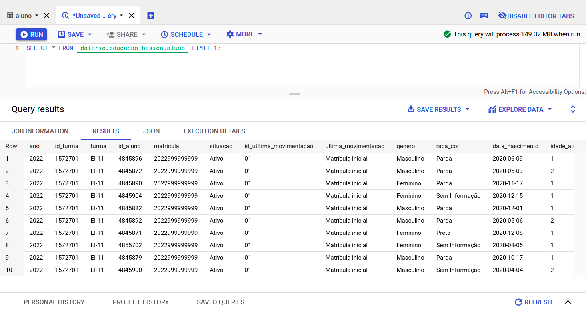{ width=90% }

    - Para executar a query, basta clicar em "Run" ou pressionar Ctrl + Enter. Os resultados serão exibidos
      como na imagem acima.

    Ao final, com os resultados da query que desejamos, podemos fazer coisas legais! 🤓

    É possível, por exemplo:

    - Baixar ou salvar os resultados clicando em "Save results".

    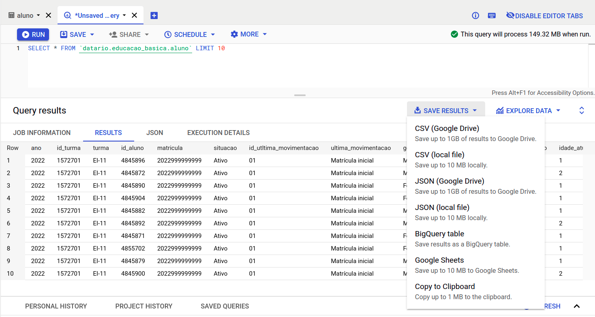{ width=90% }

    - Salvar a query ou criar uma view com ela para utilizar depois, clicando em "Save", ao lado de "Run".

    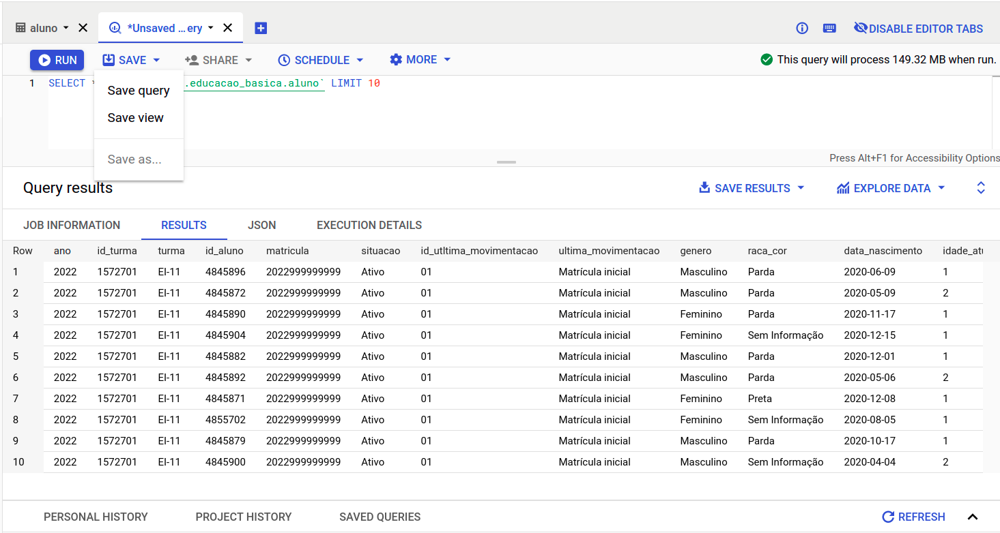{ width=90% }

    - Criar um schedule para executar essa mesma query em intervalos de tempo definidos, clicando em "Schedule".

    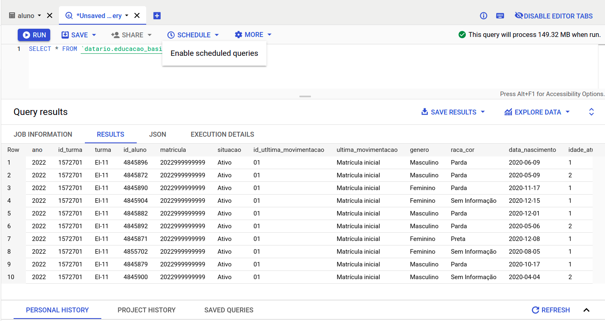{ width=90% }


=== "Vídeo"

    

### Explorando os dados com Data Studio, Google Sheets e Colab

Após rodarmos uma query no GCP também podemos explorar nossos dados utilizando outras plataformas gratuitas como o Data Studio, Google Planilhas e Colab. Para isso, basta clicar no botão "Explore Data" na parte inferior direita e escolher a melhor forma para você.

Com o Data Studio você consegue criar gráficos e dashboards que atualizarão automaticamente com seus dados. Já com o Google Planilhas também é possível criar gráficos e ainda realizar análises rápidas. Para análises mais aprofundadas e complexas recomendamos o uso do Colab, mas nesse caso será necessário um conhecimento básico de Python.

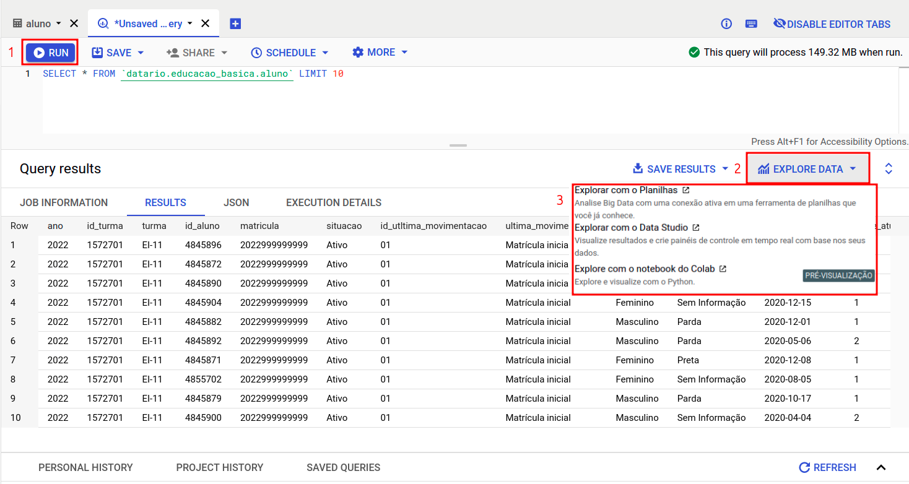{ width=90% }

E é isso! Agora é hora de voar! 🚀
### Navegando pelos dados

=== "Texto"

    - Aqui, você pode selecionar qualquer tabela, clicar nos pontinhos verticais e "Open". Assim, serão exibidas
      as propriedades dessa tabela. Na aba "Schema", será mostrado o nome de cada coluna, seu tipo e descrição.

    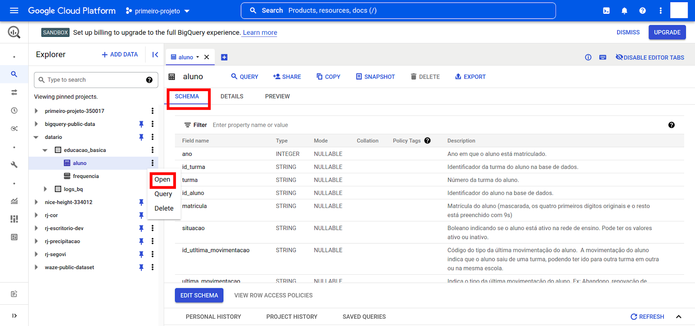{ width=90% }

    - Já na aba "Detalhes", haverá informação sobre o tamanho da tabela, número de linhas, datas de criação e
      atualização, etc.

    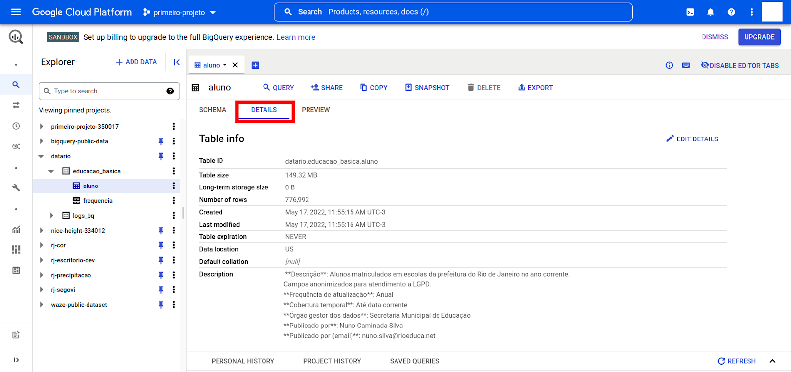{ width=90% }

    - Por fim, na aba "Preview", aparecerão alguns dados contidos nessa tabela.

    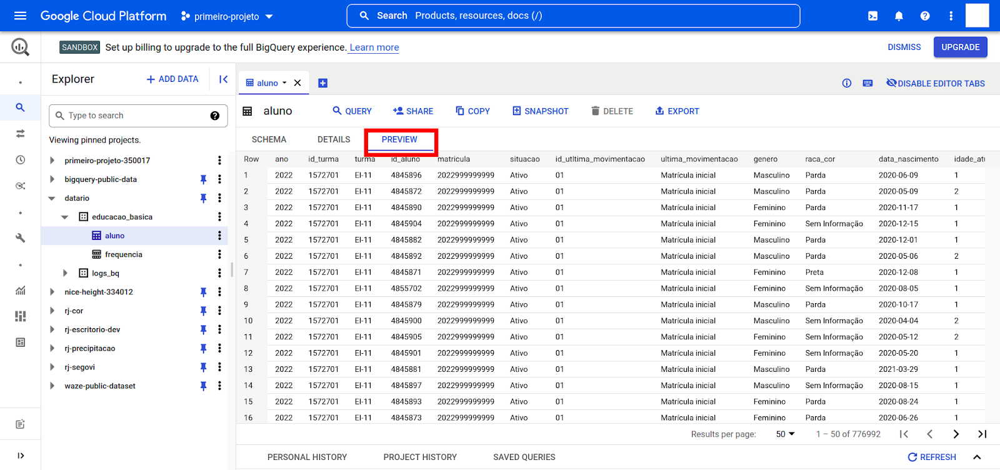{ width=90% }

=== "Vídeo"

    

## Acessando dados via Python

Então você quer acessar os dados **diretamente** via Python? A gente te dá uma força! 👨‍💻

### Requisitos

- Python 3.6 ou superior
- [basedosdados](https://github.com/basedosdados/mais) (instale com `pip install basedosdados`)

### Fazendo uma query

=== "Texto"

    A seguir, vamos consultar dados da maneira mais simples possível. Se liga só nesse snippet curtinho
    mas SUPER poderoso 💪:

    ```py
    import basedosdados as bd

    query = "SELECT * FROM `datario.educacao_basica.aluno` LIMIT 10"
    df = bd.read_sql(query, billing_project_id="<id-do-seu-projeto>")
    ```

    **Importante:** note que esse `billing_project_id` deve corresponder ao ID do seu projeto na GCP, NÃO
    ao nome do projeto. No caso da imagem abaixo, seria `"primeiro-projeto-350017"`

    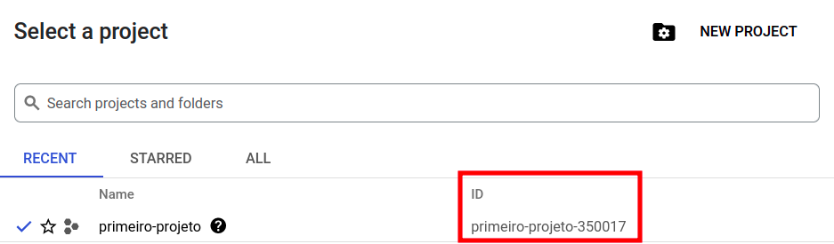{ width=60% }

    Quando você executar esse snippet, será solicitada a autenticação com sua conta Google:

    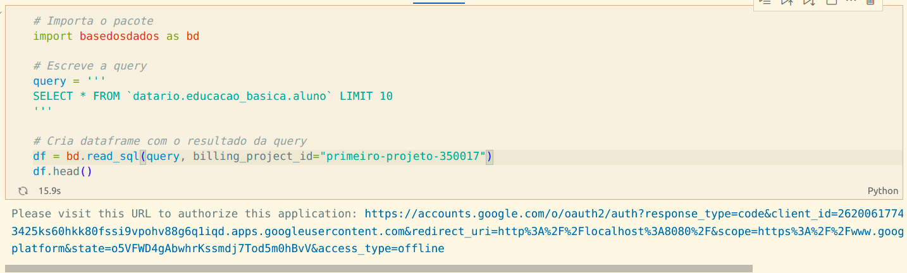

    E assim que autorizar, você vai ter seu dado lindo de bonito já em um DataFrame do [Pandas](https://pandas.pydata.org/)!
    É pura magia 🪄

    

=== "Vídeo"

    

## Acessando dados via R

A basedosdados possui um guia excelente de como acessar dados do BigQuery via R. Você pode acessá-lo
[aqui](https://medium.com/basedosdados/como-usar-a-bd-com-r-427aded95448)!

## Acessando dados via PowerBI

A documentação oficial da Microsoft possui um guia excelente de como acessar dados do BigQuery via PowerBI.
Você pode acessá-lo [aqui](https://docs.microsoft.com/pt-br/power-bi/connect-data/desktop-connect-bigquery)!

## Acessando dados via Google Sheets/Planilha

Para importar toda uma tabela em um Google Sheets você deve, primeiramente, acessar uma planilha e clicar nas opções Data > Data connectors > Connect to BigQuery. 

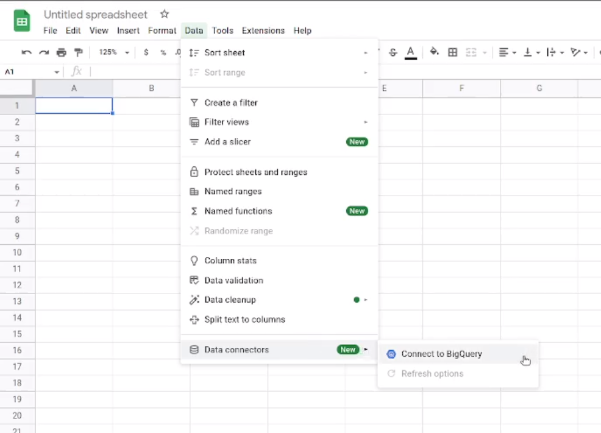{ width=50% }

Uma nova janela será aberta para que você escolha o projeto, o dataset e a tabela que você quer acessar.

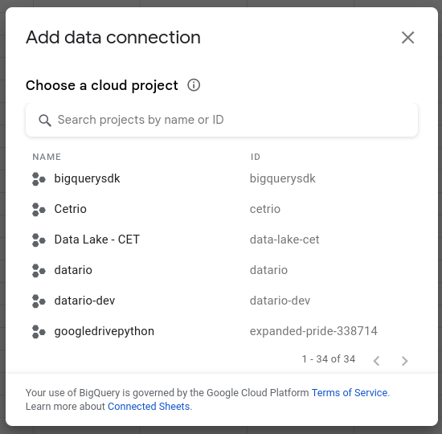{ width=30% }
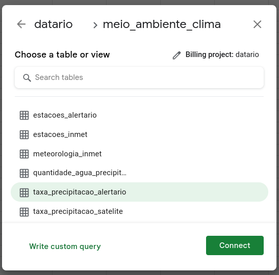{ width=30% }

Feito isso, o Google Sheets irá importar toda a tabela. Tome cuidado com tabelas muito grandes! Se esse for o seu caso recomendamos importar a tabela no python utilizando a biblioteca `basedosdados` mencionada anteriormente.

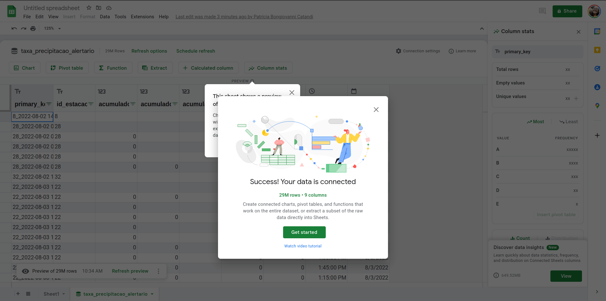{ width=80% }

## Acessando dados via Data Studio

Para importar toda uma tabela no Data Studio você deve, primeiramente, acessar o site do [Data Studio](https://datastudio.google.com) e criar um novo report. 

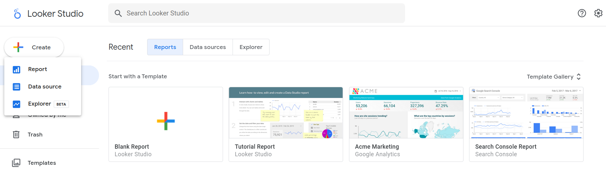{ width=80% }

Para conectar uma tabela do BigQuery clique no botão correspondente a ele.

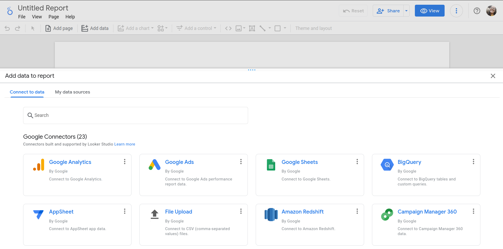{ width=80% }

Navegue nas opções de projeto, dataset e tabela até encontrar o dado de interesse.

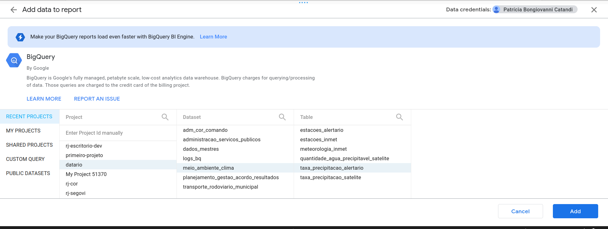{ width=80% }

Prontinho! Agora é só liberar seu lado analytics + criativo para começar suas análises. :stuck_out_tongue_winking_eye:

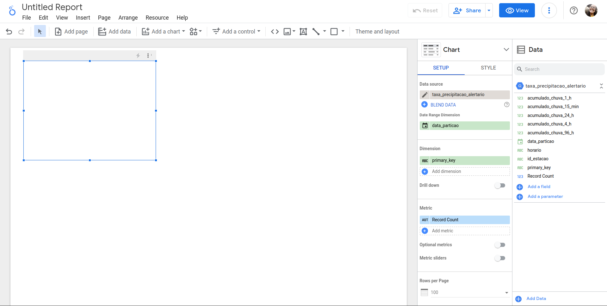{ width=80% }

## Dicas para reduzir o custo de uma query no GCP :exploding_head:

**1 - Evite `SELECT *`** :bomb:

Para contornar o uso do `SELECT *` você pode:

- Escrever apenas os nomes das colunas que deseja como retorno.
  Ex: `SELECT id_aluno, turma, situacao FROM datario.educacao_basica.aluno`
- Excluir algumas colunas com o uso do `EXCEPT`.
  Ex: `SELECT * EXCEPT(id_aluno, turma, situacao) FROM datario.educacao_basica.aluno`

**2 - Espiar como são os dados** 🕵🏽‍♀️

Para olhar como são os dados você pode:

Clicar nos pontinhos verticais e "Open". E depois selecionar a aba "Preview" para visualizar algumas linhas dessa tabela.

{ width=80% }

Dessa forma, você consegue visualizar dados gratuitamente e sem afetar sua cota mensal 🤩.

**3 - Filtrar a partição** :boom:

Se a tabela for particionada, opte por filtrá-la utilizando a coluna de partição. Você pode descobrir se a tabela é particionada seguindo o mesmo passo anterior, mas selecionando a aba "Detalhes" e procurando o termo “Particionada no campo “.

=== "Texto"

    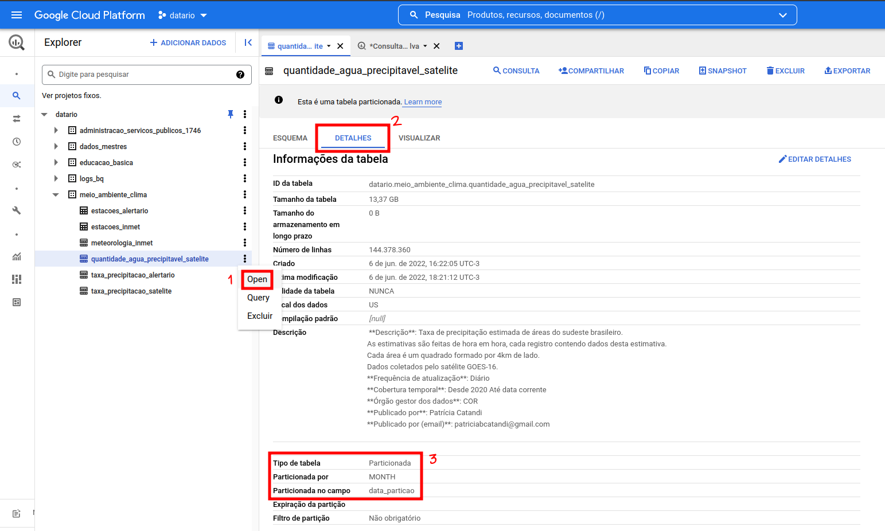{ width=80% }

    Como vimos na imagem acima, a tabela `datario.meio_ambiente_clima.quantidade_agua_precipitavel_satelite` é particionada pela coluna `data_particao`. Vamos ver um exemplo de como é importante filtrarmos nossas consultas considerando a coluna de partição:

    Suponha que queremos obter todos os valores da quantidade de água precipitável para latitudes menores que -22.0º e considerando apenas dados obtidos à 1h da manhã.
    Se adicionarmos no filtro a nossa coluna de partição, o GCP nos avisa que a query processará 83.24MB.
    
    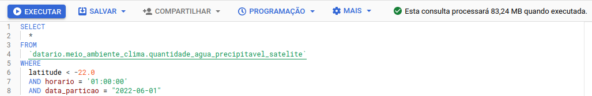{ width=80% }

    Se removermos da nossa query o filtro da partição o GCP processará 13.37GB! Bem mais do que a query anterior 🤯!
    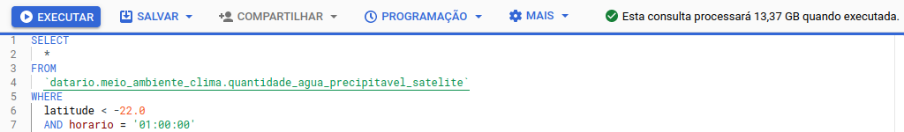{ width=80% }

    Você pode estar pensando 🤔: “Claro que a query consumirá mais! Você tem um filtro a menos nessa query.”
    Para rebater essa crítica vamos comparar a query anterior com uma sem filtro nenhum:

    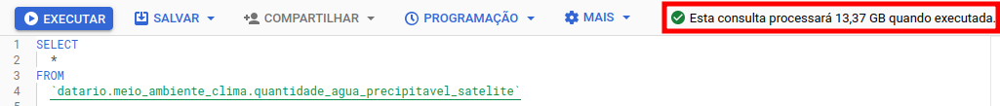{ width=80% }

    Nesse caso, o CGP irá processar a mesma quantidade de GB que a query em que não utilizamos a coluna de partição 🤓!

=== "Vídeo"

    

Então lembre-se: sempre use a coluna de partição quando sua tabela permitir 😉!

**4 - JOIN** :handshake:

Para melhorar a eficiência dos JOIN podemos:

- reduzir a quantidade de dados das tabelas antes de uma cláusula JOIN. Quanto antes reduzirmos a quantidade de dados, menos processamento iremos exigir.
- sempre que possível, utilize colunas de inteiros para realizar o join entre tabelas.

## Referências

- [Documentação oficial da GCP](https://cloud.google.com/docs)
- [Cota gratuita da GCP](https://cloud.google.com/free/docs/gcp-free-tier)
- [Documentação oficial do BigQuery](https://cloud.google.com/bigquery/docs)
- [Melhores práticas para reduzir custos](https://cloud.google.com/bigquery/docs/best-practices-costs#preview-data)
- [Documentação oficial da basedosdados](https://basedosdados.github.io/mais/access_data_packages/)
