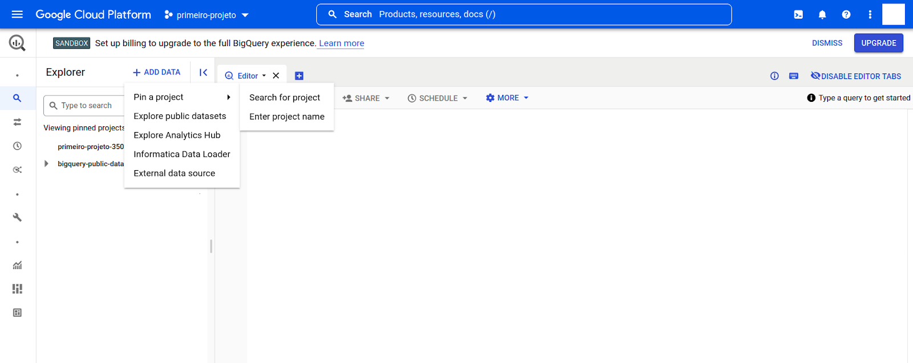
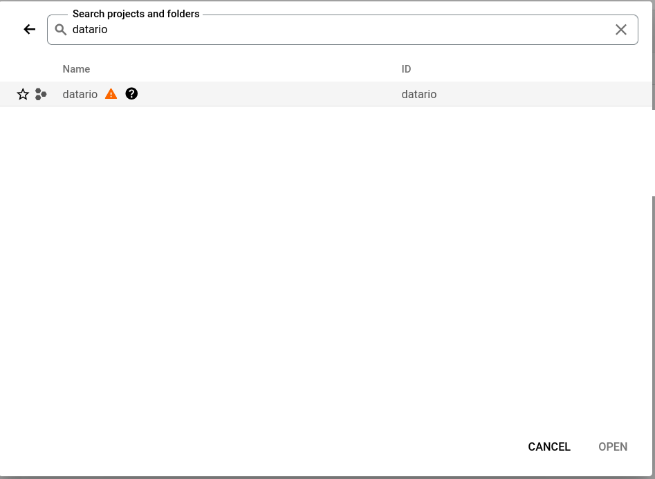

## Como encontrar dados

## Como criar uma conta na GCP

### Requisitos

- Ter uma conta Google válida (um Gmail, por exemplo)
- Cartão de crédito (apesar de ser necessário, a GCP provê 1TB de consumo de dados gratuitamente todo mês, dentre outras coisas.
  Para mais informações, veja [referências](#referencias))

### Criando uma conta

- Vá ao [GCP Console](https://console.cloud.google.com/) e clique no botão "Comece a usar gratuitamente", na barra superior direita


- Faça login com sua conta Google

- Preencha as informações necessárias para cadastro, incluindo os dados do cartão de crédito


- Quando chegar na etapa de verificação de informações de pagamento, clique em "Prosseguir para a verificação"


- A aprovação dos documentos pode levar até 2 dias úteis.

### Criando um projeto

Para consumir dados via Google BigQuery, será necessário criar um projeto na GCP. Para fazê-lo, siga as seguintes etapas:

- Vá ao [GCP Console](https://console.cloud.google.com/) e clique no botão "Selecione um projeto"


- Clique na opção "Novo projeto"


- Preencha o nome e o ID do projeto. Por questões de organização, sugerimos que o ID do projeto seja o mesmo do nome do projeto.
  Ambos devem ter hífens (`-`) no lugar de espaços.


- Clique em "Criar". Você será redirecionado para a página inicial do console da GCP. Quando o projeto tiver sido criado,
  clique em "Selecionar projeto".


Parabéns! Você já pode usar o Google BigQuery! 🎉

## Acessando dados via BigQuery

Com sua conta da GCP devidamente configurada, você pode acessar dados via BigQuery. Vamos lá!

### Adicionando o projeto do Escritório de Dados

- No [GCP Console](https://console.cloud.google.com/), verifique se você está com o projeto correto selecionado e,
  em seguida, clique no ícone de hamburguér.


- Procure, na lista, o serviço "BigQuery". Passe o mouse por cima e selecione "Espaço de trabalho SQL".

🆘 Se tiver dificuldade em encontrar o BigQuery, pode procurar por ele na barra de pesquisa lá em cima!.


- O console do BigQuery será aberto. Ao lado esquerdo, você verá todos os projetos que você possui acesso.
  Ao lado direito, há um campo de texto para executar queries.


- Na barra **Explorer**, clique em "+ Adicionar dados" para adicionar novos projetos. Depois, clique em
  "Pin a project" e "Search for project".



- Em seguida, procure pelo projeto **datario**, que se refere aos dados disponibilizados pela equipe
  do Escritório de Dados Rio. Ao encontrar, clique em "Abrir".



- Agora o projeto **datario** estará aparecendo em sua aba "Explorer". Ao navegar por ele, verá algo semelhante
  ao seguinte:


### Navegando pelos dados

- Aqui, você pode selecionar qualquer tabela, clicar nos pontinhos verticais e "Open". Assim, serão exibidas
  as propriedades dessa tabela. Na aba "Schema", será mostrado o nome de cada coluna, seu tipo e descrição.


- Já na aba "Detalhes", haverá informação sobre o tamanho da tabela, número de linhas, datas de criação e
  atualização, etc.


- Por fim, na aba "Preview", aparecerão alguns dados contidos nessa tabela.


### Fazendo sua primeira query e usando os resultados

- Pode-se fazer uma query nessa tabela clicando em "Query" ou nos três pontinhos veritcais e escolhendo
  "Query". Em ambas as formas, será gerada uma query básica para a tabela.


- Para executar a query, basta clicar em "Run" ou pressionar Ctrl + Enter. Os resultados serão exibidos
  como na imagem acima.

Ao final, com os resultados da query que desejamos, podemos fazer coisas legais! 🤓

É possível, por exemplo:

1. Baixar ou salvar os resultados clicando em "Save results".


2. Salvar a query ou criar uma view com ela para utilizar depois, clicando em "Save", ao lado de "Run".


3. Fazer gráficos e dashboards com os resultados, clicando em "Explore data".


4. Criar um schedule para executar essa mesma query em intervalos de tempo definidos, clicando em "Schedule".


E é isso! Agora é hora de voar! 🚀

## Acessando dados via Python

Então você quer acessar os dados **diretamente** via Python? A gente te dá uma força! 👨‍💻

### Requisitos

- Python 3.6 ou superior
- [basedosdados](https://github.com/basedosdados/mais) (instale com `pip install basedosdados`)

### Fazendo uma query

A seguir, vamos consultar dados da maneira mais simples possível. Se liga só nesse snippet curtinho
mas SUPER poderoso 💪:

```py
import basedosdados as bd

query = "SELECT * FROM `datario.educacao_basica.aluno` LIMIT 10"
df = bd.read_sql(query, billing_project_id="<id-do-seu-projeto>")
```

**Importante:** note que esse `billing_project_id` deve corresponder ao ID do seu projeto na GCP, NÃO
ao nome do projeto. No caso da imagem abaixo, seria `"primeiro-projeto-350017"`


Quando você executar esse snippet, será solicitada a autenticação com sua conta Google:


E assim que autorizar, você vai ter seu dado lindo de bonito já em um DataFrame do [Pandas](https://pandas.pydata.org/)!
É pura magia 🪄

## Acessando dados via R

Vide [aqui](https://medium.com/basedosdados/como-usar-a-bd-com-r-427aded95448)

## Acessando dados via PowerBI

## Referências

- [Documentação oficial da GCP](https://cloud.google.com/docs)
- [Cota gratuita da GCP](https://cloud.google.com/free/docs/gcp-free-tier)
- [Documentação oficial do BigQuery](https://cloud.google.com/bigquery/docs)
- [Documentação oficial da basedosdados](https://basedosdados.github.io/mais/access_data_packages/)
