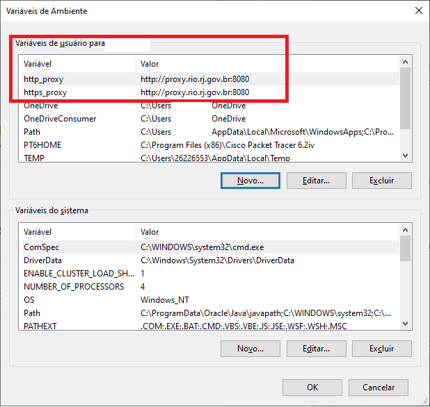

Tendo problemas em se conectar ao BigQuery via PowerBI? Vamos tentar ajudar!

## Restrições e premissas

Esse guia contempla somente o caso onde o usuário está tentando se conectar a partir da rede de computadores da Prefeitura do Rio. Se esse não for o seu caso, mas ainda estiver com problemas, [**entre em contato conosco**](/contato), será um prazer te ajudar.

Também, o guia foi focado no sistema operacional Windows. Caso precise da descrição desses passos para outros sistemas operacionais, [**entre em contato com a IPLANRIO**](https://iplanrio.prefeitura.rio/), que desenvolveu essa solução.

## Configurando as variáveis de ambiente

Os passos necessários são os seguintes:

- Clicar na lupa da barra de tarefas
- Buscar por "Environment" ou "editar as variáveis de ambiente do sistema" e clicar no ícone que aparecer
- Clicar em "Novo" na seção da janela descrita como "Variáveis de usuário para..."
- Adicionar as seguintes variáveis:

```
 - Nome da variável: http_proxy
   Valor da variável: http://proxy.rio.rj.gov.br:8080

 - Nome da variável: https_proxy
   Valor da variável: http://proxy.rio.rj.gov.br:8080
```

- Atente-se para eventuais erros de digitação!

Ao final, a tela deverá se assemelhar à seguinte:



## Observações finais

As variáveis atribuídas via Domínio serão identificadas na seção "Variáveis do sistema", que abrangerá
qualquer usuário da máquina caso ela seja compartilhada. Caso a máquina que não esteja no domínio RIO
também seja compartilhada, as variáveis também deverão ser criadas manualmente na seção "Variáveis do
sistema" e não em "Variáveis de usuário".
